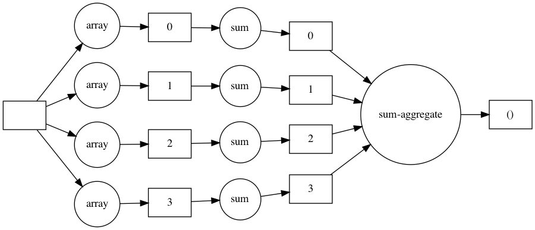

<script src="https://cdnjs.cloudflare.com/ajax/libs/require.js/2.3.6/require.min.js" integrity="sha512-c3Nl8+7g4LMSTdrm621y7kf9v3SDPnhxLNhcjFJbKECVnmZHTdo+IRO05sNLTH/D3vA6u1X32ehoLC7WFVdheg==" crossorigin="anonymous"></script>
<script src="https://cdnjs.cloudflare.com/ajax/libs/jquery/3.5.1/jquery.min.js" integrity="sha512-bLT0Qm9VnAYZDflyKcBaQ2gg0hSYNQrJ8RilYldYQ1FxQYoCLtUjuuRuZo+fjqhx/qtq/1itJ0C2ejDxltZVFg==" crossorigin="anonymous"></script>
<script type="application/javascript">define('jquery', [],function() {return window.jQuery;})</script>


``` python
import sys

import numpy as np
import pandas as pd

%load_ext snakeviz
%load_ext line_profiler
%load_ext memory_profiler
%config InlineBackend.figure_format = 'retina'
%load_ext autoreload
%autoreload 2
```

    The snakeviz extension is already loaded. To reload it, use:
      %reload_ext snakeviz
    The line_profiler extension is already loaded. To reload it, use:
      %reload_ext line_profiler
    The memory_profiler extension is already loaded. To reload it, use:
      %reload_ext memory_profiler
    The autoreload extension is already loaded. To reload it, use:
      %reload_ext autoreload

The problem:

-   I often work with largish datasets (e.g. 10s or 100s of GB) that are not big enough to warrant all the heavy machinery of big data work but are still too big to just load into Pandas and process on my 8GB-RAM MacBook.

Solutions:

-   General best practive to avoid wasteful operations

-   Diagnose bottlenecks

    -   Find slow functions (profiler, snakeviz)

    -   Find slow lines in slow functions (line profiler)

-   Specific optimisations [here](https://pythonspeed.com/memory/)

-   Use a vm

Best practices for working with largish data locally:

-   Read [these](https://pythonspeed.com/memory/) awesome articles. Seriously, before doing anything, read them.

-   Also have a look at [this](https://towardsdatascience.com/why-and-how-to-use-pandas-with-large-data-9594dda2ea4c)

-   Read data in chunks

-   Read dates [efficiently](-%20%5BUse%20cache%20to%20read%20dates%5D(https://stackoverflow.com/questions/14446744/speed-improvement-on-large-pandas-read-csv-with-datetime-index))

-   [Optimise column types](https://www.dataquest.io/blog/pandas-big-data/)

-   Delete unnecessary columns

-   [Choose efficient storage format](https://towardsdatascience.com/the-best-format-to-save-pandas-data-414dca023e0d)

Fast computations

-   https://pandas.pydata.org/pandas-docs/dev/user_guide/enhancingperf.html

-   https://engineering.upside.com/a-beginners-guide-to-optimizing-pandas-code-for-speed-c09ef2c6a4d6

Useful libraries

-   [vaex, for fast dataframe operations with focus on visualisation and exploration](https://vaex.readthedocs.io/en/latest/tutorial.html)

-   [Modin, speeds up Pandas with minimal effort using Dask under the hood](https://github.com/modin-project/modin)

## General rules

-   Improve speed

    -   General

        -   Avoid loops (use list comps, broadcasting, map). If you need a loop, do everything that needs to be done once outside of it (incl. type conversions.

    -   Regex

        -   Pre-compile
        -   Match directly rather than extract from list of matches

    -   Pandas

        -   Avoid costly groupby operations
        -   Check [this](https://medium.com/@aivinsolatorio/optimizing-pandas-groupby-50x-using-numpy-to-speedup-an-agent-based-model-a-story-of-8b0d25614915) for faster groupby
        -   Vectorise using Numpy
        -   [Enhancing performance of Pandas](https://pandas.pydata.org/pandas-docs/stable/user_guide/enhancingperf.html)
        -   [Beginners guide to optimising Pandas code for speed](https://engineering.upside.com/a-beginners-guide-to-optimizing-pandas-code-for-speed-c09ef2c6a4d6)
        -   [Avoiding apply](https://www.dunderdata.com/blog/dunder-data-challenge-3-optimal-solution)
        -   [Datacamp - Writing efficient Python code](https://learn.datacamp.com/courses/writing-efficient-python-code)
        -   [Optomising Pandas groupby](https://medium.com/@aivinsolatorio/optimizing-pandas-groupby-50x-using-numpy-to-speedup-an-agent-based-model-a-story-of-8b0d25614915)

    -   Parallelise

        -   Concurrent futures
        -   [QuantEcon intro to paralellisation](https://python-programming.quantecon.org/parallelization.html)
        -   [Speed up your algorithms](https://towardsdatascience.com/speed-up-your-algorithms-part-3-parallelization-4d95c0888748)
        -   [Dask example](https://towardsdatascience.com/speeding-up-your-algorithms-part-4-dask-7c6ed79994ef)
        -   [Datacamp - Parallel programming with Dask](https://learn.datacamp.com/courses/parallel-programming-with-dask-in-python)

    -   Vectorisation

        -   [QuantEcon on vectorisation](https://python-programming.quantecon.org/need_for_speed.html)
        -   [Numpy ufuncs](https://numpy.org/doc/stable/reference/ufuncs.html)
        -   [JVDP on vectorised string operations](https://jakevdp.github.io/PythonDataScienceHandbook/03.10-working-with-strings.html)

-   Improve memory usage

    -   Read in chunks

    -   Use generators

    -   Use Dask

    -   Efficient date types

        -   categories

Workflow

-   Profile
    -   [Snakeviz](https://jiffyclub.github.io/snakeviz/) to find slow functions
    -   Line profiler for slow lines in slow functions

## Timing and profiling code

### Profiling runtime

| **symbol** | **name**    | **unit**\* |
|------------|-------------|------------|
| s          | second      | 10^0       |
| ms         | milisecond  | 10^-3      |
| µs         | microsecond | 10^-6      |
| ns         | nanosecond  | 10^-9      |

``` python
heroes = "batman superman spiderman".split()
heights = np.array([191, 180, 187])
weights = np.array([90, 87, 85])
```

``` python
def converter(heroes, heights, weights):
    new_hts = heights * 0.39370
    new_wts = weights * 2.20462

    hero_data = {}

    for i, hero in enumerate(heroes):
        hero_data[hero] = (new_hts[i], new_wts[i])

    return hero_data


%lprun -f converter converter(heroes, heights, weights)
```

    Timer unit: 1e-06 s

    Total time: 4.5e-05 s
    File: /var/folders/xg/n9p73cf50s52twlnz7z778vr0000gn/T/ipykernel_8229/2680193188.py
    Function: converter at line 1

    Line #      Hits         Time  Per Hit   % Time  Line Contents
    ==============================================================
         1                                           def converter(heroes, heights, weights):
         2         1         31.0     31.0     68.9      new_hts = heights * 0.39370
         3         1          6.0      6.0     13.3      new_wts = weights * 2.20462
         4                                           
         5         1          0.0      0.0      0.0      hero_data = {}
         6                                           
         7         4          4.0      1.0      8.9      for i, hero in enumerate(heroes):
         8         3          4.0      1.3      8.9          hero_data[hero] = (new_hts[i], new_wts[i])
         9                                           
        10         1          0.0      0.0      0.0      return hero_data

### Profiling memory usage

Object-wise memory usage

``` python
sys.getsizeof(list(range(1000)))
```

    8056

``` python
sys.getsizeof(np.array(range(1000)))
```

    8112

To profile a function, it needs to be defined in a script.

``` python
%%file mprun_demo.py


def converter(heroes, heights, weights):
    new_hts = heights * 0.39370
    new_wts = weights * 2.20462

    hero_data = {}

    for i, hero in enumerate(heroes):
        hero_data[hero] = (new_hts[i], new_wts[i])

    return hero_data
```

    Overwriting mprun_demo.py

``` python
hro = 100000 * heroes
hgt = np.array(100000 * list(heights))
wgt = np.array(100000 * list(weights))

from mprun_demo import converter

%mprun -f converter converter(hro, hgt, wgt)
```

    Filename: /Users/fgu/dev/projects/blog/_notebooks/mprun_demo.py

    Line #    Mem usage    Increment  Occurrences   Line Contents
    =============================================================
         2     51.6 MiB     51.6 MiB           1   def converter(heroes, heights, weights):
         3     54.0 MiB      2.4 MiB           1       new_hts = heights * 0.39370
         4     54.0 MiB      0.0 MiB           1       new_wts = weights * 2.20462
         5                                         
         6     54.0 MiB      0.0 MiB           1       hero_data = {}
         7                                         
         8     54.0 MiB      0.0 MiB      300001       for i, hero in enumerate(heroes):
         9     54.0 MiB      0.0 MiB      300000           hero_data[hero] = (new_hts[i], new_wts[i])
        10                                         
        11     54.0 MiB      0.0 MiB           1       return hero_data

## General best-practices when working with large datasets

### Hidden mutability ([source](https://pythonspeed.com/articles/minimizing-copying/))

For an array of size A, running the below function uses 3A memory (for the original array, the temporary *array - low*, and the returned array)

``` python
def normalise(array):
    low = array.min()
    high = array.max()
    return (array - low) / (high - low)
```

To save memory, copy the original array within the function (to not mutate the original array) and then mutate the copy inplace. In the above case, this reduces memory use to 2A (the original and the copy).

``` python
def normalise(array):
    low = array.min()
    high = array.max()
    result = array.copy()
    result -= low
    return result / high - low
```

## How to do frequently needed tasks fast

### Group means

From https://cmdlinetips.com/2019/05/how-to-implement-pandas-groupby-operation-with-numpy/

``` python
df = sns.load_dataset("iris")
```

``` python
%timeit df.groupby('species').sepal_length.mean()
```

    481 µs ± 11.1 µs per loop (mean ± std. dev. of 7 runs, 1000 loops each)

``` python
%%timeit

spec = df.species.values
sl = df.sepal_length.values
groups = df.species.unique()
[(group, np.mean(sl[spec == group])) for group in groups]
```

    111 µs ± 7 µs per loop (mean ± std. dev. of 7 runs, 10000 loops each)

### Boolean comparisons

``` python
df = sns.load_dataset("iris")
```

``` python
%timeit df.sepal_width > 3
```

    105 µs ± 2.61 µs per loop (mean ± std. dev. of 7 runs, 10000 loops each)

``` python
%timeit df.sepal_width.values > 0
```

    6.11 µs ± 181 ns per loop (mean ± std. dev. of 7 runs, 100000 loops each)

Given the above, the below is rather surprising:

``` python
%timeit df[df.sepal_width > 3]
```

    335 µs ± 23.3 µs per loop (mean ± std. dev. of 7 runs, 1000 loops each)

``` python
%timeit df[df.sepal_width.values > 3]
```

    148 µs ± 6.14 µs per loop (mean ± std. dev. of 7 runs, 10000 loops each)

### Parse dates when reading file

``` python
def read(fp):
    return pd.read_csv(fp)


fp = "~/tmp/fable/fable_lad.csv"

df = read(fp)
inspect(df)
```

    (1,537,891, 6)

<div>
<style scoped>
    .dataframe tbody tr th:only-of-type {
        vertical-align: middle;
    }

    .dataframe tbody tr th {
        vertical-align: top;
    }

    .dataframe thead th {
        text-align: right;
    }
</style>

|     | date       | geovl         | geovlid   | indnm                           | indvl    | provider |
|-----|------------|---------------|-----------|---------------------------------|----------|----------|
| 0   | 2020-01-01 | Aberdeen City | S12000033 | Consumption - Food and Beverage | 1.564054 | Fable    |
| 1   | 2020-01-02 | Aberdeen City | S12000033 | Consumption - Food and Beverage | 7.606975 | Fable    |

</div>

``` python
%%timeit


def read1(fp):
    return pd.read_csv(fp, parse_dates=["date"])


df = read(fp)
```

    1.03 s ± 12.7 ms per loop (mean ± std. dev. of 7 runs, 1 loop each)

``` python
%%time


def read2(fp):
    return pd.read_csv(fp, parse_dates=["date"], infer_datetime_format=True)


df = read(fp)
```

    CPU times: user 951 ms, sys: 94.9 ms, total: 1.05 s
    Wall time: 1.05 s

``` python
%%time


def read2(fp):
    df = pd.read_csv(fp)
    df["date"] = pd.to_datetime(df.date, format="%Y-%m-%d")


df = read(fp)
```

    CPU times: user 927 ms, sys: 116 ms, total: 1.04 s
    Wall time: 1.05 s

## General techniques

### Avoiding groupby using `np.sort` and `np.diff`

Based on [this](https://medium.com/@aivinsolatorio/optimizing-pandas-groupby-50x-using-numpy-to-speedup-an-agent-based-model-a-story-of-8b0d25614915) article.

Create dict with list of user ids by year of birth

``` python
data = df[["year_of_birth", "user_id"]].drop_duplicates().dropna()
```

``` python
%%timeit

# Using Pandas apply
r = data.groupby("year_of_birth").user_id.apply(lambda x: x.values)
```

    3.39 ms ± 123 µs per loop (mean ± std. dev. of 7 runs, 100 loops each)

``` python
%%timeit

# Using numpy

# cast to numpy
yobs = data.year_of_birth.to_numpy()
userids = data.user_id.to_numpy()

# sort arrays
yobs_order = np.argsort(yobs)
sorted_yobs = yobs[yobs_order]
sorted_userids = userids[yobs_order]

# find group boundaries
d = np.diff(sorted_yobs, prepend=-np.inf, append=np.inf)
bdr = np.asarray(d != 0).nonzero()[0]

# create results dictionary
result = {
    yob: [sorted_userids[bdr[idx] : bdr[idx + 1]]]
    for idx, yob in enumerate(np.unique(yobs))
}
result
```

    128 µs ± 7.18 µs per loop (mean ± std. dev. of 7 runs, 10000 loops each)

``` python
np.diff
```

### Groupby on boolean series for vectorisation.

From [here](https://realpython.com/pandas-groupby/)

``` python
%%timeit
df.groupby(df.postcode.str[:2]).apply(lambda g: (g.gender == "m").sum())
```

    1.7 s ± 50.8 ms per loop (mean ± std. dev. of 7 runs, 1 loop each)

``` python
np.diff([1, 2, 4], prepend=-np.inf, append=np.inf)
```

    array([inf,  1.,  2., inf])

``` python
%%timeit
ismale = df.gender == "m"
ismale.groupby(df.postcode.str[:2]).sum()
```

    199 ms ± 6.98 ms per loop (mean ± std. dev. of 7 runs, 1 loop each)

``` python
a = pd.Series([True, False, True, False, False, False, True])
b = [1, 2, 1, 2, 1, 3, 1]

a.groupby(b).groups
```

    {1: Int64Index([0, 2, 4, 6], dtype='int64'),
     2: Int64Index([1, 3], dtype='int64'),
     3: Int64Index([5], dtype='int64')}

``` python
ismale.groupby(df.postcode.str[:2]).groups
```

    {'ab': Int64Index([ 43765,  43766,  43768,  43962,  44018,  44139,  44175,  44197,
                  44314,  44629,
                 ...
                 351737, 351769, 351774, 351778, 352022, 352053, 352296, 352370,
                 352474, 352500],
                dtype='int64', length=3381),
     'al': Int64Index([ 17352,  17510,  17553,  17613,  17718,  17823,  18466,  18848,
                  19103,  19104,
                 ...
                 374704, 374705, 374713, 374722, 374747, 374755, 375157, 375833,
                 375834, 376410],
                dtype='int64', length=1369),
     'b3': Int64Index([14468, 14494, 14554, 14555, 14558, 14561, 14567, 14569, 14570,
                 14571,
                 ...
                 84888, 84889, 85013, 85018, 85039, 85040, 85041, 85072, 85200,
                 85204],
                dtype='int64', length=937),
     'b7': Int64Index([ 17552,  17641,  17697,  17698,  17796,  17887,  17947,  17963,
                  17968,  17976,
                 ...
                 682533, 682537, 682539, 682573, 682576, 682578, 682579, 682580,
                 682581, 682610],
                dtype='int64', length=9212),
     'ba': Int64Index([190038, 190346, 190347, 190374, 191807, 191808, 196817, 196818,
                 196819, 196822,
                 ...
                 667600, 667601, 667602, 667603, 667604, 669484, 669485, 669486,
                 669488, 669489],
                dtype='int64', length=2418),
     'bb': Int64Index([23431, 23464, 23473, 23493, 23495, 23561, 23821, 23940, 24080,
                 24125,
                 ...
                 37922, 37953, 38006, 38478, 38539, 38621, 38643, 39253, 39266,
                 39332],
                dtype='int64', length=239),
     'bd': Int64Index([193105, 196081, 200846, 200847, 201532, 201533, 203468, 204213,
                 205400, 205401,
                 ...
                 671623, 671837, 671842, 671843, 671851, 671945, 672187, 672956,
                 672987, 672988],
                dtype='int64', length=1027),
     'bh': Int64Index([ 43735,  43773,  44296,  44311,  44567,  44595,  44603,  45140,
                  45220,  45716,
                 ...
                 677899, 677900, 677946, 678032, 678141, 678144, 678189, 678356,
                 678357, 678925],
                dtype='int64', length=5825),
     'bl': Int64Index([214461, 216830, 217384, 218520, 218521, 219094, 219095, 219096,
                 219113, 219642,
                 ...
                 682483, 682499, 682500, 682501, 682504, 682538, 682541, 682585,
                 682616, 682629],
                dtype='int64', length=4821),
     'bn': Int64Index([   187,    188,    189,    191,    192,    193,    195,    196,
                    198,    200,
                 ...
                 676038, 676039, 676162, 676164, 676344, 676468, 676470, 676518,
                 677286, 677304],
                dtype='int64', length=13360),
     'bs': Int64Index([ 14037,  14040,  14104,  14107,  14108,  14109,  14110,  14119,
                  14124,  14132,
                 ...
                 620895, 620896, 621245, 621246, 621247, 621257, 622354, 622371,
                 622376, 622382],
                dtype='int64', length=12104),
     'bt': Int64Index([ 70868,  70902,  71035,  71048,  71071,  71339,  71346,  71374,
                  71377,  71385,
                 ...
                 678083, 678091, 678092, 678093, 678094, 678095, 678287, 678299,
                 678376, 678898],
                dtype='int64', length=9413),
     'ca': Int64Index([471458, 471855, 473539, 473541, 473694, 473695, 474172, 474275,
                 475307, 475699,
                 ...
                 682072, 682073, 682122, 682138, 682163, 682296, 682347, 682617,
                 682633, 682634],
                dtype='int64', length=942),
     'cb': Int64Index([  3365,   3460,   3472,   3474,   3475,   3490,   3491,   3495,
                   3501,   3548,
                 ...
                 365011, 365722, 365723, 366312, 366313, 366314, 366468, 367293,
                 367691, 370676],
                dtype='int64', length=2026),
     'cf': Int64Index([   569,    572,    573,    574,    576,    582,    587,    596,
                    600,    601,
                 ...
                 674055, 674056, 674057, 674058, 674062, 674064, 674065, 674066,
                 674067, 674800],
                dtype='int64', length=12504),
     'cm': Int64Index([ 17792,  17952,  17992,  18129,  18190,  18855,  18904,  18961,
                  18992,  19035,
                 ...
                 682587, 682588, 682590, 682593, 682594, 682607, 682608, 682625,
                 682632, 682638],
                dtype='int64', length=16170),
     'co': Int64Index([30099, 30188, 30222, 30231, 30318, 30319, 30320, 30333, 30431,
                 30524,
                 ...
                 83287, 83403, 83427, 83434, 83721, 83730, 84147, 84159, 84366,
                 84638],
                dtype='int64', length=749),
     'cr': Int64Index([  9716,   9748,   9805,   9806,   9807,   9837,   9880,   9881,
                   9903,   9906,
                 ...
                 233136, 233137, 233683, 233684, 246514, 251732, 254159, 254160,
                 264747, 267178],
                dtype='int64', length=3058),
     'ct': Int64Index([ 13299,  13361,  13363,  13417,  13465,  13467,  13656,  13717,
                  13767,  13770,
                 ...
                 646361, 649357, 649952, 649956, 650557, 651151, 658651, 659125,
                 660167, 663835],
                dtype='int64', length=11843),
     'cw': Int64Index([12809, 12961, 12971, 13270, 13280, 13311, 13481, 13858, 13859,
                 13862,
                 ...
                 93818, 93890, 93891, 93892, 94393, 94394, 97861, 97951, 97952,
                 98038],
                dtype='int64', length=751),
     'da': Int64Index([ 45559,  46584,  46915,  47327,  47338,  47339,  48683,  49715,
                  50974,  51008,
                 ...
                 677355, 677357, 677359, 677436, 677463, 677526, 678297, 678303,
                 678312, 678317],
                dtype='int64', length=8261),
     'dd': Int64Index([188722, 188733, 188734, 188735, 188981, 188984, 189864, 189865,
                 189866, 189867,
                 ...
                 671042, 671043, 671044, 671048, 671049, 671050, 671051, 671052,
                 671065, 671108],
                dtype='int64', length=3980),
     'de': Int64Index([  2298,   2394,   2494,   2558,   2574,   2576,   2609,   2618,
                   2625,   2712,
                 ...
                 682300, 682314, 682315, 682324, 682327, 682330, 682331, 682477,
                 682478, 682640],
                dtype='int64', length=14626),
     'dn': Int64Index([162351, 162578, 162579, 162580, 162584, 163029, 163030, 163031,
                 163032, 163033,
                 ...
                 682604, 682611, 682614, 682627, 682628, 682651, 682652, 682653,
                 682654, 682655],
                dtype='int64', length=7398),
     'dy': Int64Index([22821, 22956, 23117, 23395, 23848, 24045, 24222, 24225, 24232,
                 24242,
                 ...
                 35077, 35119, 35207, 35281, 35313, 36100, 36112, 36117, 36118,
                 36167],
                dtype='int64', length=245),
     'e1': Int64Index([146308, 148221, 148222, 148256, 148257, 148258, 148895, 149639,
                 149640, 149851,
                 ...
                 378993, 378994, 379062, 379063, 379078, 379119, 379121, 379207,
                 379479, 379494],
                dtype='int64', length=5760),
     'e8': Int64Index([253378, 255068, 255069, 255070, 255071, 256212, 256350, 257254,
                 257255, 257256,
                 ...
                 681776, 681847, 681850, 681856, 681876, 681887, 681894, 681895,
                 681896, 682084],
                dtype='int64', length=6314),
     'eh': Int64Index([  5964,   5989,   5994,   5995,   6003,   6007,   6011,   6012,
                   6046,   6089,
                 ...
                 670078, 670079, 670080, 670081, 671011, 671023, 671024, 671027,
                 671077, 671093],
                dtype='int64', length=17927),
     'en': Int64Index([190178, 190179, 190180, 191029, 191030, 191031, 191032, 191033,
                 191034, 191035,
                 ...
                 672932, 673009, 673010, 673018, 673019, 673409, 673412, 673414,
                 673415, 673416],
                dtype='int64', length=4161),
     'ex': Int64Index([181614, 181880, 182128, 183710, 183711, 184516, 184517, 184779,
                 184817, 185082,
                 ...
                 682531, 682546, 682551, 682556, 682562, 682566, 682577, 682595,
                 682621, 682635],
                dtype='int64', length=5366),
     'fk': Int64Index([205872, 205873, 205874, 206220, 206223, 206224, 206225, 206226,
                 206227, 206228,
                 ...
                 376589, 376859, 376880, 378997, 378999, 379194, 379462, 379476,
                 381061, 381247],
                dtype='int64', length=1226),
     'g1': Int64Index([272284, 272285, 272286, 272287, 272288, 272289, 272290, 272291,
                 272292, 272293,
                 ...
                 381657, 381658, 381659, 383621, 383622, 383623, 383624, 383625,
                 383626, 383627],
                dtype='int64', length=1605),
     'g2': Int64Index([ 49308,  49317,  49318,  49320,  49321,  49444,  49451,  49473,
                  49495,  49604,
                 ...
                  75365,  78767,  80893,  81330,  81976,  85245,  85528, 207946,
                 207947, 207949],
                dtype='int64', length=539),
     'g3': Int64Index([  8718,   8719,   8722,   8740,   8750,   8795,   8796,   8803,
                   8804,   8805,
                 ...
                 669790, 669796, 669797, 670063, 671007, 671019, 671026, 671086,
                 671105, 671134],
                dtype='int64', length=10054),
     'g4': Int64Index([247549, 249317, 249318, 249319, 250125, 250667, 250668, 250669,
                 251485, 251486,
                 ...
                 682507, 682548, 682549, 682557, 682569, 682570, 682605, 682606,
                 682612, 682615],
                dtype='int64', length=3583),
     'g5': Int64Index([282615, 282616, 282703, 283881, 284393, 284394, 284395, 285031,
                 285032, 285033,
                 ...
                 625141, 625499, 625512, 625513, 625514, 627511, 627729, 628958,
                 632682, 632685],
                dtype='int64', length=2874),
     'g7': Int64Index([176715, 176716, 176717, 176718, 176719, 177292, 177293, 177294,
                 177637, 177638,
                 ...
                 670351, 670354, 670444, 670458, 670954, 671966, 671967, 671968,
                 671973, 672951],
                dtype='int64', length=4177),
     'gl': Int64Index([ 59006,  59007,  59008,  59290,  59298,  59305,  59328,  59451,
                  59508,  59524,
                 ...
                 674716, 675118, 675119, 675120, 675317, 675318, 675319, 675321,
                 675523, 675531],
                dtype='int64', length=5954),
     'gu': Int64Index([   387,    420,    422,    442,    443,    447,    448,    450,
                    468,    469,
                 ...
                 668515, 668516, 668519, 668698, 668815, 669194, 669558, 671075,
                 671085, 671104],
                dtype='int64', length=17396),
     'ha': Int64Index([107626, 108025, 108303, 108452, 108549, 108649, 108652, 108686,
                 108898, 109627,
                 ...
                 314543, 314881, 315365, 318520, 318643, 318650, 319276, 319524,
                 321037, 321201],
                dtype='int64', length=2337),
     'hd': Int64Index([ 50117,  50203,  50242,  50358,  50380,  50537,  50542,  50543,
                  50544,  50568,
                 ...
                 660123, 660185, 660607, 660611, 660643, 660651, 660688, 661002,
                 661111, 663399],
                dtype='int64', length=5489),
     'hp': Int64Index([ 38741,  38751,  38753,  38756,  38882,  38889,  38890,  38893,
                  38997,  39004,
                 ...
                 682305, 682321, 682322, 682326, 682431, 682432, 682512, 682513,
                 682520, 682602],
                dtype='int64', length=10934),
     'ig': Int64Index([  2075,   2084,   2085,   2102,   2115,   2129,   2133,   2135,
                   2137,   2140,
                 ...
                 655021, 655624, 655628, 656116, 657004, 657885, 658368, 658655,
                 659058, 663485],
                dtype='int64', length=11712),
     'im': Int64Index([189855, 189856, 189857, 190149, 190152, 190375, 190376, 190377,
                 190378, 190379,
                 ...
                 515141, 516697, 516699, 516713, 517283, 517728, 518657, 518658,
                 519684, 520710],
                dtype='int64', length=1357),
     'ip': Int64Index([251187, 251188, 251195, 252235, 252248, 253783, 254521, 254522,
                 254523, 254527,
                 ...
                 659219, 659524, 659602, 659603, 660312, 660315, 660532, 660909,
                 660910, 663493],
                dtype='int64', length=1529),
     'kt': Int64Index([   337,    343,    346,    347,    351,    352,    354,    355,
                    357,    359,
                 ...
                 645355, 645854, 649949, 651191, 653112, 654146, 655993, 659141,
                 659974, 660238],
                dtype='int64', length=2434),
     'ky': Int64Index([ 35447,  35480,  35784,  35800,  35801,  35802,  35806,  35807,
                  35808,  35879,
                 ...
                 682358, 682359, 682422, 682427, 682457, 682510, 682553, 682567,
                 682568, 682636],
                dtype='int64', length=8373),
     'l1': Int64Index([ 23295,  23411,  23618,  23674,  23681,  23682,  23769,  23866,
                  23880,  23889,
                 ...
                 533079, 533137, 533138, 533151, 533496, 533602, 534073, 534093,
                 538265, 538292],
                dtype='int64', length=5536),
     'l2': Int64Index([157517, 157532, 157795, 157802, 157805, 158944, 158945, 158946,
                 158952, 158955,
                 ...
                 283174, 283186, 283187, 283692, 285582, 285583, 285587, 285593,
                 285594, 285595],
                dtype='int64', length=700),
     'l3': Int64Index([ 30984,  31256,  31287,  31537,  31546,  31559,  31575,  31601,
                  32224,  32225,
                 ...
                 470690, 470704, 470710, 471325, 471984, 471985, 472719, 473192,
                 473206, 474462],
                dtype='int64', length=2058),
     'l5': Int64Index([137735, 137744, 137766, 138158, 138403, 138408, 138409, 138424,
                 138425, 138433,
                 ...
                 461770, 462673, 462861, 462872, 463139, 463162, 463891, 466325,
                 466326, 466371],
                dtype='int64', length=2704),
     'la': Int64Index([315807, 315809, 316582, 316583, 316584, 316585, 316586, 316587,
                 316588, 316609,
                 ...
                 561204, 561759, 561760, 561761, 561762, 561769, 562134, 562138,
                 562543, 562544],
                dtype='int64', length=1531),
     'ln': Int64Index([ 14055,  14221,  14261,  14282,  14398,  14423,  14493,  14731,
                  14742,  14754,
                 ...
                 665857, 666080, 666154, 666155, 669423, 669814, 669817, 669818,
                 670452, 671357],
                dtype='int64', length=7663),
     'ls': Int64Index([   405,    407,    412,    414,    415,    416,    417,    419,
                    421,    423,
                 ...
                 682517, 682525, 682527, 682555, 682560, 682572, 682618, 682624,
                 682637, 682641],
                dtype='int64', length=15681),
     'lu': Int64Index([ 94746,  94855,  95111,  95112,  95113,  99008,  99009,  99676,
                  99903, 101229,
                 ...
                 117328, 117329, 117762, 117763, 118238, 118409, 118410, 118722,
                 118876, 118877],
                dtype='int64', length=325),
     'm1': Int64Index([ 32640,  32719,  32722,  32723,  32736,  32744,  32885,  32887,
                  33016,  33017,
                 ...
                 682455, 682492, 682493, 682494, 682574, 682575, 682582, 682584,
                 682601, 682603],
                dtype='int64', length=7610),
     'm2': Int64Index([ 56872,  56873,  56969,  57071,  57072,  57073,  57074,  57243,
                  57532,  57533,
                 ...
                 669365, 669460, 669465, 669466, 669469, 669470, 669481, 671076,
                 671084, 671101],
                dtype='int64', length=2971),
     'm3': Int64Index([300767, 300768, 300769, 301438, 301439, 301440, 301441, 301442,
                 302792, 302793,
                 ...
                 654374, 654387, 655212, 655432, 657680, 657925, 660094, 660166,
                 660974, 663414],
                dtype='int64', length=1152),
     'm4': Int64Index([ 22510,  22520,  22521,  22527,  22537,  22565,  22566,  22623,
                  22727,  22841,
                 ...
                 679621, 679622, 679623, 679679, 679695, 679733, 679827, 680292,
                 680316, 680331],
                dtype='int64', length=4594),
     'me': Int64Index([ 63035,  63082,  63083,  63084,  63333,  63552,  63761,  63791,
                  64072,  64419,
                 ...
                 667041, 668301, 668811, 668812, 669310, 669357, 669985, 670157,
                 671324, 671325],
                dtype='int64', length=2387),
     'mk': Int64Index([ 41031,  41313,  41398,  41399,  41400,  41401,  41402,  41615,
                  41617,  41626,
                 ...
                 679803, 679893, 680012, 680235, 680434, 680922, 681160, 681567,
                 681572, 681629],
                dtype='int64', length=13067),
     'ml': Int64Index([ 31183,  31184,  31366,  31375,  31410,  31415,  31417,  31643,
                  31727,  31876,
                 ...
                 669773, 669781, 670067, 670069, 670074, 671012, 671016, 671020,
                 671021, 671099],
                dtype='int64', length=7083),
     'n1': Int64Index([ 14264,  14284,  14294,  14335,  14341,  14345,  14386,  14387,
                  14399,  14403,
                 ...
                 669145, 669443, 669453, 669813, 669825, 669828, 669834, 669835,
                 670938, 670939],
                dtype='int64', length=26040),
     'n2': Int64Index([32761, 32863, 33124, 33167, 33217, 33259, 35435, 35474, 35475,
                 35478,
                 ...
                 46920, 46921, 46922, 46923, 46928, 47182, 47296, 47328, 47329,
                 48922],
                dtype='int64', length=176),
     'n4': Int64Index([164484, 164485, 164736, 165017, 165018, 165268, 165269, 165507,
                 165508, 165509,
                 ...
                 670495, 670496, 671046, 671054, 671056, 671057, 671058, 671361,
                 671362, 671363],
                dtype='int64', length=4096),
     'n5': Int64Index([345544, 345953, 345954, 346208, 347145, 347146, 347147, 347148,
                 347149, 348082,
                 ...
                 519340, 519341, 519342, 519721, 520193, 520194, 520199, 520200,
                 520201, 520325],
                dtype='int64', length=1103),
     'n7': Int64Index([392483, 392751, 392985, 393960, 393961, 393962, 394772, 395504,
                 399965, 401791,
                 ...
                 668603, 668776, 669039, 669042, 669097, 669420, 670034, 670035,
                 670036, 670981],
                dtype='int64', length=1050),
     'ne': Int64Index([ 18375,  18564,  18708,  18778,  18779,  18780,  18989,  19052,
                  19119,  19127,
                 ...
                 663679, 663805, 663806, 663821, 663822, 663823, 663824, 664553,
                 664554, 664555],
                dtype='int64', length=8994),
     'ng': Int64Index([ 13605,  13626,  13636,  13787,  14161,  14194,  14211,  14219,
                  14295,  14377,
                 ...
                 672978, 672990, 672991, 673087, 673406, 673438, 673442, 673787,
                 673793, 673869],
                dtype='int64', length=15829),
     'nn': Int64Index([ 10590,  10597,  11352,  11447,  11452,  11458,  11486,  11707,
                  12042,  12100,
                 ...
                 489278, 489347, 490024, 490037, 490106, 491471, 492813, 492848,
                 493201, 493230],
                dtype='int64', length=2576),
     'np': Int64Index([ 49256,  49492,  49515,  49523,  49527,  49556,  49562,  49822,
                  49823,  49835,
                 ...
                 379074, 379083, 379084, 379098, 379122, 379302, 379443, 379591,
                 381054, 381122],
                dtype='int64', length=3103),
     'nr': Int64Index([ 23494,  26594,  26628,  27255,  27402,  27403,  27404,  27405,
                  27406,  27407,
                 ...
                 682420, 682425, 682472, 682474, 682518, 682571, 682613, 682620,
                 682622, 682623],
                dtype='int64', length=6786),
     'nw': Int64Index([ 52887,  53271,  53276,  53302,  54095,  54178,  54196,  54264,
                  54663,  54767,
                 ...
                 566813, 566814, 566815, 566816, 566817, 566818, 566819, 566827,
                 566920, 566921],
                dtype='int64', length=8537),
     'ol': Int64Index([109767, 110125, 110915, 110936, 110963, 111009, 111322, 111327,
                 111471, 111497,
                 ...
                 249620, 249622, 250136, 250692, 251608, 251822, 252855, 253442,
                 253497, 253641],
                dtype='int64', length=670),
     'ox': Int64Index([ 32796,  32798,  32860,  32861,  32862, 155988, 155991, 156087,
                 156088, 156089,
                 ...
                 668923, 668935, 669026, 669183, 669200, 669360, 669784, 669815,
                 671010, 671367],
                dtype='int64', length=6544),
     'pa': Int64Index([163035, 163036, 163037, 163038, 163635, 163636, 163637, 163638,
                 163639, 163869,
                 ...
                 646277, 646278, 646279, 646396, 646506, 648171, 648196, 648236,
                 653814, 657713],
                dtype='int64', length=7059),
     'pe': Int64Index([  4617,   4632,   4642,   4647,   4650,   4651,   4665,   4682,
                   4752,   4753,
                 ...
                 663479, 663481, 663482, 663483, 663551, 663684, 663685, 667724,
                 668388, 669014],
                dtype='int64', length=11789),
     'ph': Int64Index([ 15036,  15056,  15074,  15083,  15084,  15085,  15086,  15087,
                  15088,  15097,
                 ...
                 663627, 664084, 664897, 666974, 668810, 669007, 669012, 669065,
                 669111, 669890],
                dtype='int64', length=11963),
     'pl': Int64Index([ 82118,  83820,  83890,  83893,  83894,  83895,  83922,  84060,
                  84070,  84073,
                 ...
                 681571, 681576, 681848, 681874, 681886, 682034, 682212, 682247,
                 682282, 682283],
                dtype='int64', length=5349),
     'po': Int64Index([42070, 42082, 44573, 44692, 46187, 46193, 46313, 46466, 47326,
                 48040, 49024, 49348, 49391, 49414, 49510, 49512, 49676, 49677,
                 49747, 49785, 49913, 49914, 49915, 50164, 50306, 50399, 50422,
                 50440, 50654, 50927, 50929, 50937, 50952, 51019, 51020, 51144,
                 51145, 51309, 51336, 51337, 51408, 51953, 51990, 52180, 52271,
                 52358, 52495, 52496, 52520, 52659, 52663, 52678, 52697, 52698,
                 52766, 52865, 52866, 53065, 53067, 53197, 53292, 53376, 53468,
                 53471, 53547, 53619, 53622, 53847, 53848, 54041, 54068, 54133,
                 54171, 54199, 54214, 54250, 54479, 54480, 54481, 54648, 54649,
                 54672, 54707, 54777, 54826, 54925, 54946, 55019, 55024, 55130,
                 55131, 55145, 55152, 55154, 55184, 55195, 55323, 55324],
                dtype='int64'),
     'pr': Int64Index([ 17484,  17496,  17497,  17498,  17500,  17509,  17550,  17723,
                  17768,  17800,
                 ...
                 633003, 633005, 633007, 633012, 633014, 633020, 633393, 633395,
                 634664, 634666],
                dtype='int64', length=7102),
     'rg': Int64Index([   719,    732,    733,    734,    736,    747,    750,    753,
                    759,    761,
                 ...
                 654135, 657669, 658230, 658650, 658652, 658703, 659382, 659579,
                 662831, 662835],
                dtype='int64', length=16551),
     'rh': Int64Index([ 20922,  20939,  20982,  20983,  20984,  20985,  21022,  21031,
                  21270,  21308,
                 ...
                 668021, 668278, 668460, 668717, 668818, 669264, 669467, 669482,
                 671092, 671106],
                dtype='int64', length=3305),
     'rm': Int64Index([ 19036,  19037,  19041,  19047,  19063,  19067,  19068,  19071,
                  19084,  19085,
                 ...
                 661099, 663425, 663428, 663434, 663435, 663439, 663441, 663544,
                 663680, 663811],
                dtype='int64', length=3644),
     's4': Int64Index([ 27481,  28450,  29473,  29823,  30145,  30267,  30270,  30486,
                  32886,  33770,
                 ...
                 132258, 132640, 132641, 132657, 133115, 136727, 136761, 136800,
                 136801, 207817],
                dtype='int64', length=281),
     's6': Int64Index([332046, 332047, 332526, 332632, 332939, 333673, 337667, 337668,
                 339014, 339015,
                 ...
                 497232, 497233, 498148, 498149, 498656, 498663, 498716, 498738,
                 498785, 499344],
                dtype='int64', length=257),
     'sa': Int64Index([ 17901,  17913,  17914,  18049,  18060,  18067,  18081,  18157,
                  18233,  18234,
                 ...
                 667967, 667973, 668275, 668452, 668547, 668720, 668721, 668722,
                 668814, 671103],
                dtype='int64', length=8139),
     'se': Int64Index([ 26818,  27117,  27386,  28038,  28081,  28338,  28357,  28515,
                  28543,  28570,
                 ...
                 682409, 682412, 682414, 682467, 682498, 682505, 682532, 682589,
                 682591, 682592],
                dtype='int64', length=23527),
     'sg': Int64Index([ 16850,  16853,  16940,  16946,  16997,  17106,  17109,  17238,
                  17264,  17290,
                 ...
                 660121, 660137, 660150, 660153, 660173, 663834, 663840, 665166,
                 666095, 666432],
                dtype='int64', length=5150),
     'sk': Int64Index([167905, 168102, 168266, 168267, 168268, 168269, 168329, 169307,
                 169366, 169367,
                 ...
                 343735, 343906, 344017, 344019, 344061, 344339, 344358, 352586,
                 361336, 373992],
                dtype='int64', length=1458),
     'sl': Int64Index([404103, 404104, 404267, 404268, 404269, 404370, 408497, 408498,
                 408499, 410586,
                 ...
                 671275, 671565, 671772, 671796, 671954, 672115, 672202, 672428,
                 672456, 673449],
                dtype='int64', length=1148),
     'sm': Int64Index([ 57685,  57934,  57936,  57937,  58136,  58286,  59431,  59435,
                  59437,  59754,
                 ...
                 415815, 416305, 417121, 417206, 418290, 418295, 421271, 421275,
                 421294, 421308],
                dtype='int64', length=1855),
     'sn': Int64Index([ 18283,  18286,  18313,  18432,  18438,  18462,  18615,  18647,
                  18712,  18738,
                 ...
                 680158, 680181, 680187, 680188, 680191, 680198, 680378, 681049,
                 681052, 681443],
                dtype='int64', length=10880),
     'so': Int64Index([ 44121,  44168,  44214,  44282,  44312,  44360,  44362,  44463,
                  44506,  44550,
                 ...
                 681345, 681620, 681893, 681906, 681940, 681954, 682394, 682440,
                 682534, 682544],
                dtype='int64', length=12901),
     'sp': Int64Index([385649, 391684, 392474, 392475, 392476, 393027, 394889, 394890,
                 395838, 395950,
                 ...
                 611251, 611255, 611256, 611257, 611259, 611260, 612316, 612317,
                 612384, 612385],
                dtype='int64', length=1181),
     'ss': Int64Index([ 25973,  26184,  26284,  26302,  26303,  26304,  26400,  26428,
                  26681,  26926,
                 ...
                 466049, 466050, 466051, 466052, 466066, 466067, 469259, 469350,
                 469358, 469368],
                dtype='int64', length=4682),
     'st': Int64Index([17674, 17675, 17679, 17687, 17688, 17878, 17897, 17900, 17915,
                 17921,
                 ...
                 39832, 39847, 39871, 39874, 41927, 41948, 41966, 41970, 41971,
                 42015],
                dtype='int64', length=421),
     'sw': Int64Index([   806,    807,    808,    810,    819,    820,    834,    861,
                    862,    863,
                 ...
                 670062, 670068, 670122, 670147, 670191, 670192, 670271, 670291,
                 671025, 671029],
                dtype='int64', length=26051),
     'ta': Int64Index([  2300,   2301,   2343,   2385,   2401,   2402,   2403,   2408,
                   2409,   2410,
                 ...
                 669473, 669474, 669475, 669476, 669559, 671079, 671088, 671089,
                 671091, 671102],
                dtype='int64', length=10399),
     'tn': Int64Index([ 47304,  47308,  47320,  47398,  47484,  47608,  47610,  47682,
                  47683,  47778,
                 ...
                 682101, 682107, 682108, 682183, 682184, 682185, 682186, 682389,
                 682423, 682583],
                dtype='int64', length=9419),
     'tq': Int64Index([280525, 280526, 280874, 280912, 282035, 282258, 283890, 285199,
                 285208, 285209,
                 ...
                 457190, 457191, 457398, 458846, 459581, 460179, 460488, 462343,
                 462344, 462685],
                dtype='int64', length=625),
     'ts': Int64Index([ 39772,  40024,  40077,  40161,  40189,  40196,  40250,  40318,
                  40319,  40352,
                 ...
                 673559, 673591, 673621, 673669, 673689, 673691, 673836, 673838,
                 673854, 673857],
                dtype='int64', length=8770),
     'ub': Int64Index([184280, 184281, 184288, 184545, 184754, 186311, 187371, 187372,
                 187379, 187384,
                 ...
                 682508, 682545, 682558, 682559, 682561, 682597, 682619, 682626,
                 682631, 682639],
                dtype='int64', length=7826),
     'w1': Int64Index([25210, 25518, 25519, 25522, 25523, 25700, 25701, 25728, 25856,
                 26001,
                 ...
                 37910, 38092, 38215, 38367, 38611, 38612, 38616, 38626, 39421,
                 39422],
                dtype='int64', length=204),
     'w7': Int64Index([245584, 245585, 246336, 246338, 247172, 247173, 247174, 247551,
                 247552, 247553,
                 ...
                 682488, 682523, 682526, 682550, 682564, 682596, 682598, 682599,
                 682609, 682630],
                dtype='int64', length=5921),
     'wa': Int64Index([     0,      1,      2,      3,      4,      5,      6,      7,
                      8,      9,
                 ...
                 680526, 680620, 680751, 680752, 680753, 680761, 681097, 681101,
                 681102, 681188],
                dtype='int64', length=13292),
     'wd': Int64Index([176211, 176269, 176284, 176328, 176384, 176405, 176406, 176407,
                 176412, 176416,
                 ...
                 610692, 610695, 611186, 611187, 611198, 611201, 611204, 611206,
                 611207, 611208],
                dtype='int64', length=2647),
     'wf': Int64Index([209911, 209912, 209913, 209914, 209915, 209916, 209917, 210307,
                 210308, 210309,
                 ...
                 677350, 677353, 677354, 677459, 677460, 677461, 677465, 677645,
                 678326, 678327],
                dtype='int64', length=4175),
     'wn': Int64Index([ 49537,  49543,  49564,  49568,  49670,  49775,  49786,  49794,
                  49804,  49853,
                 ...
                 682466, 682642, 682643, 682644, 682645, 682646, 682647, 682648,
                 682649, 682650],
                dtype='int64', length=5475),
     'wr': Int64Index([ 54332,  54475,  54476,  54496,  54740,  54753,  54758,  55421,
                  55424,  55425,
                 ...
                 658394, 658395, 658396, 658961, 659215, 659216, 659327, 659482,
                 659483, 659828],
                dtype='int64', length=2739),
     'ws': Int64Index([20111, 20392, 22207, 23347, 25377, 25602, 25607, 25878, 25879,
                 25914,
                 ...
                 31625, 31628, 31640, 31641, 31642, 31658, 31686, 31688, 32025,
                 32102],
                dtype='int64', length=106),
     'wv': Int64Index([235814, 236166, 238236, 247378, 248199, 251532, 252610, 259104,
                 259883, 260509,
                 ...
                 658876, 658877, 658878, 659059, 659359, 659485, 659486, 659582,
                 659604, 659811],
                dtype='int64', length=843),
     'xx': Int64Index([ 15216,  16296,  16440,  17750,  18304,  18439,  18449,  18475,
                  18477,  18642,
                 ...
                 547854, 547855, 547856, 547857, 547858, 547859, 549393, 549802,
                 549804, 549805],
                dtype='int64', length=4262),
     'yo': Int64Index([215719, 216047, 216048, 216094, 217772, 217773, 217774, 217775,
                 217776, 217777,
                 ...
                 678883, 678893, 678904, 678926, 678962, 678966, 678967, 678973,
                 678978, 679001],
                dtype='int64', length=2836)}

``` python
def test(df):
    spend = df.loc[df.amount > 0, ["user_id", "transaction_date", "amount"]]
    spend["ym"] = spend.transaction_date.dt.to_period("M")
    spend = spend.set_index("transaction_date")

    g = spend.groupby("user_id")
    spend["first_month"] = g.ym.transform(min)
    spend["last_month"] = g.ym.transform(max)
    spend = spend[(spend.ym != spend.first_month) & (spend.ym != spend.last_month)]

    mins = g.resample("M").amount.agg(["count", "sum"]).groupby("user_id").min()
    users = mins[mins >= (5, 200)].index

    return df[df.user_id.isin(users)]


%time test(df)
```

    CPU times: user 2.18 s, sys: 706 ms, total: 2.88 s
    Wall time: 2.95 s

<div>
<style scoped>
    .dataframe tbody tr th:only-of-type {
        vertical-align: middle;
    }

    .dataframe tbody tr th {
        vertical-align: top;
    }

    .dataframe thead th {
        text-align: right;
    }
</style>

|        | transaction_id | user_id | user_registration_date | year_of_birth | salary_range | postcode | gender | transaction_date | account_id | bank         | account_type | latest_balance | transaction_description                                  | credit_debit | amount   | up_tag                     | manual_tag             | auto_tag                   | merchant_name   | merchant_business_line    | account_created | account_last_refreshed | ym      |
|--------|----------------|---------|------------------------|---------------|--------------|----------|--------|------------------|------------|--------------|--------------|----------------|----------------------------------------------------------|--------------|----------|----------------------------|------------------------|----------------------------|-----------------|---------------------------|-----------------|------------------------|---------|
| 0      | 688293         | 777     | 2011-07-20             | 1969.0        | 20k to 30k   | wa1 4    | m      | 2012-01-25       | 262916     | natwest bank | current      | 364.22         | 9572 24jan12 , tcs bowdon , bowdon gb - pos              | debit        | 25.03    | no tag                     | no tag                 | no tag                     | no merchant     | unknown merchant          | 2011-07-20      | 2020-07-21 20:32:00    | 2012-01 |
| 1      | 688291         | 777     | 2011-07-20             | 1969.0        | 20k to 30k   | wa1 4    | m      | 2012-01-25       | 262916     | natwest bank | current      | 364.22         | warrington b.c. - d/d                                    | debit        | 26.00    | gym membership             | gym membership         | no tag                     | no merchant     | unknown merchant          | 2011-07-20      | 2020-07-21 20:32:00    | 2012-01 |
| 2      | 688290         | 777     | 2011-07-20             | 1969.0        | 20k to 30k   | wa1 4    | m      | 2012-01-25       | 262916     | natwest bank | current      | 364.22         | 9572 24jan12 , apple itunes store, gbp , london gb - pos | debit        | 6.97     | mobile app                 | no tag                 | entertainment, tv, media   | apple           | apple                     | 2011-07-20      | 2020-07-21 20:32:00    | 2012-01 |
| 3      | 688292         | 777     | 2011-07-20             | 1969.0        | 20k to 30k   | wa1 4    | m      | 2012-01-25       | 262916     | natwest bank | current      | 364.22         | \<mdbremoved\>                                           | credit       | -1901.33 | salary or wages (main)     | salary or wages (main) | salary or wages (main)     | no merchant     | no merchant business line | 2011-07-20      | 2020-07-21 20:32:00    | 2012-01 |
| 4      | 688294         | 777     | 2011-07-20             | 1969.0        | 20k to 30k   | wa1 4    | m      | 2012-01-30       | 262916     | natwest bank | current      | 364.22         | legal & gen mi c/l - d/d                                 | debit        | 16.19    | life insurance             | no tag                 | insurance                  | legal & general | legal & general           | 2011-07-20      | 2020-07-21 20:32:00    | 2012-01 |
| \...   | \...           | \...    | \...                   | \...          | \...         | \...     | \...   | \...             | \...       | \...         | \...         | \...           | \...                                                     | \...         | \...     | \...                       | \...                   | \...                       | \...            | \...                      | \...            | \...                   | \...    |
| 682651 | 807020573      | 576777  | 2020-03-11             | 1995.0        | 10k to 20k   | dn5 9    | m      | 2020-08-07       | 1634983    | hsbc         | current      | 1068.42        | cash barclay \<mdbremoved\>                              | debit        | 20.00    | cash                       | no tag                 | cash                       | no merchant     | personal                  | 2020-03-11      | 2020-08-14 14:50:00    | 2020-08 |
| 682652 | 807020571      | 576777  | 2020-03-11             | 1995.0        | 10k to 20k   | dn5 9    | m      | 2020-08-07       | 1634983    | hsbc         | current      | 1068.42        | paypal \*wetherspooxxxxxxxx001                           | debit        | 3.75     | dining or going out        | no tag                 | dining or going out        | wetherspoon     | wetherspoon               | 2020-03-11      | 2020-08-14 14:50:00    | 2020-08 |
| 682653 | 807020572      | 576777  | 2020-03-11             | 1995.0        | 10k to 20k   | dn5 9    | m      | 2020-08-07       | 1634983    | hsbc         | current      | 1068.42        | amznmktplace amazon.co.uk                                | debit        | 28.98    | enjoyment                  | no tag                 | enjoyment                  | amazon          | amazon                    | 2020-03-11      | 2020-08-14 14:50:00    | 2020-08 |
| 682654 | 807020569      | 576777  | 2020-03-11             | 1995.0        | 10k to 20k   | dn5 9    | m      | 2020-08-07       | 1634983    | hsbc         | current      | 1068.42        | asda store 4519 south elmsall                            | debit        | 11.15    | food, groceries, household | no tag                 | food, groceries, household | asda            | asda supermarket          | 2020-03-11      | 2020-08-14 14:50:00    | 2020-08 |
| 682655 | 807020570      | 576777  | 2020-03-11             | 1995.0        | 10k to 20k   | dn5 9    | m      | 2020-08-07       | 1634983    | hsbc         | current      | 1068.42        | asda store 4519 south elmsall                            | debit        | 11.34    | food, groceries, household | no tag                 | food, groceries, household | asda            | asda supermarket          | 2020-03-11      | 2020-08-14 14:50:00    | 2020-08 |

<p>682651 rows × 23 columns</p>
</div>

### Minimum transactions and spend

Lessons:

-   Avoid `groupby()` with complex callables
-   Still looking for ways to optimise unavoidable `groupby()`

``` python
def min_txns_and_spend(df, min_txns=5, min_spend=200):
    """At least 5 transactions and spend of GBP200 per full month."""

    def helper(g):
        txns = g.resample("M", on="transaction_date").transaction_id.size()
        debits = g[g.amount > 0]
        spend = debits.resample("M", on="transaction_date").amount.sum()
        return txns[1:-1].min() >= min_txns and spend[1:-1].min() >= min_spend

    return df.groupby("user_id").filter(helper).reset_index(drop=True)


%timeit min_txns_and_spend(df)
```

    4.66 s ± 231 ms per loop (mean ± std. dev. of 7 runs, 1 loop each)

``` python
def cond(df):
    df = df.set_index("transaction_date")
    debits = df[df.amount > 0]

    def drop_first_last(g):
        return g[1:-1]

    txns = (
        df.groupby("user_id")
        .resample("M")
        .size()
        .groupby("user_id")
        .apply(drop_first_last)
        .groupby("user_id")
        .min()
    )
    txns_users = txns[txns.ge(5)].index

    spend = (
        debits.groupby("user_id")
        .resample("M")
        .amount.sum()
        .groupby("user_id")
        .apply(drop_first_last)
        .groupby("user_id")
        .min()
    )
    spend_users = spend[spend.ge(200)].index

    users = set(txns_users).intersection(spend_users)
    return df[df.user_id.isin(users)].reset_index()


%timeit cond(df)
```

    5.06 s ± 124 ms per loop (mean ± std. dev. of 7 runs, 1 loop each)

``` python
def cond(df):

    debits = df[df.amount > 0].set_index("transaction_date")

    def helper(g):
        g = g[1:-1]
        return (np.min(g["count"]) > 5) & (np.min(g["sum"]) > 200)

    users = (
        debits.groupby("user_id")
        .resample("M")
        .amount.agg(["count", "sum"])
        .groupby("user_id")
        .apply(helper)
    )
    users = users[users].index
    return df[df.user_id.isin(users)]


%timeit cond(df)
```

    2.57 s ± 52.4 ms per loop (mean ± std. dev. of 7 runs, 1 loop each)

``` python
def test(df):
    spend = df.loc[df.amount > 0, ["user_id", "transaction_date", "amount"]]
    spend["ym"] = spend.transaction_date.dt.to_period("M")
    spend = spend.set_index("transaction_date")

    g = spend.groupby("user_id")
    spend["first_month"] = g.ym.transform(min)
    spend["last_month"] = g.ym.transform(max)
    spend = spend[(spend.ym != spend.first_month) & (spend.ym != spend.last_month)]

    mins = g.resample("M").amount.agg(["count", "sum"]).groupby("user_id").min()
    users = mins[mins >= (5, 200)].index

    return df[df.user_id.isin(users)]


%timeit test(df)
```

    2.31 s ± 110 ms per loop (mean ± std. dev. of 7 runs, 1 loop each)

### Improving split file

Lessons:

-   Using a regular expression that matches the first two digits of each line and extracts the second one using a capturing group is more than 10 times faster than extracting all digits for each line and then using the second one only.

-   Using names for capturing groups adds a bit of overhead, so don't use it when performing a large number of matches.

``` python
import re

path = os.path.join(config.TEMPDIR, "data_000.csv")
```

``` python
%%timeit

DIGITS_RE = re.compile(r"\d+")

ids = []
with open(path) as f:
    next(f)
    for line in f:
        user_id = DIGITS_RE.findall(line)[1]
        ids.append(user_id)
```

    10.5 ms ± 242 µs per loop (mean ± std. dev. of 7 runs, 100 loops each)

``` python
%%timeit

DIGITS_RE = re.compile(r"^\d+\|(\d+)")

ids = []
with open(path) as f:
    next(f)
    for line in f:
        user_id = DIGITS_RE.match(line).group(1)
        ids.append(user_id)
```

    780 µs ± 24.6 µs per loop (mean ± std. dev. of 7 runs, 1000 loops each)

``` python
%%timeit

DIGITS_RE = re.compile(r"^(?P<txn_id>\d+)\|(?P<user_id>\d+)")

ids = []
with open(path) as f:
    next(f)
    for line in f:
        user_id = DIGITS_RE.match(line).group("user_id")
        ids.append(user_id)
```

    865 µs ± 40 µs per loop (mean ± std. dev. of 7 runs, 1000 loops each)

## Best practices

### Setting df index is costly

``` python
print(df.shape)
%timeit df.set_index('user_id')
```

    (682656, 22)
    137 ms ± 1.93 ms per loop (mean ± std. dev. of 7 runs, 10 loops each)

### Creating a list of numbers

I prefer the second approach, as it's much clearer than the first

``` python
%timeit -n1000 [*range(50)]
```

    545 ns ± 31.4 ns per loop (mean ± std. dev. of 7 runs, 1000 loops each)

``` python
%timeit -n1000 list(range(50))
```

    567 ns ± 5.29 ns per loop (mean ± std. dev. of 7 runs, 1000 loops each)

``` python
%timeit -n1000 [n for n in range(50)]
```

    2.18 µs ± 326 ns per loop (mean ± std. dev. of 7 runs, 1000 loops each)

### Numpy arrays

Broadcasting

``` python
%%timeit

nums = range(100)
[x ** 2 for x in nums]
```

    21.8 µs ± 407 ns per loop (mean ± std. dev. of 7 runs, 10000 loops each)

``` python
%%timeit

nums = np.array(range(100))
nums ** 2
```

    11 µs ± 35.5 ns per loop (mean ± std. dev. of 7 runs, 100000 loops each)

Boolean selection

``` python
nums = np.array(range(-50, 50))
pos = nums[nums > 0]
```

### Creating data structures

Literal syntax is faster

Dict

``` python
%timeit -r5 -n1000 {}
```

    36.4 ns ± 0.405 ns per loop (mean ± std. dev. of 5 runs, 1000 loops each)

``` python
%timeit -r5 -n1000 dict()
```

    99.8 ns ± 9.45 ns per loop (mean ± std. dev. of 5 runs, 1000 loops each)

Tuple

``` python
%timeit -r5 -n1000 ()
```

    8.68 ns ± 0.112 ns per loop (mean ± std. dev. of 5 runs, 1000 loops each)

``` python
%timeit -r5 -n1000 tuple()
```

    55.4 ns ± 0.202 ns per loop (mean ± std. dev. of 5 runs, 1000 loops each)

#### Row-wise sums

``` python
import timeit

ROW_SIZE = 1_000

data = [
    list(np.random.rand(ROW_SIZE)),
    list(np.random.rand(ROW_SIZE)),
    list(np.random.rand(ROW_SIZE)),
]

TIMES = 10
RUNS = 3


def clock(label, cmd):
    plusminus = "\u00B1"
    res = timeit.repeat(cmd, repeat=RUNS, number=TIMES, globals=globals())
    print(f"{label} {np.mean(res):.3g} {plusminus} {np.std(res):.3g}")
```

``` python
clock("list comp               :", "[sum(row) for row in data]")
clock("map                     :", "list(map(sum, data))")
clock("np with type conversion :", "np.array(data).sum(axis=1)")
npdata = np.array(data)
clock("np w/o type conversion  :", "npdata.sum(axis=1)")
df = pd.DataFrame(data)
clock("pandas df               :", "df.sum(axis=1)")
clock("pandas df to np to s    :", "pd.Series(df.values.sum(axis=1))")
clock("pandas df to np         :", "df.values.sum(axis=1)")
```

    list comp               : 0.00251 ± 0.000141
    map                     : 0.00236 ± 0.000128
    np with type conversion : 0.00234 ± 0.000129
    np w/o type conversion  : 0.000303 ± 0.000372
    pandas df               : 0.0032 ± 0.00173
    pandas df to np to s    : 0.00103 ± 0.00023
    pandas df to np         : 0.000289 ± 7.24e-05

### Pandas Creating a new variabe based on existing rows

Create a new collumn with run differential (difference between scored and allowed runs).

Lessons:

-   Vectorised computations with numpy arrays is king -- it's 350-times faster than using `apply()`.

-   Direct assignment to new column within the loop (or using apply) is costly except when used with vectorised computations.

-   `Itertuples()` is faster than `apply()` is faster than `iterrows()`

``` python
url = "https://assets.datacamp.com/production/repositories/3581/datasets/779033fb8fb5021aee9ff46253980abcbc5851f3/baseball_stats.csv"
df = pd.read_csv(url).rename(columns=str.lower)
print(df.shape)
df.head()
```

    (1232, 15)

<div>
<style scoped>
    .dataframe tbody tr th:only-of-type {
        vertical-align: middle;
    }

    .dataframe tbody tr th {
        vertical-align: top;
    }

    .dataframe thead th {
        text-align: right;
    }
</style>

|     | team | league | year | rs  | ra  | w   | obp   | slg   | ba    | playoffs | rankseason | rankplayoffs | g   | oobp  | oslg  |
|-----|------|--------|------|-----|-----|-----|-------|-------|-------|----------|------------|--------------|-----|-------|-------|
| 0   | ARI  | NL     | 2012 | 734 | 688 | 81  | 0.328 | 0.418 | 0.259 | 0        | NaN        | NaN          | 162 | 0.317 | 0.415 |
| 1   | ATL  | NL     | 2012 | 700 | 600 | 94  | 0.320 | 0.389 | 0.247 | 1        | 4.0        | 5.0          | 162 | 0.306 | 0.378 |
| 2   | BAL  | AL     | 2012 | 712 | 705 | 93  | 0.311 | 0.417 | 0.247 | 1        | 5.0        | 4.0          | 162 | 0.315 | 0.403 |
| 3   | BOS  | AL     | 2012 | 734 | 806 | 69  | 0.315 | 0.415 | 0.260 | 0        | NaN        | NaN          | 162 | 0.331 | 0.428 |
| 4   | CHC  | NL     | 2012 | 613 | 759 | 61  | 0.302 | 0.378 | 0.240 | 0        | NaN        | NaN          | 162 | 0.335 | 0.424 |

</div>

``` python
def run_diff(runs_scored, runs_allowed):
    return runs_scored - runs_allowed
```

``` python
%%timeit
# vectorized calculation with arrays

rd = df.rs.values - df.ra.values
df["rd"] = rd
```

    101 µs ± 1.46 µs per loop (mean ± std. dev. of 7 runs, 10000 loops each)

``` python
%%timeit
# vectorized calculation with arrays and direct assignment
# (direct assignment makes no difference, so use from now on)

df["rd"] = df.rs.values - df.ra.values
```

    97.9 µs ± 3.85 µs per loop (mean ± std. dev. of 7 runs, 10000 loops each)

``` python
%%timeit
# vectorized calculation with series and direct assignment

df["rd"] = df.rs - df.ra
```

    250 µs ± 6.91 µs per loop (mean ± std. dev. of 7 runs, 1000 loops each)

``` python
%%timeit
# itertuples

diffs = []
for row in df.itertuples():
    rd = run_diff(row.rs, row.ra)
    diffs.append(rd)
df["rd"] = diffs
```

    3.36 ms ± 90.7 µs per loop (mean ± std. dev. of 7 runs, 100 loops each)

``` python
%%timeit
# apply with direct assignment

df["rd"] = df.apply(lambda row: run_diff(row.rs, row.ra), axis=1)
```

    34.5 ms ± 1 ms per loop (mean ± std. dev. of 7 runs, 10 loops each)

``` python
%%timeit
# apply

rd = df.apply(lambda row: run_diff(row.rs, row.ra), axis=1)
df["rd"] = rd
```

    43.9 ms ± 5.81 ms per loop (mean ± std. dev. of 7 runs, 10 loops each)

``` python
%%timeit
# itertuples with direct assignment

for row in df.itertuples():
    df["rd"] = run_diff(row.rs, row.ra)
```

    66.1 ms ± 1.23 ms per loop (mean ± std. dev. of 7 runs, 10 loops each)

``` python
%%timeit
# iterrows

diffs = []
for idx, row in df.iterrows():
    rd = run_diff(row["rs"], row["ra"])
    diffs.append(rd)
df["rd"] = diffs
```

    106 ms ± 3.69 ms per loop (mean ± std. dev. of 7 runs, 10 loops each)

### Pandas Conditional column assignment

``` python
path = os.path.join(TEMPDIR, "data_X77.parquet")
df = pd.read_parquet(path)
df.shape
```

    (3807657, 25)

``` python
mask = df.auto_tag.str.contains("salary")
```

``` python
%%timeit
df.loc[mask, "tag"] = "salary"
```

    32.1 ms ± 971 µs per loop (mean ± std. dev. of 7 runs, 10 loops each)

``` python
%%timeit
df["tag"] = df.tag.where(~mask, "salary")
```

    55.2 ms ± 1.39 ms per loop (mean ± std. dev. of 7 runs, 10 loops each)

``` python
%%timeit
df["tag"] = np.where(mask, "salary", df.tag)
```

    35.9 ms ± 1.66 ms per loop (mean ± std. dev. of 7 runs, 10 loops each)

For simple assignment, `loc` is fastest, and is also considered to be idiomatic Pandas code -- clear win. If you need if-else assignment, then numpy where seems much faster than the Pandas implementation, while also being more readable (I find the Pandas implementation somewhat counterintuitive to read).

### Select subset of group in df

When working with panel-data I often want to select a subset of individuals based on an individual-level boolean series. For example, below I want to keep users who make at least 5 transactions worth GBP200 each month, as identified by `mask`.

``` python
cols = ["user_id", "ym", "amount"]
df = pd.read_parquet(SAMPLEDATA, columns=cols)
df.sample(3)
```

<div>
<style scoped>
    .dataframe tbody tr th:only-of-type {
        vertical-align: middle;
    }

    .dataframe tbody tr th {
        vertical-align: top;
    }

    .dataframe thead th {
        text-align: right;
    }
</style>

|       | user_id | ym     | amount |
|-------|---------|--------|--------|
| 48123 | 476777  | 201902 | 4.74   |
| 88992 | 53777   | 201702 | 23.00  |
| 28655 | 414777  | 201810 | 238.93 |

</div>

``` python
# calculate min spend and count per month per user
g = df.groupby(["user_id", "ym"]).amount
spend = g.sum()
count = g.size()
min_spend = spend.groupby("user_id").min()
min_count = count.groupby("user_id").min()

mask = (min_count >= 5) & (min_spend >= 100)
mask[-7:]
```

    user_id
    536777    False
    542777    False
    554777    False
    562777    False
    567777    False
    573777    False
    579777    False
    Name: amount, dtype: bool

`isin()`:

``` python
%%timeit
users = mask[mask].index
result = df[df.user_id.isin(users)]
```

    2.79 ms ± 127 µs per loop (mean ± std. dev. of 7 runs, 100 loops each)

Indexing

``` python
%%timeit
df.set_index("user_id")[mask].reset_index()
```

    /Users/fgu/miniconda3/envs/habits/lib/python3.7/site-packages/ipykernel_launcher.py:1: UserWarning: Boolean Series key will be reindexed to match DataFrame index.
      """Entry point for launching an IPython kernel.

    3.26 ms ± 92.9 µs per loop (mean ± std. dev. of 7 runs, 100 loops each)

`query()`:

``` python
%%timeit
users = mask[mask].index
df.query("user_id in @users")
```

    3.97 ms ± 91.5 µs per loop (mean ± std. dev. of 7 runs, 100 loops each)

List comprehension:

``` python
%%timeit
users = mask[mask].index
df[[x in users for x in df.user_id]]
```

    34.4 ms ± 1.19 ms per loop (mean ± std. dev. of 7 runs, 10 loops each)

``` python
%%timeit
users = mask[mask].index
df[df.user_id.apply(lambda x: x in users)]
```

    35.3 ms ± 588 µs per loop (mean ± std. dev. of 7 runs, 10 loops each)

Merge or join

``` python
%%timeit
users = mask[mask]
df.join(users, how="inner", on="user_id", lsuffix="a", rsuffix="k")
```

    5.87 ms ± 155 µs per loop (mean ± std. dev. of 7 runs, 100 loops each)

``` python
%%timeit
users = mask[mask]
df.merge(users, on="user_id")
```

    5.62 ms ± 139 µs per loop (mean ± std. dev. of 7 runs, 100 loops each)

# Parallel computing


"Big data" means when data overflows from RAM into storage, resulting access and processing times to increase by orders of magnitudes.

## Checking memory footprint

``` python
import os

import psutil


def memory_footprint():
    """Returns memory in MB used by Python process."""
    mem = psutil.Process(os.getpid()).memory_info().rss
    return mem // 1024 ** 2
```

``` python
before = memory_footprint()
N = (1024 ** 2) // 8  # floats per MB
x = np.random.rand(50 * N)  # array filling 50 MB
after = memory_footprint()
after - before
```

    50

``` python
x.nbytes // 1024 ** 2
```

    50

``` python
df = pd.DataFrame(x)
df.memory_usage(index=False) // 1024 ** 2
```

    0    50
    dtype: int64

## Reading data in chunks

``` python
def long_trips(df):
    long_trip = df.trip_distance > 1.7
    return df[long_trip]


path = "./input/nyctaxi/yellow_tripdata_2015-03.csv"
```

``` python
%%timeit

chunks = []
for chunk in pd.read_csv(path, chunksize=10_000):
    clean_chunk = chunk.pipe(long_trips)
    chunks.append(clean_chunk)

df = pd.concat(chunks)
```

    202 ms ± 4.55 ms per loop (mean ± std. dev. of 7 runs, 1 loop each)

``` python
%%timeit

chunks = [chunk.pipe(long_trips) for chunk in pd.read_csv(path, chunksize=10_000)]

df = pd.concat(chunks)
```

    203 ms ± 15 ms per loop (mean ± std. dev. of 7 runs, 1 loop each)

Alternatives, that aren't much faster, though

``` python
%%timeit

chunks = [long_trips(chunk) for chunk in pd.read_csv(path, chunksize=10_000)]
df = pd.concat(chunks)
```

    189 ms ± 4.88 ms per loop (mean ± std. dev. of 7 runs, 1 loop each)

``` python
%%timeit

df = pd.concat([long_trips(chunk) for chunk in pd.read_csv(path, chunksize=10_000)])
```

    191 ms ± 2 ms per loop (mean ± std. dev. of 7 runs, 1 loop each)

## Using generators

To defer computation and control memory use (only one item in memory at any givne time).

``` python
%%timeit


def count_long_trips(df):
    df["duration"] = (df.tpep_pickup_datetime - df.tpep_dropoff_datetime).dt.seconds
    is_long_trip = df.duration > 1200
    return pd.DataFrame({"n_long": [np.sum(is_long_trip)], "n_total": [len(df)]})


template = "./input/nyctaxi/yellow_tripdata_2015-{:02d}.csv"
filenames = (template.format(month) for month in range(1, 4))
dataframes = (pd.read_csv(file, parse_dates=[1, 2]) for file in filenames)
totals = (count_long_trips(df) for df in dataframes)

total = sum(totals)  # All computations happen at this point
```

    621 ms ± 14 ms per loop (mean ± std. dev. of 7 runs, 1 loop each)

## Using Dask

``` python
from dask import delayed
```

``` python
%%timeit


@delayed
def count_long_trips(df):
    df["duration"] = (df.tpep_pickup_datetime - df.tpep_dropoff_datetime).dt.seconds
    is_long_trip = df.duration > 1200
    return pd.DataFrame({"n_long": [np.sum(is_long_trip)], "n_total": [len(df)]})


@delayed
def read_file(fname):
    return pd.read_csv(fname, parse_dates=[1, 2])


template = "./input/nyctaxi/yellow_tripdata_2015-{:02d}.csv"
filenames = (template.format(month) for month in range(1, 4))

totals = (read_file(fname).pipe(count_long_trips) for fname in filenames)

annual_total = sum(totals)
annual_total = annual_total.compute()
```

    402 ms ± 9.79 ms per loop (mean ± std. dev. of 7 runs, 1 loop each)

## Dask arrays

``` python
import dask.array as da

a = np.random.rand(10000)
ada = da.from_array(a, chunks=len(a) // 4)
ada
```

<table data-quarto-postprocess="true">
<colgroup>
<col style="width: 50%" />
<col style="width: 50%" />
</colgroup>
<tbody>
<tr class="odd">
<td><table data-quarto-postprocess="true">
<thead>
<tr class="header">
<th></th>
<th data-quarto-table-cell-role="th">Array</th>
<th data-quarto-table-cell-role="th">Chunk</th>
</tr>
</thead>
<tbody>
<tr class="odd">
<td data-quarto-table-cell-role="th">Bytes</td>
<td>80.00 kB</td>
<td>20.00 kB</td>
</tr>
<tr class="even">
<td data-quarto-table-cell-role="th">Shape</td>
<td>(10000,)</td>
<td>(2500,)</td>
</tr>
<tr class="odd">
<td data-quarto-table-cell-role="th">Count</td>
<td>5 Tasks</td>
<td>4 Chunks</td>
</tr>
<tr class="even">
<td data-quarto-table-cell-role="th">Type</td>
<td>float64</td>
<td>numpy.ndarray</td>
</tr>
</tbody>
</table></td>
<td></td>
</tr>
</tbody>
</table>

Visualise the task graph

``` python
result = ada.sum()
result.visualize(rankdir="LR")
```



``` python
%timeit ada.sum().compute()
```

    2.05 ms ± 78.2 µs per loop (mean ± std. dev. of 7 runs, 100 loops each)

``` python
%timeit a.sum()
```

    4.63 µs ± 105 ns per loop (mean ± std. dev. of 7 runs, 100000 loops each)

## Dask dataframes

``` python
import dask.dataframe as dd
```

``` python
df = dd.read_csv("./input/nyctaxi/*.csv", assume_missing=True)
df.head()
```

<div>
<style scoped>
    .dataframe tbody tr th:only-of-type {
        vertical-align: middle;
    }

    .dataframe tbody tr th {
        vertical-align: top;
    }

    .dataframe thead th {
        text-align: right;
    }
</style>

|     | VendorID | tpep_pickup_datetime | tpep_dropoff_datetime | passenger_count | trip_distance | pickup_longitude | pickup_latitude | RateCodeID | store_and_fwd_flag | dropoff_longitude | dropoff_latitude | payment_type | fare_amount | extra | mta_tax | tip_amount | tolls_amount | improvement_surcharge | total_amount |
|-----|----------|----------------------|-----------------------|-----------------|---------------|------------------|-----------------|------------|--------------------|-------------------|------------------|--------------|-------------|-------|---------|------------|--------------|-----------------------|--------------|
| 0   | 1.0      | 2015-01-13 00:04:10  | 2015-01-13 00:16:13   | 2.0             | 2.00          | -74.0044         | 40.7421         | 1.0        | N                  | -73.9976          | 40.7231          | 2.0          | 10.0        | 0.5   | 0.5     | 0.0        | 0.0          | 0.3                   | 11.3         |
| 1   | 1.0      | 2015-01-18 00:42:09  | 2015-01-18 00:57:40   | 1.0             | 4.00          | -73.9565         | 40.7712         | 1.0        | N                  | -73.9956          | 40.7269          | 1.0          | 14.5        | 0.5   | 0.5     | 1.0        | 0.0          | 0.3                   | 16.8         |
| 2   | 1.0      | 2015-01-07 00:41:31  | 2015-01-07 00:43:42   | 1.0             | 0.70          | -73.9785         | 40.7450         | 1.0        | N                  | -73.9713          | 40.7549          | 2.0          | 4.5         | 0.5   | 0.5     | 0.0        | 0.0          | 0.3                   | 5.8          |
| 3   | 2.0      | 2015-01-11 00:31:11  | 2015-01-11 00:35:55   | 1.0             | 0.86          | -74.0025         | 40.7199         | 1.0        | N                  | -73.9912          | 40.7174          | 2.0          | 5.5         | 0.5   | 0.5     | 0.0        | 0.0          | 0.3                   | 6.8          |
| 4   | 2.0      | 2015-01-03 00:25:40  | 2015-01-03 00:37:06   | 1.0             | 2.67          | -74.0011         | 40.7316         | 1.0        | N                  | -73.9735          | 40.7555          | 2.0          | 11.0        | 0.5   | 0.5     | 0.0        | 0.0          | 0.3                   | 12.3         |

</div>
