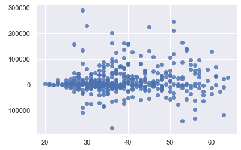
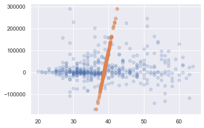

<script src="https://cdnjs.cloudflare.com/ajax/libs/require.js/2.3.6/require.min.js" integrity="sha512-c3Nl8+7g4LMSTdrm621y7kf9v3SDPnhxLNhcjFJbKECVnmZHTdo+IRO05sNLTH/D3vA6u1X32ehoLC7WFVdheg==" crossorigin="anonymous"></script>
<script src="https://cdnjs.cloudflare.com/ajax/libs/jquery/3.5.1/jquery.min.js" integrity="sha512-bLT0Qm9VnAYZDflyKcBaQ2gg0hSYNQrJ8RilYldYQ1FxQYoCLtUjuuRuZo+fjqhx/qtq/1itJ0C2ejDxltZVFg==" crossorigin="anonymous"></script>
<script type="application/javascript">define('jquery', [],function() {return window.jQuery;})</script>


-   hide: true
-   toc: true
-   comments: true
-   categories: \[stats\]

``` python
from datetime import datetime

import matplotlib.pyplot as plt
import numpy as np
import pandas as pd
import seaborn as sns; sns.set()
import statsmodels.api as sm
```

``` python
def make_data():
    """Fetch and prepare data used for examples."""
    fp = 's3://fgu-samples/transactions.parquet'
    cols = ['amount', 'user_id', 'year_of_birth', 'gender']
    
    df = pd.read_parquet(fp, columns=cols)
    df = df[df.gender.isin(['m', 'f'])]
    df['age'] = datetime.now().year - df.year_of_birth
    df['male'] = df.gender == 'm'
    df = df.rename(columns={'amount': 'spend'})
    g = df.groupby('user_id')
    df = g.agg({'spend': 'sum', 'age': 'first', 'male': 'first'})
    return df

df = make_data()
df.head(3)
```

<div>
<style scoped>
    .dataframe tbody tr th:only-of-type {
        vertical-align: middle;
    }

    .dataframe tbody tr th {
        vertical-align: top;
    }

    .dataframe thead th {
        text-align: right;
    }
</style>

|         | spend         | age  | male  |
|---------|---------------|------|-------|
| user_id |               |      |       |
| 977     | 36665.800781  | 48.0 | True  |
| 3277    | 17830.087891  | 34.0 | False |
| 4277    | -24827.089844 | 62.0 | True  |

</div>

### 

### Basics

``` python
from sklearn.decomposition import PCA

pca = PCA(n_components=1)
pca.fit(df)
```

    PCA(n_components=1)

The fitted PCA's component attribute contains the loading vectors of each principal component, which, in turn, contain the loadings for each of the original features.

``` python
pca.components_
```

    array([[ 1.00000000e+00,  1.30713265e-05, -5.78356798e-07]])

By definition, their squares have to sum to zero. Let's check:

``` python
np.sum(np.square(pca.components_))
```

    1.0

Let's transform the data

``` python
df_pca = pca.transform(df)
df_pca[:5]
```

    array([[ 21732.90091993],
           [  2897.18784849],
           [-39759.98951681],
           [ 72551.13144968],
           [-21768.62012473]])

We could have done this manually, like to:

``` python
((df - df.mean()) * pca.components_[0]).sum(1)[:5]
```

    user_id
    977     21732.900508
    3277     2897.187436
    4277   -39759.989929
    5377    72551.131038
    7077   -21768.620537
    dtype: float64

### Dimensionality reduction

``` python
plt.scatter(data=df, x='age', y='spend', alpha=0.8);
```



``` python
pca = PCA(n_components=1)
df_pca = pca.fit_transform(df)
df_new = pca.inverse_transform(df_pca)
```

``` python
plt.scatter(data=df, x='age', y='spend', alpha=0.2);
plt.scatter(df_new[:, 1], df_new[:, 0], alpha=0.6);
```



# Sources

-   [The hundred-page machine learning book](http://themlbook.com)
-   [An introduction to statistical learning](https://www.statlearning.com)
