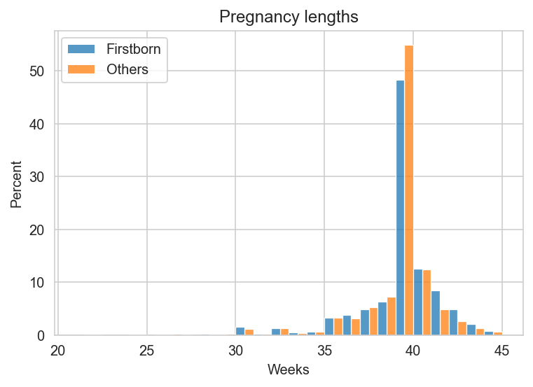
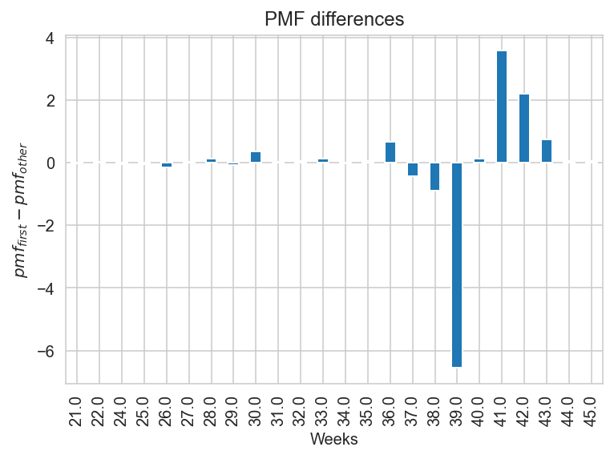
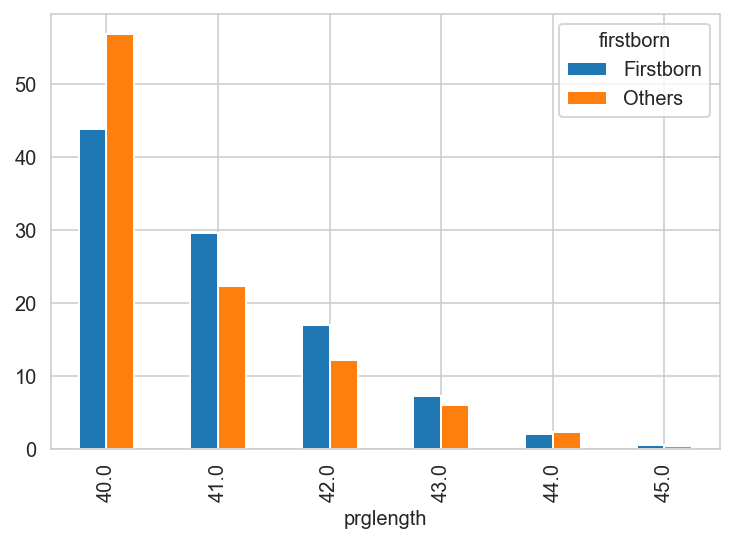
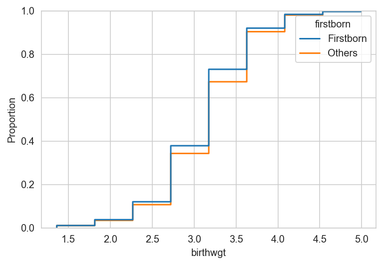
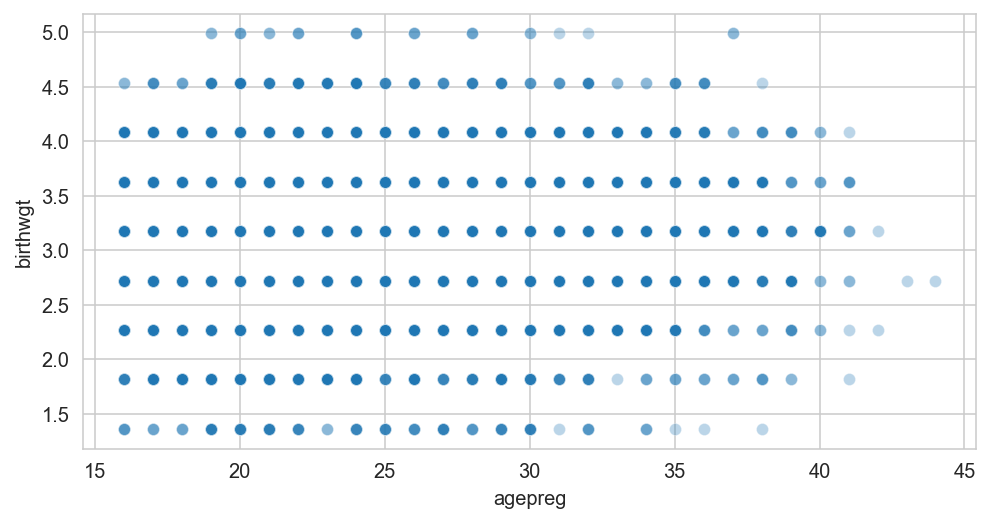

<script src="https://cdnjs.cloudflare.com/ajax/libs/require.js/2.3.6/require.min.js" integrity="sha512-c3Nl8+7g4LMSTdrm621y7kf9v3SDPnhxLNhcjFJbKECVnmZHTdo+IRO05sNLTH/D3vA6u1X32ehoLC7WFVdheg==" crossorigin="anonymous"></script>
<script src="https://cdnjs.cloudflare.com/ajax/libs/jquery/3.5.1/jquery.min.js" integrity="sha512-bLT0Qm9VnAYZDflyKcBaQ2gg0hSYNQrJ8RilYldYQ1FxQYoCLtUjuuRuZo+fjqhx/qtq/1itJ0C2ejDxltZVFg==" crossorigin="anonymous"></script>
<script type="application/javascript">define('jquery', [],function() {return window.jQuery;})</script>


Source: Think Stats

``` python
import matplotlib.pyplot as plt
import numpy as np
import pandas as pd
import scipy.stats as stats
import seaborn as sns
import statsmodels.formula.api as smf

sns.set_style("whitegrid")

%config InlineBackend.figure_format ='retina'
```

``` python
# replace with version in helpers and adapt code below

def read_pregnancy_data():
    """Load pregnancy data used in ThinkStats.

    Assumes that pregnancy lengths of < 20 and > 45 weeks are data errors.
    Converts birghweight from pounds to kilograms.
    """

    def extract_idx(s, start, end):
        """Returns cleaned up version of s[start:end]."""
        return (
            s.str[start:end]
            .replace("^\s*$", np.nan, regex=True)
            .str.strip()
            .astype("float")
        )

    fp = "https://greenteapress.com/thinkstats/2002FemPreg.dat.gz"
    fb_labs = {True: "Firstborn", False: "Others"}
    return (
        pd.read_table(fp, header=None, names=["line"])
        .assign(
            caseid=lambda df: df.line.str[:12].str.strip().astype("int"),
            babysex=lambda df: extract_idx(df.line, 55, 56),
            birthord=lambda df: extract_idx(df.line, 277, 279),
            firstbornn=lambda df: df.birthord.eq(1),
            firstborn=lambda df: df.firstbornn.map(fb_labs).astype("category"),
            prglength=lambda df: extract_idx(df.line, 274, 276),
            birthwgt=lambda df: extract_idx(df.line, 56, 58) / 2.205,
            outcome=lambda df: extract_idx(df.line, 276, 277),
            agepreg=lambda df: extract_idx(df.line, 283, 285),
        )
        .drop(columns="line")
        .loc[lambda df:
             df.prglength.between(20, 45)
             & df.birthwgt.between(1, 5)
             & df.agepreg.between(16, 50)
             & df.outcome.eq(1)
        ]
    )


df = read_pregnancy_data()
df.head(3)
```

<div>
<style scoped>
    .dataframe tbody tr th:only-of-type {
        vertical-align: middle;
    }

    .dataframe tbody tr th {
        vertical-align: top;
    }

    .dataframe thead th {
        text-align: right;
    }
</style>

|     | caseid | babysex | birthord | firstbornn | firstborn | prglength | birthwgt | outcome | agepreg |
|-----|--------|---------|----------|------------|-----------|-----------|----------|---------|---------|
| 0   | 1      | 1.0     | 1.0      | True       | Firstborn | 39.0      | 3.628118 | 1.0     | 33.0    |
| 1   | 1      | 2.0     | 2.0      | False      | Others    | 39.0      | 3.174603 | 1.0     | 39.0    |
| 3   | 2      | 2.0     | 2.0      | False      | Others    | 39.0      | 3.174603 | 1.0     | 17.0    |

</div>

``` python
def firstborn_pmfs(data):
    ax = sns.histplot(
        data=data,
        x="prglength",
        hue="firstborn",
        multiple="dodge",
        stat="percent",
        common_norm=False,
        binwidth=1,
    )
    ax.set(xlabel="Weeks", title="Pregnancy lengths")
    ax.legend_.set_title(None)


firstborn_pmfs(df)
```



``` python
def firstborn_dpmfs():
    counts = df.groupby(["prglength", "firstborn"]).size().unstack().fillna(0)
    probs = counts / counts.sum() * 100
    diffs = probs.Firstborn - probs.Others
    return diffs.plot(
        kind="bar",
        xlabel="Weeks",
        ylabel="$pmf_{first} - pmf_{other}$",
        title="PMF differences",
    )


firstborn_dpmfs();
```



``` python
def conditional_pmf(current_wk=0):
    counts = df.groupby(["prglength", "firstborn"]).size().unstack().fillna(0)
    subset = counts.loc[current_wk:]
    return subset / subset.sum() * 100


conditional_pmf(40).plot(kind="bar");
```



``` python
sns.ecdfplot(data=df, x="birthwgt", hue="firstborn");
```


## Distributions

### Exponential distribution

-   CDF is $CDF(x) = 1 - e^{-\lambda x}$

``` python
pal = 'Paired'
print(sns.color_palette(pal).as_hex())
sns.color_palette(pal)


# colors = sns.color_palatte('Paired')[:4]
```

    ['#a6cee3', '#1f78b4', '#b2df8a', '#33a02c', '#fb9a99', '#e31a1c', '#fdbf6f', '#ff7f00', '#cab2d6', '#6a3d9a', '#ffff99', '#b15928']

<svg  width="660" height="55"><rect x="0" y="0" width="55" height="55" style="fill:#a6cee3;stroke-width:2;stroke:rgb(255,255,255)"/><rect x="55" y="0" width="55" height="55" style="fill:#1f78b4;stroke-width:2;stroke:rgb(255,255,255)"/><rect x="110" y="0" width="55" height="55" style="fill:#b2df8a;stroke-width:2;stroke:rgb(255,255,255)"/><rect x="165" y="0" width="55" height="55" style="fill:#33a02c;stroke-width:2;stroke:rgb(255,255,255)"/><rect x="220" y="0" width="55" height="55" style="fill:#fb9a99;stroke-width:2;stroke:rgb(255,255,255)"/><rect x="275" y="0" width="55" height="55" style="fill:#e31a1c;stroke-width:2;stroke:rgb(255,255,255)"/><rect x="330" y="0" width="55" height="55" style="fill:#fdbf6f;stroke-width:2;stroke:rgb(255,255,255)"/><rect x="385" y="0" width="55" height="55" style="fill:#ff7f00;stroke-width:2;stroke:rgb(255,255,255)"/><rect x="440" y="0" width="55" height="55" style="fill:#cab2d6;stroke-width:2;stroke:rgb(255,255,255)"/><rect x="495" y="0" width="55" height="55" style="fill:#6a3d9a;stroke-width:2;stroke:rgb(255,255,255)"/><rect x="550" y="0" width="55" height="55" style="fill:#ffff99;stroke-width:2;stroke:rgb(255,255,255)"/><rect x="605" y="0" width="55" height="55" style="fill:#b15928;stroke-width:2;stroke:rgb(255,255,255)"/></svg>

### Baby weights

First born babies tend to be leighter than others

``` python
df.groupby('firstborn').birthwgt.mean()
```

    firstborn
    Firstborn    3.093493
    Others       3.151810
    Name: birthwgt, dtype: float64

``` python
sns.ecdfplot(data=df, x='birthwgt', hue='firstborn');
```



Is that because mothers of first born babies are younger? For this to be the case, it wound need to be the case that a) mothers of first born babies are younger (which is necessarily true) and b) that babies of younger mothers are also lighter.

``` python
fig, ax = plt.subplots(figsize=(8, 4))
sns.scatterplot(data=df, x='agepreg', y='birthwgt', alpha=0.3, ax=ax);
```



``` python
df[['agepreg', 'birthwgt']].corr()
```

<div>
<style scoped>
    .dataframe tbody tr th:only-of-type {
        vertical-align: middle;
    }

    .dataframe tbody tr th {
        vertical-align: top;
    }

    .dataframe thead th {
        text-align: right;
    }
</style>

|          | agepreg  | birthwgt |
|----------|----------|----------|
| agepreg  | 1.000000 | 0.076252 |
| birthwgt | 0.076252 | 1.000000 |

</div>

``` python
m = smf.ols('birthwgt ~ agepreg', data=df).fit()
print(m.summary())
```

                                OLS Regression Results                            
    ==============================================================================
    Dep. Variable:               birthwgt   R-squared:                       0.006
    Model:                            OLS   Adj. R-squared:                  0.006
    Method:                 Least Squares   F-statistic:                     51.27
    Date:                Mon, 30 May 2022   Prob (F-statistic):           8.71e-13
    Time:                        15:56:39   Log-Likelihood:                -7590.2
    No. Observations:                8768   AIC:                         1.518e+04
    Df Residuals:                    8766   BIC:                         1.520e+04
    Df Model:                           1                                         
    Covariance Type:            nonrobust                                         
    ==============================================================================
                     coef    std err          t      P>|t|      [0.025      0.975]
    ------------------------------------------------------------------------------
    Intercept      2.9243      0.029    102.215      0.000       2.868       2.980
    agepreg        0.0081      0.001      7.160      0.000       0.006       0.010
    ==============================================================================
    Omnibus:                      116.753   Durbin-Watson:                   1.604
    Prob(Omnibus):                  0.000   Jarque-Bera (JB):              166.500
    Skew:                          -0.163   Prob(JB):                     7.00e-37
    Kurtosis:                       3.592   Cond. No.                         118.
    ==============================================================================

    Notes:
    [1] Standard Errors assume that the covariance matrix of the errors is correctly specified.
