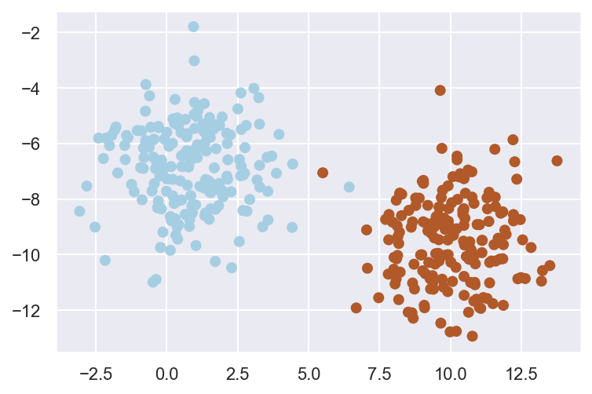
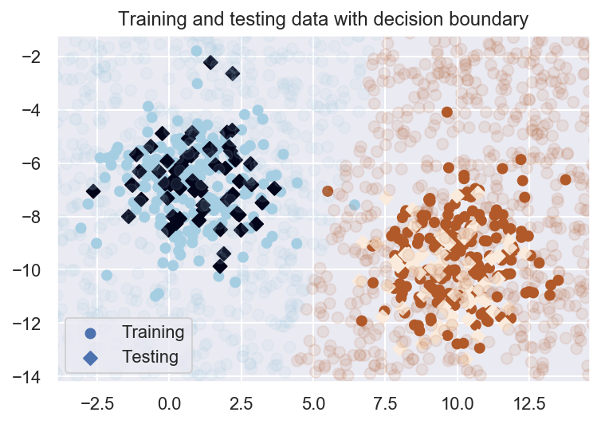

## Setup

We're interested in estimating $P(L|features)$, the probability of a label given a collection of features.

Bayes's formula helps us express this in terms of things we can measure in the data as:

$$P(L|features) = \frac{P(features|L) * P(L)}{P(features)}$$

To decide which label is more probable given a set of features, we can compute the posterior ratio of likelihoods:

$$\frac{P(L_1|features)}{P(L_2|features)} = \frac{P(features|L_1) * P(L_1)}{P(features|L_2) * P(L_2)}$$.

To be able to do this, we need to specify a generative model (a hypothetical random process that generates the data) for each label in the data. Generating these models is the main task of training a Bayesian classifier.

A naive Bayesian classifier comes about by making naive assumptions about the nature of these models, which can, in principle, be quite complex.

## Gaussian Naive Bayes

A simple approach is to assume that data from each label is drawn from a simple Gaussian distribution (with no covariance between them). We can then estimate the mean and standard deviation for each set of labelled points, which is all we need to estimate the distribution. Once we have the distribution, we can calculate the likelihood of being drawn from the distribution for each new data-point, and thus compute the posterior ratio above.

``` python
import matplotlib.pyplot as plt
import numpy as np
import seaborn as sns
from sklearn.datasets import make_blobs
from sklearn.model_selection import train_test_split

sns.set()

X, y = make_blobs(500, 2, centers=2, random_state=1223, cluster_std=1.5)

Xtrain, Xtest, ytrain, ytest = train_test_split(X, y)
plt.scatter(Xtrain[:, 0], Xtrain[:, 1], c=ytrain, cmap="Paired");
```



``` python
from sklearn.naive_bayes import GaussianNB

model = GaussianNB().fit(Xtrain, ytrain)

# New data to show decision boundary
rng = np.random.RandomState(1223)
Xnew = [-5, -14] + [20, 20] * rng.rand(2000, 2)
ynew = model.predict(Xnew)


plt.scatter(Xtrain[:, 0], Xtrain[:, 1], c=ytrain, cmap="Paired", label="Training")
plt.scatter(Xtest[:, 0], Xtest[:, 1], c=ytest, marker="D", label="Testing")
lim = plt.axis()
plt.scatter(Xnew[:, 0], Xnew[:, 1], c=ynew, s=50, cmap="Paired", alpha=0.1)
plt.axis(lim)
plt.legend()
plt.title("Training and testing data with decision boundary");
```



## Sources

-   [Python Data Science Handbook](https://www.oreilly.com/library/view/python-data-science/9781491912126/)
