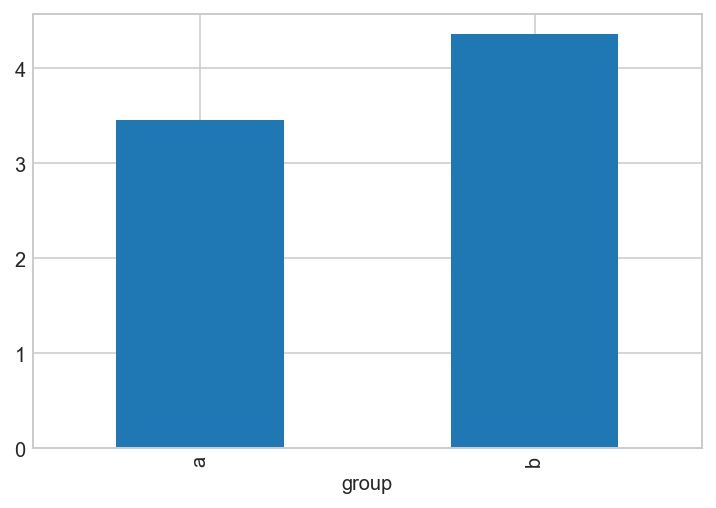
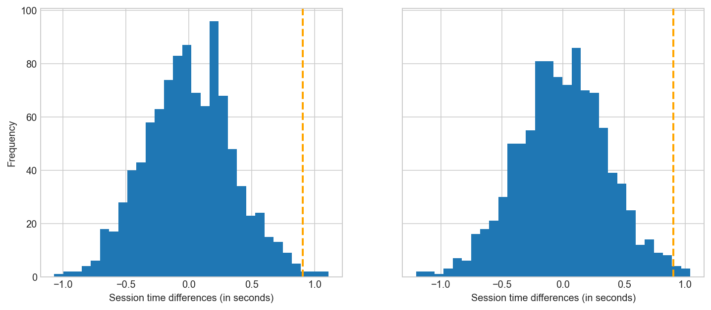
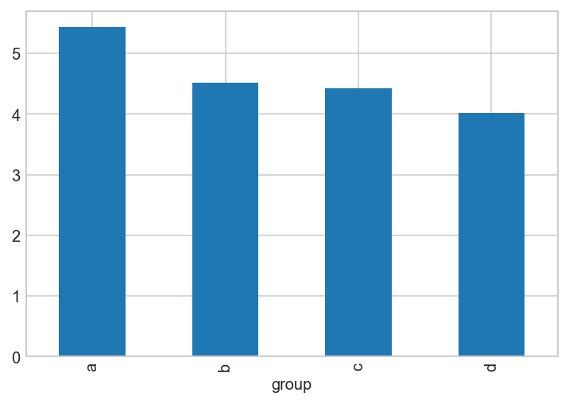

<script src="https://cdnjs.cloudflare.com/ajax/libs/require.js/2.3.6/require.min.js" integrity="sha512-c3Nl8+7g4LMSTdrm621y7kf9v3SDPnhxLNhcjFJbKECVnmZHTdo+IRO05sNLTH/D3vA6u1X32ehoLC7WFVdheg==" crossorigin="anonymous"></script>
<script src="https://cdnjs.cloudflare.com/ajax/libs/jquery/3.5.1/jquery.min.js" integrity="sha512-bLT0Qm9VnAYZDflyKcBaQ2gg0hSYNQrJ8RilYldYQ1FxQYoCLtUjuuRuZo+fjqhx/qtq/1itJ0C2ejDxltZVFg==" crossorigin="anonymous"></script>
<script type="application/javascript">define('jquery', [],function() {return window.jQuery;})</script>


``` python
import matplotlib.pyplot as plt
import numpy as np
import pandas as pd
import statsmodels.api as sm

plt.style.use("seaborn-whitegrid")
%config InlineBackend.figure_format ='retina'
```

An experiment is a proceedure to test whether one or multiple variations on the status quo deliver superior results.

We generally proceed in the following ways:

1.  Define the problem (e.g. improve search experience)
2.  Design solution (e.g. new landing page for dead searches)
3.  Define outcome metric to be improved (e.g. number of dead searches)

3.1 Design experiment

    - Level and type of randomisation
        - Spillovers
        - Feasibility
        - Seasonality

    - Variable to measure and level of measurement

1.  Define target population and sampling approach

2.  Specify hypothesis

3.  Conduct power calculations

    -   Coverage: doesn longer experiment duration change sample composision?

4.  Randomise units into groups

5.  Run experiment

6.  Analyse results

7.  Communicate results

# Design

# Target population and sampling approach

``` python
n = 1000
cities = ["London", "Bath", "Leeds"]

rng = np.random.default_rng(2312)

data = {
    "ids": np.arange(n),
    "age": rng.normal(45, 20, n).astype("int"),
    "female": rng.integers(0, 2, n),
    "city": rng.choice(cities, n),
}
df = pd.DataFrame(data)
df.head()
```

<div>
<style scoped>
    .dataframe tbody tr th:only-of-type {
        vertical-align: middle;
    }

    .dataframe tbody tr th {
        vertical-align: top;
    }

    .dataframe thead th {
        text-align: right;
    }
</style>

|     | ids | age | female | city   |
|-----|-----|-----|--------|--------|
| 0   | 0   | 27  | 0      | Leeds  |
| 1   | 1   | 32  | 0      | London |
| 2   | 2   | 59  | 0      | Leeds  |
| 3   | 3   | 30  | 0      | Bath   |
| 4   | 4   | 34  | 1      | Leeds  |

</div>

## Hypotheses

## Power

## Randomisation

### Methods

-   Level of randomisation
-   Simple randomisation
-   Stratified randomisation

### Balance checks

## Implementation

## Communicate results

### Randomisation functions

``` python
# Create routines for simple and blocked randomisation


def simple_rand(df, n_groups):

    # Randomly sort df rows
    df = df.sample(frac=1).reset_index(drop=True)

    # Allocate to groups
    df["group"] = np.ceil(n_groups * (df.index + 1) / len(df)).astype("int")

    return df


def blocked_rand(df, n_groups, block_vars):

    return df.groupby(block_vars).apply(simple_rand, n_groups).reset_index(drop=True)


blocked_rand(df, 3, ["city", "female"]).head()
```

<div>
<style scoped>
    .dataframe tbody tr th:only-of-type {
        vertical-align: middle;
    }

    .dataframe tbody tr th {
        vertical-align: top;
    }

    .dataframe thead th {
        text-align: right;
    }
</style>

|     | ids | age | female | city       | group |
|-----|-----|-----|--------|------------|-------|
| 0   | 33  | 22  | 0      | Birmingham | 1     |
| 1   | 20  | 12  | 0      | Birmingham | 1     |
| 2   | 46  | 47  | 0      | Birmingham | 1     |
| 3   | 73  | 21  | 0      | Birmingham | 1     |
| 4   | 34  | 38  | 0      | Birmingham | 2     |

</div>

## Significance testing

My notes from working through section 3, experiments and significance testing, of [Practical statistics for data science](https://learning.oreilly.com/library/view/practical-statistics-for/9781492072935/), to revise consepts and get comfortable implementing them in Python.

### The basic experimental process:

-   Formulate a hypothesis
-   Design experiment
-   Collect data
-   Draw inferences and conclusions

### Hypothesis testing

-   The book makes a nice point about why we need hypothesis testing in the first place: to guard against our tendency to underestimate chance, and, as a result, to interprete observed differences as being driven by something "real" (e.g. our treatment).
-   A nice example is our intuition of what a random series of coin flips looks like: most people will switch between heads and tail too frequently, believing that five heads in a row are very unlikely in a series of 50 flips (which it is not).

### Resampling

-   Means to repeatedly sample values from observed data to assess variability in a statistic.
-   There are two main approaches: the bootstrap, usually used to assess the reliability of an estimate (see distributions notebook), and permutation tests, used to test hypotheses.

### Permutation tests

-   Is a way to perform hypothesis testing while being agnostic about the outcome distribution. In a traditional hypothesis test, we assume that the outcome variable (e.g. the difference between treatment and control outcome) has a certain distribution (usually t or standard normal) and then see where in that distribution the observed outcome falls: if it's far out on either tail of the distribution, beyond some critical value (usually the 2.5th percentile on either end) we conclude that the result is unlikely to be produced by chance and reject the null hypothesis.
-   A permutation test works the same except that we don't compare our outcome to a theoretical distribution, but to a distribution we create. We create the distribution by pooling all outcome data, resampling (without replacement) to construct groups of the size of each treatment group, and then comparing the outcomes. This outcome is one observation. We then repeat this procedure R times to build a distribution of outcomes, and finally compare our original outcome to the distribution to see where it falls and how likely it is to be a product of chance.
-   Permutation tests come in three variants: random permutation tests, exhaustive permuation tests, and bootstrap permutation tests. The first is as described above, in the second we construct our permutatin samples such that they cover all possible cases we can construct, and in a bootstrap test we sample with replacement. The exhaustive test is sometimes clled "exact test" because it guarantees that we will not find a significant result more often than the alpha level of the test. Bootstrap resampling models not only the randomness in the treatment allocation to subjects (as random variation does) but also the randomness in the sampling of subjects from a population.
-   Hence: bootstrap models both sampling and randomisation variation

**Example: random permutation test for web stickiness**

Create data

``` python
rng = np.random.default_rng(2312)

sessions_a = rng.normal(3.5, 1, 25)
sessions_b = np.random.normal(4.5, 1, 15)
session_times = np.concatenate([sessions_a, sessions_b])
groups = ["a"] * 25 + ["b"] * 15
df = pd.DataFrame({"group": groups, "session_time": session_times})
df.sample(3)
```

<div>
<style scoped>
    .dataframe tbody tr th:only-of-type {
        vertical-align: middle;
    }

    .dataframe tbody tr th {
        vertical-align: top;
    }

    .dataframe thead th {
        text-align: right;
    }
</style>

|     | group | session_time |
|-----|-------|--------------|
| 20  | a     | 5.540896     |
| 4   | a     | 2.980558     |
| 19  | a     | 2.211652     |

</div>

Calculate and plot means

``` python
mean_a = df[df["group"] == "a"].session_time.mean()
mean_b = df[df["group"] == "b"].session_time.mean()
mean_diff = mean_b - mean_a
df.groupby("group").mean().plot(kind="bar", legend=None)
print(f"Mean difference in session times is {mean_diff:.2} seconds.")
```

    Mean difference in session times is 0.9 seconds.



Create permutations

``` python
np.random.choice

def random_perm(x, n_a, n_b):
    """Return difference in x for random groups of size n_a
    and n_b (groups are sampled without replacement)."""
    n = n_a + n_b
    idx_a = set(rng.choice(range(n), n_a))
    idx_b = set(range(n)) - idx_a
    return x.loc[idx_a].mean() - x.loc[idx_b].mean()


def bootstrap_perm(x, n_a, n_b):
    """Return difference in x for random groups of size n_a
    and n_b (groups are sampled with replacement)."""
    n = n_a + n_b
    idx_a = rng.choice(range(n), n_a)
    idx_b = rng.choice(range(n), n_b)
    return x.loc[idx_a].mean() - x.loc[idx_b].mean()


random_diffs = [random_perm(df.session_time, 25, 15) for _ in range(1000)]
bootstrap_diffs = [bootstrap_perm(df.session_time, 25, 15) for _ in range(1000)]
```

Plot distribution of permuation differences and group difference and calculate p-value

``` python
fig, (ax0, ax1) = plt.subplots(1, 2, sharey=True, figsize=(12, 5))

ax0.hist(random_diffs, bins=30)
ax0.axvline(mean_diff, color="orange", lw=2, ls="--")
ax0.set_xlabel("Session time differences (in seconds)")
ax0.set_ylabel("Frequency")

ax1.hist(bootstrap_diffs, bins=30)
ax1.axvline(mean_diff, color="orange", lw=2, ls="--")
ax1.set_xlabel("Session time differences (in seconds)")

p_random = sum(random_diffs > mean_diff) / len(random_diffs)
p_bootstrap = sum(bootstrap_diffs > mean_diff) / len(bootstrap_diffs)
print(f"Random: P-value of observed difference is {p_random}")
print(f"Bootstrap: P-value of observed difference is {p_bootstrap}")
```

    Random: P-value of observed difference is 0.005
    Bootstrap: P-value of observed difference is 0.006



**Example: comparing resampling and formal testing**\*

We have different conversion rates for two prices A and B as shown below. Test whether the difference in conversion rates is statistically significant at the 5 percent level.

Price A: conversion: 200; non-conversion 23539

Price B: conversion: 182; non-conversion 22406

Create dataset

``` python
a_c, a_nc = [200, 23539]
b_c, b_nc = [182, 22406]
a_n = a_c + a_nc
b_n = b_c + b_nc
groups = ["a"] * a_n + ["b"] * b_n
outcomes = [1] * a_c + [0] * a_nc + [1] * b_c + [0] * b_nc
df = pd.DataFrame({"group": groups, "conv": outcomes})
df.head()
```

<div>
<style scoped>
    .dataframe tbody tr th:only-of-type {
        vertical-align: middle;
    }

    .dataframe tbody tr th {
        vertical-align: top;
    }

    .dataframe thead th {
        text-align: right;
    }
</style>

|     | group | conv |
|-----|-------|------|
| 0   | a     | 1    |
| 1   | a     | 1    |
| 2   | a     | 1    |
| 3   | a     | 1    |
| 4   | a     | 1    |

</div>

Calculate difference in conversion rate

``` python
conv_a = df[df.group.eq("a")].conv.mean()
conv_b = df[df.group.eq("b")].conv.mean()
conv_diff = conv_a - conv_b
print(f"Difference in conversion rate is {conv_diff * 100:.3} percentage points.")
```

    Difference in conversion rate is 0.0368 percentage points.

Test significance using random permutation test

``` python
diffs = [random_perm(df.conv, a_n, b_n) for _ in range(1000)]
p = sum(diff > conv_diff for diff in diffs) / len(diffs)
print(f"P-value is: {p:.3f}")
```

    P-value is: 0.336

Test using a one-sided two-proportion z-test

``` python
convs = np.array([a_c, b_c])
obs = np.array([a_n, b_n])
z, p = sm.stats.proportions_ztest(convs, obs, alternative="larger")
print(f"P-value is: {p:.3f}")
```

    P-value is: 0.331

Test using a one-sided t-test

``` python
outcomes_a = df[df.group.eq("a")].conv
outcomes_b = df[df.group.eq("b")].conv
t, p, _ = sm.stats.ttest_ind(outcomes_a, outcomes_b, usevar='unequal')
print(f"P-value is: {p / 2:.3f}")
```

    P-value is: 0.331

### Multiple hypothesis testing

-   If we use a significance level of 5 percent, then if we run 20 hypothesis tests the probability that we will at least make one Type I error (find a significant result purely due to chance) is $1 - 0.95^{20} = 0.64$.
-   This, in essence, captures the problem of multiple comparisons, which applies similarly to trying out different model specifications and models -- the more you try, the larger the probability that significant results appear due to chance.
-   Ways to guard against this:
    -   Explicit corrections (like Bonferroni) in the case of multiple hypothesis tests
    -   Holdout sets in classification tasks, awareness of the problem in unsupervised learning tasks

### ANOVA

-   ANOVA decomposes the overall variance between groups into between- and within-group variance, and then constructs an F-test using the ratio of the two sources of variance to assess the likelihood that the observed between-group variance is a result of chance.

-   One use of this is to test whether means of multiple groups differ statistically (i.e. whether the variance between them is unlikely to result from chance).

-   The test is an omnibus test and tells us whether there is significant variation in the data overall (whether some group means are significantly different from others), but not which ones differ and by how much.

-   For this, we can conduct so-called post-hoc tests, which are simple pair-wise t-tests, usually with adjusted significance levels to account for the multiple testing problem. Two common approaches are Tukey's HSD test and Bonferroni's correction approach.

-   One way to straightforwardly perform an ANOVA analysis is to encode group indicators as dummies and then regress the outcome variable on the set of dummies (either dropping one and including an intercept, or including all dummies but omitting the intrecept). The F-test of the regression, which tests for whether the model as a whole (i.e. all estimators together) has explanatory power is exactly the ANOVA F-test.

-   As Peter Kennedy explains on p. 240 of his textbook, if you know multiple regression and understand the use of dummy variables, then there is no need to worry about ANOVA, because regression gives you ANOVA plus additional useful output (like parameter estimates for each group). But it's obviously worthwhile to know the link between the two.

-   Helpful references: [here](https://pythonfordatascience.org/anova-python/)

``` python
# Create dataset

np.random.seed(2312)
n = 10
groups = np.sort(["a", "b", "c", "d"] * n)
times_a = np.random.normal(5, 1, n)
times_b = np.random.normal(4.5, 1, n)
times_c = np.random.normal(4.25, 1, n)
times_d = np.random.normal(4, 1, n)
times = np.concatenate([times_a, times_b, times_c, times_d])
df = pd.DataFrame({"group": groups, "time": times})
df.head()

observed_var = df.groupby("group").mean().var()[0]

df.groupby("group").mean().plot(kind="bar", legend=None)
print(f"Observed variance of means is {observed_var:.2}.")
```

    Observed variance of means is 0.36.



``` python
# ANOVA using a permutation test

np.random.seed(231286)


def perm_var(df):
    df = df.copy()
    df["time"] = np.random.permutation(df["time"].values)
    return df.groupby("group").mean().var()[0]


p = np.mean([perm_var(df) > observed_var for _ in range(1000)])
print(f"P-value is {p:.3}")
```

    P-value is 0.028

``` python
# ANOVA in scipy

from scipy import stats

dataA = df[df["group"] == "a"].time
dataB = df[df["group"] == "b"].time
dataC = df[df["group"] == "c"].time
dataD = df[df["group"] == "d"].time

F, p = stats.f_oneway(dataA, dataB, dataC, dataD)
print(f"F-statistic is {F:.4}, p-value is {p:.3}")
```

    F-statistic is 3.317, p-value is 0.0306

``` python
# ANOVA with statsmodels

x = pd.get_dummies(df["group"]).values
y = df["time"].values

print(sm.OLS(y, x).fit().summary())
```

                                OLS Regression Results                            
    ==============================================================================
    Dep. Variable:                      y   R-squared:                       0.217
    Model:                            OLS   Adj. R-squared:                  0.151
    Method:                 Least Squares   F-statistic:                     3.317
    Date:                Wed, 08 Jun 2022   Prob (F-statistic):             0.0306
    Time:                        11:42:07   Log-Likelihood:                -56.023
    No. Observations:                  40   AIC:                             120.0
    Df Residuals:                      36   BIC:                             126.8
    Df Model:                           3                                         
    Covariance Type:            nonrobust                                         
    ==============================================================================
                     coef    std err          t      P>|t|      [0.025      0.975]
    ------------------------------------------------------------------------------
    x1             5.4287      0.327     16.588      0.000       4.765       6.092
    x2             4.5132      0.327     13.790      0.000       3.849       5.177
    x3             4.4185      0.327     13.501      0.000       3.755       5.082
    x4             4.0181      0.327     12.277      0.000       3.354       4.682
    ==============================================================================
    Omnibus:                        0.738   Durbin-Watson:                   1.894
    Prob(Omnibus):                  0.691   Jarque-Bera (JB):                0.746
    Skew:                           0.295   Prob(JB):                        0.689
    Kurtosis:                       2.686   Cond. No.                         1.00
    ==============================================================================

    Notes:
    [1] Standard Errors assume that the covariance matrix of the errors is correctly specified.

Interpretation of output:

-   F(3, 36)-test is test statistics for ANOVA.
-   Durbin-Watson tests for autocorrelation in the residuals and takes values between 0 and 4, with 2 meaning no autocorrelation and values between \[1.5, 2.5\] considered to be relatively normal. Values below 2 indicate positive autocorrelation, values above 2 negative autocorrelation. Above, we have slight positive autocorrelation.
-   Omnibus tests for homogeneity of variance, which is not rejected above.
-   J-B tests for normality of the errors, which, too, is not rejected.

Finally, we want to do pair-wise comparisons (post-hoc test in ANOVA lingo) to test for differerent effects among the different groups.

``` python
# Pairwise comparisons using Tukey's HSD (honest significant difference) test

from statsmodels.stats.multicomp import MultiComparison, pairwise_tukeyhsd

mc = MultiComparison(df["time"], df["group"])
print(mc.tukeyhsd())
```

    Multiple Comparison of Means - Tukey HSD, FWER=0.05 
    ====================================================
    group1 group2 meandiff p-adj   lower   upper  reject
    ----------------------------------------------------
         a      b  -0.9155 0.2152  -2.162   0.331  False
         a      c  -1.0102 0.1475 -2.2567  0.2363  False
         a      d  -1.4107 0.0214 -2.6572 -0.1641   True
         b      c  -0.0947    0.9 -1.3412  1.1518  False
         b      d  -0.4952 0.6891 -1.7417  0.7514  False
         c      d  -0.4005 0.8021  -1.647  0.8461  False
    ----------------------------------------------------

``` python
# Pairwise comparison using the Bonferroni correction

from itertools import combinations

groups = df["group"].unique()
n_comparisons = len([c for c in combinations(groups, 2)])
alpha_adjusted = 0.05 / n_comparisons

print(f"Adjusted alpha is {alpha_adjusted:.3}")
for a, b in combinations(groups, 2):
    t, p = stats.ttest_ind(df["time"][df["group"] == a], df["time"][df["group"] == b])
    print(f"{a} vs {b}: p-value: {p:.3}, reject H0: {p < alpha_adjusted}")
```

    Adjusted alpha is 0.00833
    a vs b: p-value: 0.0621, reject H0: False
    a vs c: p-value: 0.0342, reject H0: False
    a vs d: p-value: 0.00297, reject H0: True
    b vs c: p-value: 0.855, reject H0: False
    b vs d: p-value: 0.32, reject H0: False
    c vs d: p-value: 0.401, reject H0: False

### Chi-Square tests

Uses in data-science:
- Determining appropriate sample size for web experiments where, despite large exposure, actual click rates are low (Fisher's exact test is recommended, here, look at "Lady tasting tea" example).
- As a filter to check whether something is worth pursuing further: is crime concentrated in one area to a degree that is unlikely to result from chance?

Resources:
- [Stat trek](https://stattrek.com/chi-square-test/independence.aspx?Tutorial=AP)

``` python
# Create dataset
data = {
    "counts": [14, 8, 12, 986, 992, 988],
    "groups": ["a", "b", "c"] * 2,
    "col": np.sort(["Clicks", "NoClicks"] * 3),
}
df = pd.DataFrame(data).pivot_table(index="col", columns="groups")
df.columns = df.columns.droplevel()
df
```

<div>
<style scoped>
    .dataframe tbody tr th:only-of-type {
        vertical-align: middle;
    }

    .dataframe tbody tr th {
        vertical-align: top;
    }

    .dataframe thead th {
        text-align: right;
    }
</style>

| groups   | a   | b   | c   |
|----------|-----|-----|-----|
| col      |     |     |     |
| Clicks   | 14  | 8   | 12  |
| NoClicks | 986 | 992 | 988 |

</div>

``` python
# Chi-Squared test using permutation approach


def chi_squared(observed, expected):
    """Returns Chi-Squared test statistic."""
    pearson_residuals = (observed - expected) / np.sqrt(expected)
    chi_squared = np.sum(pearson_residuals) ** 2
    return chi_squared


observed = df.values
expected = [observed[0].mean()] * len(observed[0]) + [observed[1].mean()] * len(
    observed[1]
)
observed = observed.flatten()

chi_squared_observed = chi_squared(observed, expected)


def chi_square_perm(box):
    clicks = [
        sum(random.sample(box, 1000)),
        sum(random.sample(box, 1000)),
        sum(random.sample(box, 1000)),
    ]
    noclicks = [1000 - n for n in clicks]
    observed = np.array([clicks, noclicks]).flatten()
    return chi_squared(observed, expected)


box = [1] * df.loc["Clicks"].sum() + [0] * df.loc["NoClicks"].sum()

perms = [chi_square_perm(box) for _ in range(100)]
p = sum([perm < chi_squared_observed for perm in perms]) / len(perms)
print(f"P-value is {p}.")
```

    P-value is 0.04.

``` python
from scipy import stats

chisq, p, dfs, exp = stats.chi2_contingency(df.values.T)
print(f"p-value: {pvalue:.4f}")
```

    p-value: 0.4348

``` python
import scipy.stats

chi2, p, df, E = stats.chi2_contingency([[a_c, a_nc], [b_c, b_nc]])
print(f"P-value is: {p / 2:.3f}")
```

    P-value is: 0.350

Seems odd that the difference would be this large. But can't figure out what's going on. The test statistics differ widely, and I can't see why. Might look into this at some point.

### Multi-arm bandit algorithms

-   A class of algorithms to decide to what extent and when to shift towards the dominant seeming treatment in an A/B test.
