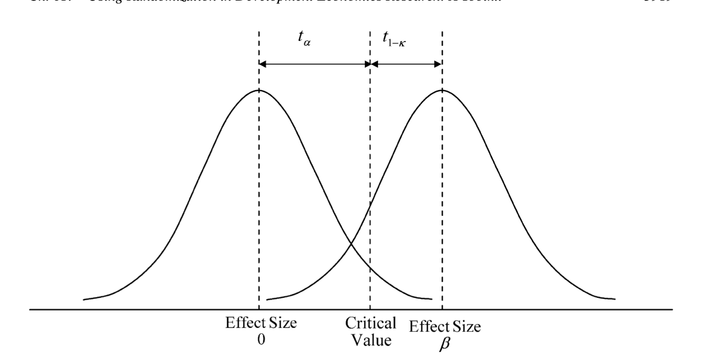

## Theory

based on duflo2008randomization

Power basics

-   In the simplest possible, we randomly draw a sample of size $N$ from an identical population, so that our observations can be assumed to be i.i.d, and we allocate a fraction $P$ of our sample to treatment. We can then estiamte the treatment effect using the OLS regression

$$ y = \alpha + \beta T + \epsilon$$

-   where the standard error of $\beta$ is given by $\sqrt{\frac{1}{P(1-P)}\frac{\sigma^2}{N}}$.

-   std error derivation (from standard variance result of two independent samples, using population fractions):

$$
std = \sqrt{\frac{\sigma^2}{N_t} + \frac{\sigma^2}{N_c}} = \sqrt{\frac{\sigma^2}{PN} + \frac{\sigma^2}{(1-P)N}} = ... = \sqrt{\frac{1}{P(1-P)}\frac{\sigma^2}{N}}
$$

-   The distribution on the left hand side below shows the distribution of our effect size estimator $\hat{\beta}$ if the null hypothesis is true.

-   We reject the null hypothesis if the estimated effect size is larger than the critical value $t_{\alpha}$, determined by the significance level $\alpha$. Hence, for this to happen we need $\hat{\beta} > t_{\alpha} * SE(\hat{\beta})$ (follows from rearranging the t-test formula).

-   On the right is the distribution of $\hat{\beta}$ if the true effect size is $\beta$.

-   The power of the test for a true effect size of $\beta$ is the area under this curve that falls to the right of $t_{\alpha}$. This is the probability that we reject the null hypothesis given that it is false.

-   Hence, to attain a power of $\kappa$ it must be that $\beta > (t_a + t_{1-\kappa}) * SE(\hat{\beta})$, where $t_{1-\kappa}$ is the value from a t-distribution that has $1-\kappa$ of its probability mass to the left (for $\kappa = 0.8$, $t_{1-\kappa} = 0.84$).

-   This means that the minimum detectable effect ($\delta$) is given by:

$$ \delta = (t_a + t_{1-\kappa}) * \sqrt{\frac{1}{P(1-P)}\frac{\sigma^2}{N}} $$

-   Rearranding for the minimum required sample size we get:

$$ N =  \frac{(t_a + t_{1-\kappa})^2}{P(1-P)}\left(\frac{\sigma}{\delta}\right)^2 $$

-   So that the required sample size is inversely proportional to the minimal effect size we wish to detect. This makes sense, it means that the smaller an effect we want to detect, the larger the samle size we need. In particular, given that $N \propto \delta^{-2}$, to detect an effect of half the size we need a sample four times the size.

-   SE($\beta$) also includes measurement error, so this is also a determinant of power.

## Problems with low power

-   Truth inflation: underpowered studies only find a significant effect it the effect size is larger than the true effect size, leading to inflated claims of effect sizes.

## Best practices

-   When aiming to estimate a precise effect size rather than just being interested in statistical significance, use assucance instead of power: instead of choosing a sample size to attain a given level of power, choose sample size so that confidence interval will be suitably narrow 99 percent of the time ([Sample-Size Planning for More Accurate Statistical Power: A Method Adjusting Sample Effect Sizes for Publication Bias and Uncertainty](https://www3.nd.edu/~kkelley/publications/articles/Anderson_Kelley_Maxwell_Psychological_Science_2017.pdf) and [Understanding the new statistics](https://tandfbis.s3.amazonaws.com/rt-media/pp/common/sample-chapters/9780415879682.pdf).)

## Exercises

**1.**

An online shopping site ranks products according to their average rating. Why might this be suboptimal? What could the site do instead?

## Solutions

**1.**

-   The approach is suboptimal because products with few ratings will have much more variance than products with many ratings, and their average rating is thus less reliable. The problem is akin to small US states having the highest *and* lowest rates of kidney cancer, or small schools having highest *and* lowest average pupil performance. Fundamentally, it's a problem of low power -- the sample size is too low to reliably detect a true effect.

-   The solution is to use a shrinkage method: use a weighted average of the product average rating and some global product rating, with the weight of the product average rating being proportional to the number of ratins. This way, products with few ratings will be average, while products with many ratings will reflect their own rating.
