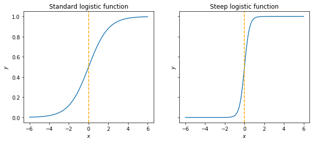

-   For more than two outcome values (e.g. a, b, c):

    -   We can use linear regression and classify outcomes as 1, 2, 3, but we then have to assume that (1) there is a natural ordering between the values, and (2) the distances between them are the same, which is often not true.

    -   Furthermore, we can get predictions outside the interval \[0, 1\], which is nonsensical.

    -   With only two possible outcomes, only the latter is a problem.

The (general) logistic function is a curve with equation:

$$f(x) = \frac{L}{1 + e^{-k(x - x_0)}},$$

where $L$ is the asymptotic upper value of the curve, $e$ is the base of the natural logarithm, $k$ is the steepness of the curve, and $x_0$ is its midpoint.

The standard logistic function, with $L = k = 1$ and $x_0 = 0$ maps values from minus infinity to plus infinity to between 0 and 1.

``` python
def general_logistic(x, L, k, x0):
    return L / (1 + np.exp(-k * (x - x0)))


x = np.linspace(-domain, domain, 100)

fig, (ax0, ax1) = plt.subplots(1, 2, sharey=True, figsize=(10, 4))

ax0.plot(x, general_logistic(x, 1, 1, 0))
ax0.axvline(0, color="orange", linestyle="dashed")
ax0.set(title="Standard logistic function", xlabel="$x$", ylabel="$y$")

ax1.plot(x, general_logistic(x, 1, 4, 0))
ax1.axvline(0, color="orange", linestyle="dashed")
ax1.set(title="Steep logistic function", xlabel="$x$", ylabel="$y$");
```


