<script src="https://cdnjs.cloudflare.com/ajax/libs/require.js/2.3.6/require.min.js" integrity="sha512-c3Nl8+7g4LMSTdrm621y7kf9v3SDPnhxLNhcjFJbKECVnmZHTdo+IRO05sNLTH/D3vA6u1X32ehoLC7WFVdheg==" crossorigin="anonymous"></script>
<script src="https://cdnjs.cloudflare.com/ajax/libs/jquery/3.5.1/jquery.min.js" integrity="sha512-bLT0Qm9VnAYZDflyKcBaQ2gg0hSYNQrJ8RilYldYQ1FxQYoCLtUjuuRuZo+fjqhx/qtq/1itJ0C2ejDxltZVFg==" crossorigin="anonymous"></script>
<script type="application/javascript">define('jquery', [],function() {return window.jQuery;})</script>


-   hide: false
-   toc: true
-   badges: true
-   comments: true
-   categories: \[datascience\]

``` python
import numpy as np
import pandas as pd

import matplotlib.pyplot as plt
import seaborn as sns

%config InlineBackend.figure_format = 'retina'
%load_ext autoreload
%autoreload 2
```

    The autoreload extension is already loaded. To reload it, use:
      %reload_ext autoreload

## Histograms by group

A simple setup to automatically create subplots by iterating over groups in the data, based on [this](https://medium.com/@rayheberer/generating-matplotlib-subplots-programmatically-cc234629b648) Medium post. To use matplotlib histograms, I could use `ax.hist()` instead of `sns.histplot()`.

``` python
df = sns.load_dataset('iris').set_index('species')
df.head(2)
```

<div>
<style scoped>
    .dataframe tbody tr th:only-of-type {
        vertical-align: middle;
    }

    .dataframe tbody tr th {
        vertical-align: top;
    }

    .dataframe thead th {
        text-align: right;
    }
</style>

|         | sepal_length | sepal_width | petal_length | petal_width |
|---------|--------------|-------------|--------------|-------------|
| species |              |             |              |             |
| setosa  | 5.1          | 3.5         | 1.4          | 0.2         |
| setosa  | 4.9          | 3.0         | 1.4          | 0.2         |

</div>

``` python
fig, axes = plt.subplots(2, 2)
fig.suptitle('Distribution of Iris features')
fig.subplots_adjust(hspace=0.5, wspace=0.3)

for ax, data, name in zip(axes.flatten(), df.values.T, df.columns):
    sns.histplot(data, ax=ax, kde=True, bins=len(np.unique(data))//2)
    ax.set(xlabel='cm')
```

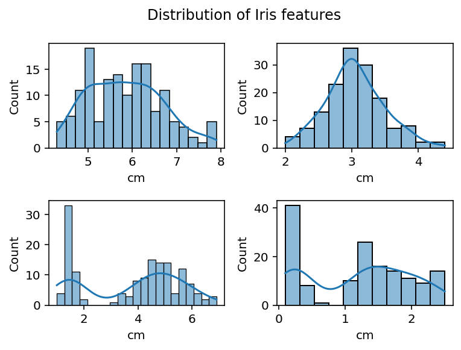

### Effect of holidays on births

From [Python Data Science Handbook](https://www.oreilly.com/library/view/python-data-science/9781491912126/)

``` python
fp = 'https://raw.githubusercontent.com/jakevdp/data-CDCbirths/master/births.csv'

def sigma_clipper(df, column, sigmas=5):
    """
    Eliminate outliers using sigma-clipping.
    
    For a normal distribution, 0.74 is the factor that turns
    the IQR into the standard deviation, sigma. Derivation:
    for standard normal, sigma is 1, q1 and q3 are -0.675 and
    0.675, so that IQR = 1.35. Hence, factor = sigma / IQR
    = 1 / 1.35 = 0.74.
    """
    pcts = np.percentile(df.births, [25, 50, 75])
    mu, sigma = pcts[1], 0.74 * (pcts[2] - pcts[0])
    bound = sigmas * sigma
    return df.query(f'({column} > @mu - @bound) & ({column} < @mu + @bound)')


df = (pd.read_csv(fp)
      .dropna()
      .pipe(sigma_clipper, 'births'))
df.head(2)
```

``` python
# Prepare data

# Eliminate outliers using sigma-clipping
pcts = np.percentile(df.births, [25, 50, 75])
mu, sigma = pcts[1], 0.74 * (pcts[2] - pcts[0])
df = df.query('(births > @mu - 5 * @sigma) & (births < @mu + 5 * @sigma)')

# Create datetime index
df.index = pd.to_datetime(df.year * 10_000 + df.month * 100 + df.day, format='%Y%m%d')

# Make pivot table with month-day index and mean of births column
day_means = df.pivot_table('births', [df.index.month, df.index.day])

# Turn pivot index into year-month-day index (for leap year) for plotting
from datetime import date
day_means.index = [date(2020, month, day) for month, day in day_means.index]
```

``` python
df
```

<div>
<style scoped>
    .dataframe tbody tr th:only-of-type {
        vertical-align: middle;
    }

    .dataframe tbody tr th {
        vertical-align: top;
    }

    .dataframe thead th {
        text-align: right;
    }
</style>

|            | year | month | day  | gender | births |
|------------|------|-------|------|--------|--------|
| 1969-01-01 | 1969 | 1     | 1.0  | F      | 4046   |
| 1969-01-01 | 1969 | 1     | 1.0  | M      | 4440   |
| 1969-01-02 | 1969 | 1     | 2.0  | F      | 4454   |
| 1969-01-02 | 1969 | 1     | 2.0  | M      | 4548   |
| 1969-01-03 | 1969 | 1     | 3.0  | F      | 4548   |
| \...       | \... | \...  | \... | \...   | \...   |
| 1988-12-29 | 1988 | 12    | 29.0 | M      | 5944   |
| 1988-12-30 | 1988 | 12    | 30.0 | F      | 5742   |
| 1988-12-30 | 1988 | 12    | 30.0 | M      | 6095   |
| 1988-12-31 | 1988 | 12    | 31.0 | F      | 4435   |
| 1988-12-31 | 1988 | 12    | 31.0 | M      | 4698   |

<p>14610 rows × 5 columns</p>
</div>

``` python
# Plot

fig, ax = plt.subplots(figsize=(12, 4))

style = dict(color='cornflowerblue', linewidth=4, style='-')
day_means.plot(ax=ax, legend=None, **style)

# Format
ax.set(ylim=(3600, None), ylabel='Mean number of births')
ax.xaxis.set_major_locator(mpl.dates.MonthLocator())
ax.xaxis.set_minor_locator(mpl.dates.MonthLocator(bymonthday=15))
ax.xaxis.set_major_formatter(plt.NullFormatter())
ax.xaxis.set_minor_formatter(mpl.dates.DateFormatter('%h'))

# Add text
ax.text('2020-01-01', 3900, "New year's day", ha='left')
ax.text('2020-07-04', 4200, 'Independence day', ha='center')
ax.text('2020-12-25', 3700, 'Christmas', ha='right');
```

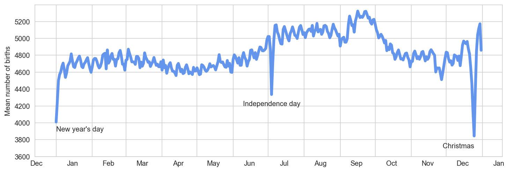

### Seatle cycling data

From JVDP's [blog](https://jakevdp.github.io/blog/2014/06/10/is-seattle-really-seeing-an-uptick-in-cycling/)

``` python
file = 'https://data.seattle.gov/api/views/65db-xm6k/rows.csv?accessType=DOWNLOAD'
data = pd.read_csv(file, skiprows=1, names=['date', 'total', 'east', 'west'],
                   parse_dates=True, index_col='date')
```

``` python
data.describe()
```

<div>
<style scoped>
    .dataframe tbody tr th:only-of-type {
        vertical-align: middle;
    }

    .dataframe tbody tr th {
        vertical-align: top;
    }

    .dataframe thead th {
        text-align: right;
    }
</style>

|       | total        | east         | west         |
|-------|--------------|--------------|--------------|
| count | 67118.000000 | 67118.000000 | 67118.000000 |
| mean  | 112.912527   | 51.559835    | 61.352692    |
| std   | 144.160880   | 66.522811    | 89.768937    |
| min   | 0.000000     | 0.000000     | 0.000000     |
| 25%   | 14.000000    | 6.000000     | 7.000000     |
| 50%   | 60.000000    | 28.000000    | 30.000000    |
| 75%   | 147.000000   | 69.000000    | 74.000000    |
| max   | 1097.000000  | 698.000000   | 850.000000   |

</div>

``` python
data.plot();
```

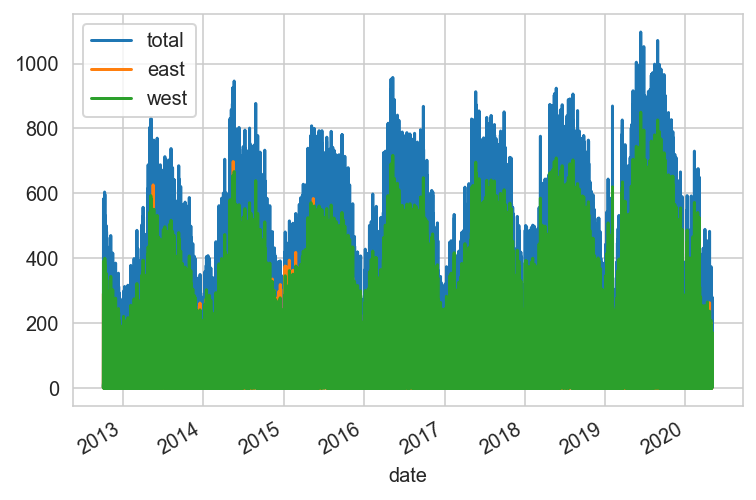

``` python
# Weekly aggregates

weekly = data.resample('W').sum()
weekly.plot(style=['-', '--', ':']);
```

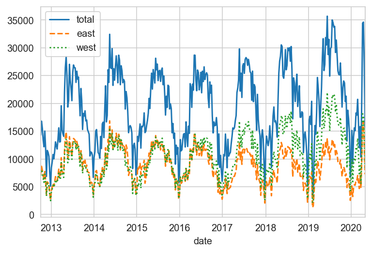

``` python
# Rolling window

daily = data.resample('D').sum()
daily.rolling(window=30, center=True).sum().plot(style=['-', '--', ':']);
```


``` python
# By hour of day

by_time = data.groupby(data.index.time).sum()
hourly_ticks = 3 * 60 * 60 * np.arange(8)
by_time.plot(xticks=hourly_ticks, style=['-', '--', ':']);
```

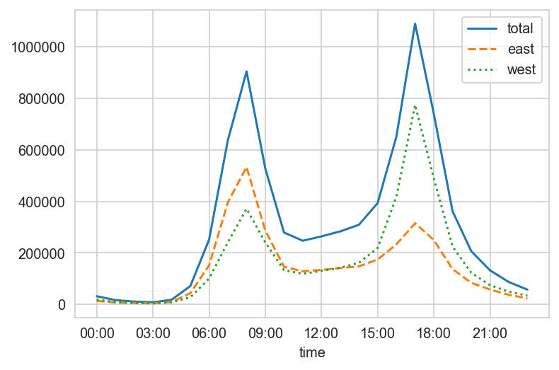

``` python
# By day of week

by_weekday = data.groupby(data.index.dayofweek).sum()
by_weekday.index = ['Mo', 'Tu', 'We', 'Th', 'Fr', 'Sa', 'So']
by_weekday.plot(style=['-', '--', ':']);
```

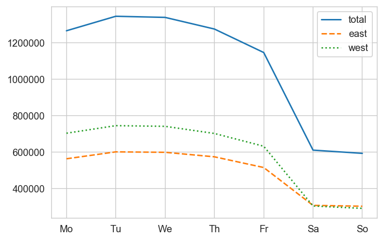

``` python
mpl.get_configdir()
```

    '/Users/fgu/.matplotlib'

``` python
# Hourly by weekdays and weekends

wknd = np.where(data.index.dayofweek > 4, 'weekend', 'weekday')
hourly = data.groupby([wknd, data.index.time]).sum()

fig, (ax0, ax1) = plt.subplots(1, 2, figsize=(10, 5))

hourly.loc['weekday'].plot(ax=ax1, title='Weekdays', xticks=hourly_ticks,
                           style=['-', '--', ':'])
hourly.loc['weekend'].plot(ax=ax0, title='Weekends', xticks=hourly_ticks,
                           style=['-', '--', ':']);
```

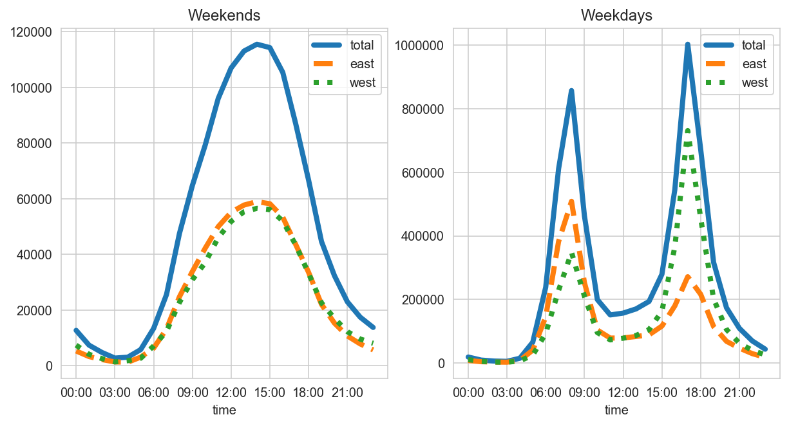

### USA.gov data from Bitly

From [Python for Data Analysis](https://www.oreilly.com/library/view/python-for-data/9781491957653/)

``` python
import pandas as pd
import numpy as np
import seaborn as sns
sns.set()

%config InlineBackend.figure_format ='retina'
```

``` python
path = 'https://raw.githubusercontent.com/wesm/pydata-book/2nd-edition/datasets/bitly_usagov/example.txt'
df = pd.read_json(path, lines=True)
df.head()
```

<div>
<style scoped>
    .dataframe tbody tr th:only-of-type {
        vertical-align: middle;
    }

    .dataframe tbody tr th {
        vertical-align: top;
    }

    .dataframe thead th {
        text-align: right;
    }
</style>

|     | a                                                  | c   | nk  | tz                | gr  | g      | h      | l        | al             | hh        | r                                                  | u                                                  | t            | hc           | cy         | ll                         | \_heartbeat\_ | kw  |
|-----|----------------------------------------------------|-----|-----|-------------------|-----|--------|--------|----------|----------------|-----------|----------------------------------------------------|----------------------------------------------------|--------------|--------------|------------|----------------------------|---------------|-----|
| 0   | Mozilla/5.0 (Windows NT 6.1; WOW64) AppleWebKi\... | US  | 1.0 | America/New_York  | MA  | A6qOVH | wfLQtf | orofrog  | en-US,en;q=0.8 | 1.usa.gov | http://www.facebook.com/l/7AQEFzjSi/1.usa.gov/\... | http://www.ncbi.nlm.nih.gov/pubmed/22415991        | 1.331923e+09 | 1.331823e+09 | Danvers    | \[42.576698, -70.954903\]  | NaN           | NaN |
| 1   | GoogleMaps/RochesterNY                             | US  | 0.0 | America/Denver    | UT  | mwszkS | mwszkS | bitly    | NaN            | j.mp      | http://www.AwareMap.com/                           | http://www.monroecounty.gov/etc/911/rss.php        | 1.331923e+09 | 1.308262e+09 | Provo      | \[40.218102, -111.613297\] | NaN           | NaN |
| 2   | Mozilla/4.0 (compatible; MSIE 8.0; Windows NT \... | US  | 1.0 | America/New_York  | DC  | xxr3Qb | xxr3Qb | bitly    | en-US          | 1.usa.gov | http://t.co/03elZC4Q                               | http://boxer.senate.gov/en/press/releases/0316\... | 1.331923e+09 | 1.331920e+09 | Washington | \[38.9007, -77.043098\]    | NaN           | NaN |
| 3   | Mozilla/5.0 (Macintosh; Intel Mac OS X 10_6_8)\... | BR  | 0.0 | America/Sao_Paulo | 27  | zCaLwp | zUtuOu | alelex88 | pt-br          | 1.usa.gov | direct                                             | http://apod.nasa.gov/apod/ap120312.html            | 1.331923e+09 | 1.331923e+09 | Braz       | \[-23.549999, -46.616699\] | NaN           | NaN |
| 4   | Mozilla/5.0 (Windows NT 6.1; WOW64) AppleWebKi\... | US  | 0.0 | America/New_York  | MA  | 9b6kNl | 9b6kNl | bitly    | en-US,en;q=0.8 | bit.ly    | http://www.shrewsbury-ma.gov/selco/                | http://www.shrewsbury-ma.gov/egov/gallery/1341\... | 1.331923e+09 | 1.273672e+09 | Shrewsbury | \[42.286499, -71.714699\]  | NaN           | NaN |

</div>

Let's plot the most occuring time-zones.

``` python
counts = df.tz.str.replace('^$', 'Unknown').fillna('Missing').value_counts()[:10]
sns.barplot(counts.values, counts.index);
```

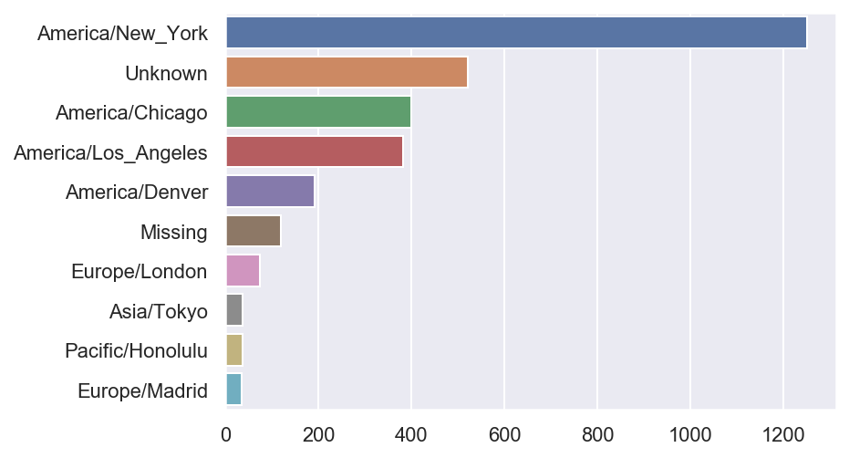

Now, let's split the bars by operating system.

``` python
pd.Series.reverse = lambda self: self[::-1]  # Cool trick from here: https://stackoverflow.com/a/46624694

df['os'] = np.where(df.a.str.contains('Mac'), 'Mac', 'Not Mac')

agg_counts = (df.replace('^$', 'Unknown', regex=True)
              .groupby(['tz', 'os'])
              .size()
              .unstack()
              .fillna(0))

indexer = agg_counts.sum(1).argsort()
data = agg_counts.take(indexer[-10:]).reverse().stack()
data.name = 'totals'
data = data.reset_index()

sns.barplot(x='totals', y='tz', hue='os', data=data);
```

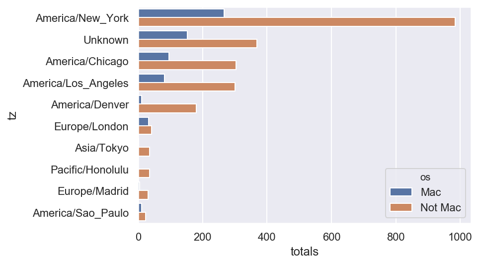

### MovieLens 1M dataset

From [Python for Data Analysis](https://www.oreilly.com/library/view/python-for-data/9781491957653/)

``` python
!ls data/ml-1m
```

    README      movies.dat  ratings.dat users.dat

``` python
import pandas as pd
```

``` python
path = 'data/ml-1m/'

unames = ['user_id', 'gender', 'age', 'occupation', 'zip']
users = pd.read_table(path + 'users.dat', sep='::', engine='python', names=unames)

rnames = ['user_id', 'movie_id', 'rating', 'timestamp']
ratings = pd.read_table(path + 'ratings.dat', sep='::', engine='python', names=rnames)

mnames = ['movie_id', 'title', 'genres']
movies = pd.read_table(path + 'movies.dat', sep='::', engine='python', names=mnames)

data = pd.merge(pd.merge(users, ratings), movies)
data.head()
```

<div>
<style scoped>
    .dataframe tbody tr th:only-of-type {
        vertical-align: middle;
    }

    .dataframe tbody tr th {
        vertical-align: top;
    }

    .dataframe thead th {
        text-align: right;
    }
</style>

|     | user_id | gender | age | occupation | zip   | movie_id | rating | timestamp | title                                   | genres |
|-----|---------|--------|-----|------------|-------|----------|--------|-----------|-----------------------------------------|--------|
| 0   | 1       | F      | 1   | 10         | 48067 | 1193     | 5      | 978300760 | One Flew Over the Cuckoo\'s Nest (1975) | Drama  |
| 1   | 2       | M      | 56  | 16         | 70072 | 1193     | 5      | 978298413 | One Flew Over the Cuckoo\'s Nest (1975) | Drama  |
| 2   | 12      | M      | 25  | 12         | 32793 | 1193     | 4      | 978220179 | One Flew Over the Cuckoo\'s Nest (1975) | Drama  |
| 3   | 15      | M      | 25  | 7          | 22903 | 1193     | 4      | 978199279 | One Flew Over the Cuckoo\'s Nest (1975) | Drama  |
| 4   | 17      | M      | 50  | 1          | 95350 | 1193     | 5      | 978158471 | One Flew Over the Cuckoo\'s Nest (1975) | Drama  |

</div>

Calculate average ratings by gender

``` python
mean_ratings = data.pivot_table(values='rating', index='title',
                                columns='gender', aggfunc='mean')
mean_ratings.head()
```

<div>
<style scoped>
    .dataframe tbody tr th:only-of-type {
        vertical-align: middle;
    }

    .dataframe tbody tr th {
        vertical-align: top;
    }

    .dataframe thead th {
        text-align: right;
    }
</style>

| gender                         | F        | M        |
|--------------------------------|----------|----------|
| title                          |          |          |
| \$1,000,000 Duck (1971)        | 3.375000 | 2.761905 |
| \'Night Mother (1986)          | 3.388889 | 3.352941 |
| \'Til There Was You (1997)     | 2.675676 | 2.733333 |
| \'burbs, The (1989)            | 2.793478 | 2.962085 |
| \...And Justice for All (1979) | 3.828571 | 3.689024 |

</div>

Keep only movies with at least 200 ratings

``` python
ratings_count = data.groupby('title').size()
active_titles = ratings_count[ratings_count > 200].index

mean_ratings = mean_ratings.loc[active_titles]
# mean_ratings = mean_ratings.reindex(active_titles)  # alternative
```

Above was mainly to practice, what I actually want is to exclude movies with fewer than 200 ratings from the very start

``` python
rating_count = data.groupby('title').size()
active_movies = rating_count[rating_count > 200].index
data = data[data.title.isin(active_movies)]
data.head()
```

<div>
<style scoped>
    .dataframe tbody tr th:only-of-type {
        vertical-align: middle;
    }

    .dataframe tbody tr th {
        vertical-align: top;
    }

    .dataframe thead th {
        text-align: right;
    }
</style>

|     | user_id | gender | age | occupation | zip   | movie_id | rating | timestamp | title                                   | genres |
|-----|---------|--------|-----|------------|-------|----------|--------|-----------|-----------------------------------------|--------|
| 0   | 1       | F      | 1   | 10         | 48067 | 1193     | 5      | 978300760 | One Flew Over the Cuckoo\'s Nest (1975) | Drama  |
| 1   | 2       | M      | 56  | 16         | 70072 | 1193     | 5      | 978298413 | One Flew Over the Cuckoo\'s Nest (1975) | Drama  |
| 2   | 12      | M      | 25  | 12         | 32793 | 1193     | 4      | 978220179 | One Flew Over the Cuckoo\'s Nest (1975) | Drama  |
| 3   | 15      | M      | 25  | 7          | 22903 | 1193     | 4      | 978199279 | One Flew Over the Cuckoo\'s Nest (1975) | Drama  |
| 4   | 17      | M      | 50  | 1          | 95350 | 1193     | 5      | 978158471 | One Flew Over the Cuckoo\'s Nest (1975) | Drama  |

</div>

Calculate ratings difference by gender (again, just for fun, and to compare to above result)

``` python
mean_ratings2 = data.pivot_table('rating', 'title', 'gender', 'mean')
all(mean_ratings2 == mean_ratings)
```

    True

Look at top movis by gender

``` python
mean_ratings.sort_values('F', ascending=False).head()
```

<div>
<style scoped>
    .dataframe tbody tr th:only-of-type {
        vertical-align: middle;
    }

    .dataframe tbody tr th {
        vertical-align: top;
    }

    .dataframe thead th {
        text-align: right;
    }
</style>

| gender                                                 | F        | M        |
|--------------------------------------------------------|----------|----------|
| title                                                  |          |          |
| Close Shave, A (1995)                                  | 4.644444 | 4.473795 |
| Wrong Trousers, The (1993)                             | 4.588235 | 4.478261 |
| General, The (1927)                                    | 4.575758 | 4.329480 |
| Sunset Blvd. (a.k.a. Sunset Boulevard) (1950)          | 4.572650 | 4.464589 |
| Wallace & Gromit: The Best of Aardman Animation (1996) | 4.563107 | 4.385075 |

</div>

``` python
mean_ratings.sort_values('M', ascending=False).head()
```

<div>
<style scoped>
    .dataframe tbody tr th:only-of-type {
        vertical-align: middle;
    }

    .dataframe tbody tr th {
        vertical-align: top;
    }

    .dataframe thead th {
        text-align: right;
    }
</style>

| gender                                                              | F        | M        |
|---------------------------------------------------------------------|----------|----------|
| title                                                               |          |          |
| Godfather, The (1972)                                               | 4.314700 | 4.583333 |
| Seven Samurai (The Magnificent Seven) (Shichinin no samurai) (1954) | 4.481132 | 4.576628 |
| Shawshank Redemption, The (1994)                                    | 4.539075 | 4.560625 |
| Raiders of the Lost Ark (1981)                                      | 4.332168 | 4.520597 |
| Usual Suspects, The (1995)                                          | 4.513317 | 4.518248 |

</div>

Calculate rating differences

``` python
mean_ratings['diff'] = np.abs(mean_ratings['F'] - mean_ratings['M'])
mean_ratings.sort_values('diff', ascending=False).head()
```

<div>
<style scoped>
    .dataframe tbody tr th:only-of-type {
        vertical-align: middle;
    }

    .dataframe tbody tr th {
        vertical-align: top;
    }

    .dataframe thead th {
        text-align: right;
    }
</style>

| gender                                                  | F        | M        | diff     |
|---------------------------------------------------------|----------|----------|----------|
| title                                                   |          |          |          |
| Dirty Dancing (1987)                                    | 3.790378 | 2.959596 | 0.830782 |
| Good, The Bad and The Ugly, The (1966)                  | 3.494949 | 4.221300 | 0.726351 |
| To Wong Foo, Thanks for Everything! Julie Newmar (1995) | 3.486842 | 2.795276 | 0.691567 |
| Kentucky Fried Movie, The (1977)                        | 2.878788 | 3.555147 | 0.676359 |
| Jumpin\' Jack Flash (1986)                              | 3.254717 | 2.578358 | 0.676359 |

</div>

Find movies with the most rating disagreement among all viwers

``` python
data.groupby('title').rating.std().sort_values(ascending=False).head()
```

    title
    Plan 9 from Outer Space (1958)         1.455998
    Texas Chainsaw Massacre, The (1974)    1.332448
    Dumb & Dumber (1994)                   1.321333
    Blair Witch Project, The (1999)        1.316368
    Natural Born Killers (1994)            1.307198
    Name: rating, dtype: float64

### Baby names

From [Python for Data Analysis](https://www.oreilly.com/library/view/python-for-data/9781491957653/)

``` python
!head data/names/yob1880.txt
```

    Mary,F,7065
    Anna,F,2604
    Emma,F,2003
    Elizabeth,F,1939
    Minnie,F,1746
    Margaret,F,1578
    Ida,F,1472
    Alice,F,1414
    Bertha,F,1320
    Sarah,F,1288

``` python
import re

files = !ls data/names/yob*

pieces = []
columns = ['name', 'sex', 'births']

for file in files:
    frame = pd.read_csv(file, names=columns)
    
    year = int(re.findall('\d+', file)[0])
    frame['year'] = year
    pieces.append(frame)

names = pd.concat(pieces, ignore_index=True)
names.head()
```

<div>
<style scoped>
    .dataframe tbody tr th:only-of-type {
        vertical-align: middle;
    }

    .dataframe tbody tr th {
        vertical-align: top;
    }

    .dataframe thead th {
        text-align: right;
    }
</style>

|     | name      | sex | births | year |
|-----|-----------|-----|--------|------|
| 0   | Mary      | F   | 7065   | 1880 |
| 1   | Anna      | F   | 2604   | 1880 |
| 2   | Emma      | F   | 2003   | 1880 |
| 3   | Elizabeth | F   | 1939   | 1880 |
| 4   | Minnie    | F   | 1746   | 1880 |

</div>

``` python
years = range(1880, 2019)

pieces = []
columns = ['name', 'gender', 'births']

for year in years:
    path = 'data/names/yob%d.txt' % year
    frame = pd.read_csv(path, names=columns)

    frame['year'] = year
    pieces.append(frame)

names = pd.concat(pieces, ignore_index=True)
names.head()
```

<div>
<style scoped>
    .dataframe tbody tr th:only-of-type {
        vertical-align: middle;
    }

    .dataframe tbody tr th {
        vertical-align: top;
    }

    .dataframe thead th {
        text-align: right;
    }
</style>

|     | name      | gender | births | year |
|-----|-----------|--------|--------|------|
| 0   | Mary      | F      | 7065   | 1880 |
| 1   | Anna      | F      | 2604   | 1880 |
| 2   | Emma      | F      | 2003   | 1880 |
| 3   | Elizabeth | F      | 1939   | 1880 |
| 4   | Minnie    | F      | 1746   | 1880 |

</div>

Plot number of girls and boys born over time

``` python
names.pivot_table('births', 'year', 'gender', 'sum').plot();
```

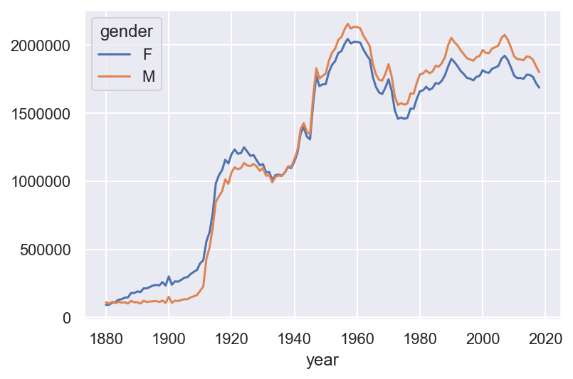

Add a proportion column

``` python
def add_prop(group):
    group['prop'] = group.births / group.births.sum()
    return group

names = names.groupby(['gender', 'year']).apply(add_prop)
names.head()
```

<div>
<style scoped>
    .dataframe tbody tr th:only-of-type {
        vertical-align: middle;
    }

    .dataframe tbody tr th {
        vertical-align: top;
    }

    .dataframe thead th {
        text-align: right;
    }
</style>

|     | name      | gender | births | year | prop     |
|-----|-----------|--------|--------|------|----------|
| 0   | Mary      | F      | 7065   | 1880 | 0.077642 |
| 1   | Anna      | F      | 2604   | 1880 | 0.028617 |
| 2   | Emma      | F      | 2003   | 1880 | 0.022012 |
| 3   | Elizabeth | F      | 1939   | 1880 | 0.021309 |
| 4   | Minnie    | F      | 1746   | 1880 | 0.019188 |

</div>

Check that prop sums to 1 for each year-gender group

``` python
names.groupby(['gender', 'year']).prop.sum()
```

    gender  year
    F       1880    1.0
            1881    1.0
            1882    1.0
            1883    1.0
            1884    1.0
                   ... 
    M       2014    1.0
            2015    1.0
            2016    1.0
            2017    1.0
            2018    1.0
    Name: prop, Length: 278, dtype: float64

Keep only top 1000 names per gender and year

``` python
def top1000(group):
    return group.sort_values(by='births', ascending=False)[:1000]

top1000 = names.groupby(['gender', 'year']).apply(top1000).reset_index(drop=True)
```

Let's look at the number of births per year for common names

``` python
subset = ['John', 'Harry', 'Mary', 'Marilyn']

(names.pivot_table('births', 'year', 'name', 'sum')[subset]
 .plot(subplots=True, figsize=(12,10), title='Number of births per year'));
```

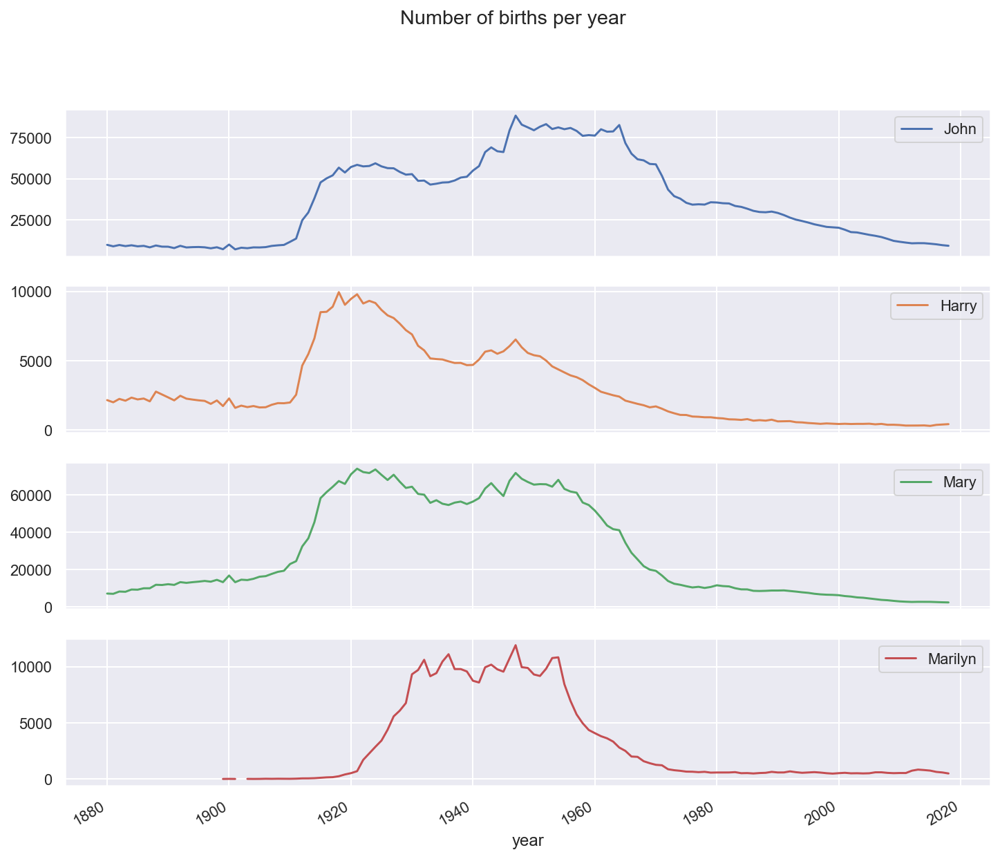

Plot suggest that common names have become less popular. This could be either because people use other names instead, or becasue people just use more names overall. Let's look into this. First by looking at the proportion of birhts for the top 1000 names.

``` python
(top1000.pivot_table('prop', 'year', 'gender', 'sum')
 .plot(title='Proportion of top 1000 names of all births',
       figsize=(6, 5),
       yticks=np.linspace(0, 1.2, 13)));
```

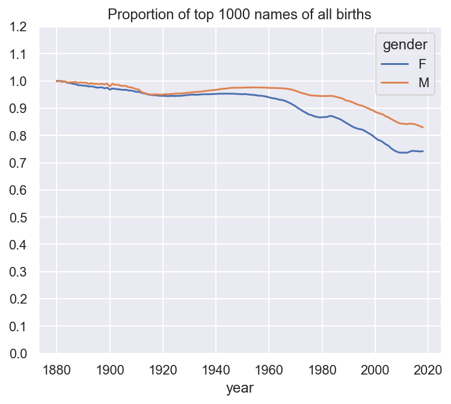

It's clear from the above plot that the top 1000 names are becoming a smaller proportion of all names over time, indicating that naming diversity is increasing. To corroborate this, let's look at the number of names that account for 50 percent of all births in each year for each sex.

``` python
boys2018 = top1000[(top1000.year == 2018) & (top1000.gender == 'M')]
boys2018.sort_values('prop', ascending=False).prop.cumsum().searchsorted(.5) + 1
```

    149

``` python
def get_quantile_count(group, q=0.5):
    group = group.sort_values('prop', ascending=False)
    return group.prop.cumsum().searchsorted(.5) + 1

diversity = top1000.groupby(['gender', 'year']).apply(get_quantile_count).unstack(level=0)
diversity.plot(figsize=(8, 6));
```

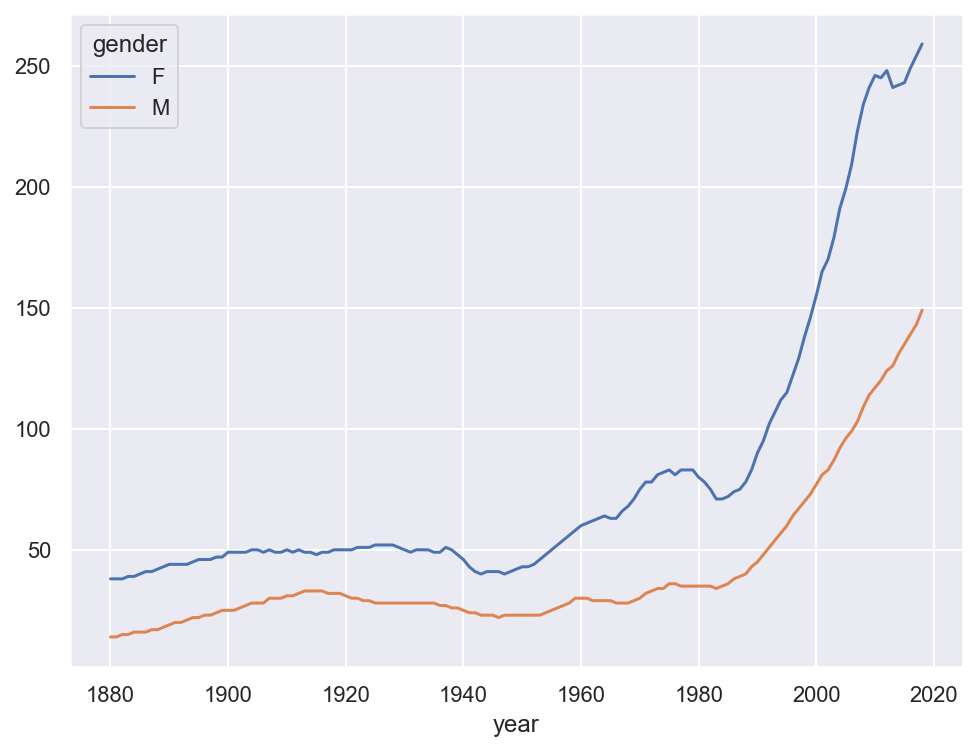

Explore the last-letter revolution

``` python
import matplotlib.pyplot as plt

def get_last_letter(name):
    return name[-1]

names['last_letter'] = names.name.map(get_last_letter)

table = names.pivot_table('births', 'last_letter', ['sex', 'year'], 'sum')

subtable = table.reindex(columns=[1960, 1990, 2018], level='year')
subtable = subtable / subtable.sum()
subtable

fig, (ax1, ax2) = plt.subplots(2, 1, figsize=(12,10))

subtable['M'].plot(kind='bar', ax=ax1)
subtable['F'].plot(kind='bar', ax=ax2);
```

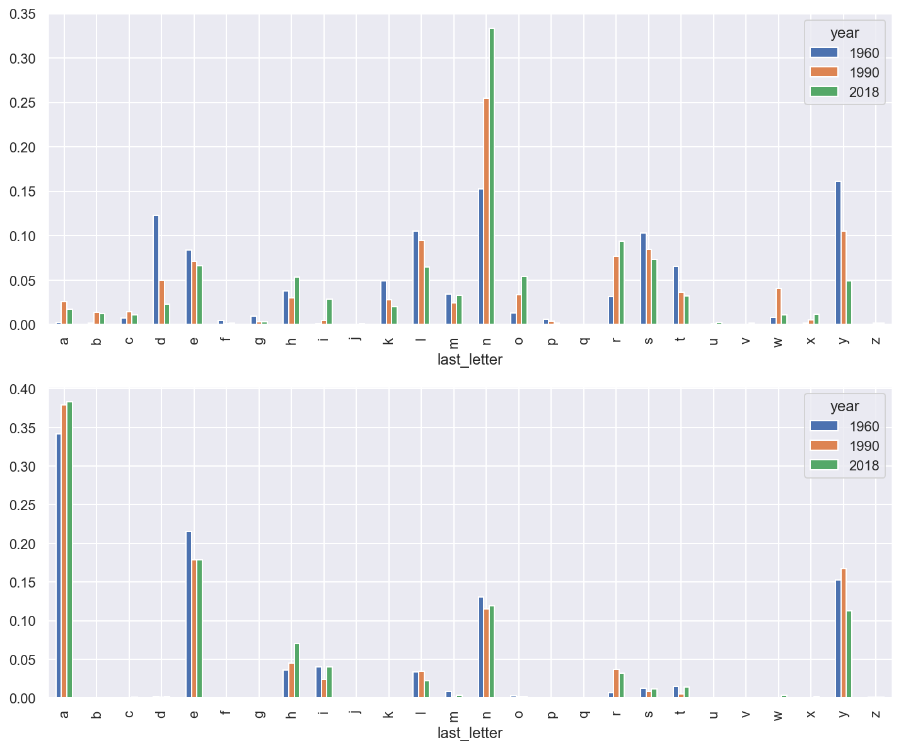

For boys names, d, n, and y have changed markedly in popularity over the past six decads. Let's look at this more closely.

``` python
table['M'].reindex(['d', 'n', 'y']).T.plot(figsize=(8, 6), linewidth=5);
```

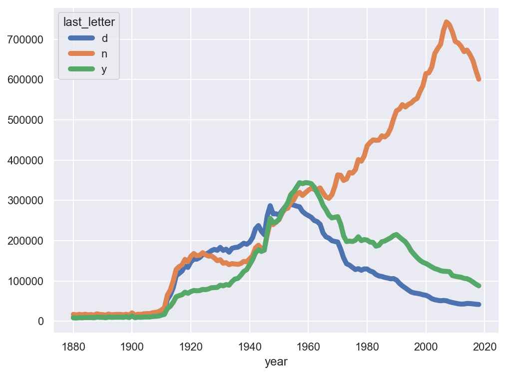

Leslie-like names have evolved from being boy to being girl names

``` python
def normalise(df):
    return df.div(df.sum(1), axis='rows')

(names[names.name.str.lower().str.contains('^lesl')]
 .pivot_table('births', 'year', 'sex', 'sum')
 .pipe(normalise)
 .plot(figsize=(8, 6), linewidth=5));
```

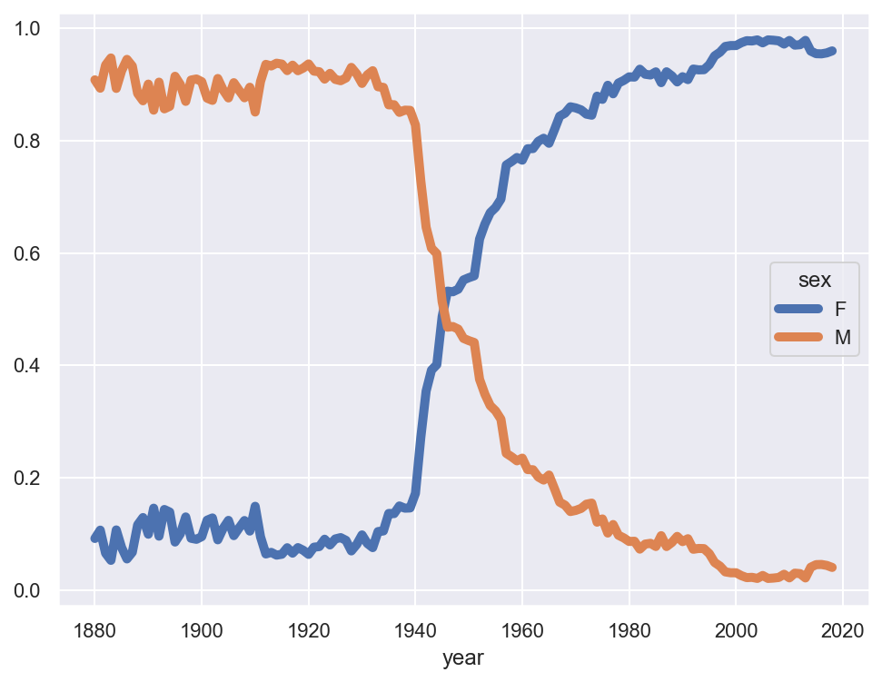

Evolution of Molly and Fabian

``` python
names
```

<div>
<style scoped>
    .dataframe tbody tr th:only-of-type {
        vertical-align: middle;
    }

    .dataframe tbody tr th {
        vertical-align: top;
    }

    .dataframe thead th {
        text-align: right;
    }
</style>

|         | name      | sex  | births | year | last_letter |
|---------|-----------|------|--------|------|-------------|
| 0       | Mary      | F    | 7065   | 1880 | y           |
| 1       | Anna      | F    | 2604   | 1880 | a           |
| 2       | Emma      | F    | 2003   | 1880 | a           |
| 3       | Elizabeth | F    | 1939   | 1880 | h           |
| 4       | Minnie    | F    | 1746   | 1880 | e           |
| \...    | \...      | \... | \...   | \... | \...        |
| 1957041 | Zylas     | M    | 5      | 2018 | s           |
| 1957042 | Zyran     | M    | 5      | 2018 | n           |
| 1957043 | Zyrie     | M    | 5      | 2018 | e           |
| 1957044 | Zyron     | M    | 5      | 2018 | n           |
| 1957045 | Zzyzx     | M    | 5      | 2018 | x           |

<p>1957046 rows × 5 columns</p>
</div>

``` python
(names[names.name.isin(['Molly', 'Fabian'])]
 .pivot_table('births', 'year', 'name', 'sum')
 .plot(figsize=(10, 8), linewidth=8));
```

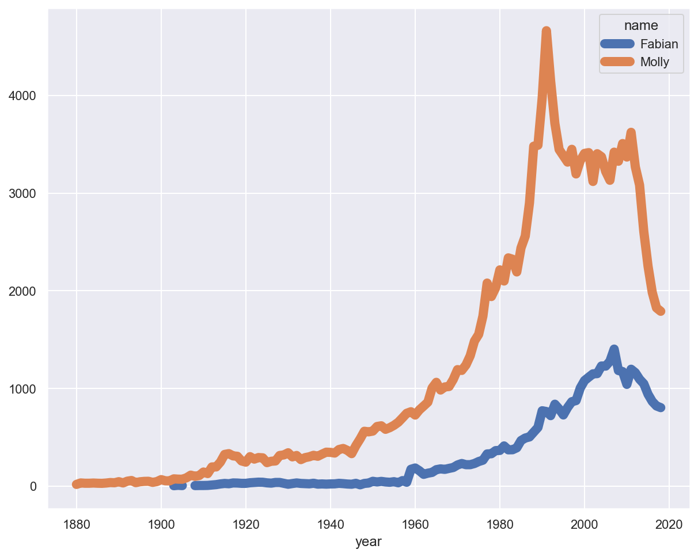

### Baby names in Switzerland

``` python
ls data/ch-names/
```

    f.xlsx  m.xlsx

``` python
genders = ['f', 'm']

def rename_cols(df, names):
    df.columns = names
    return df

pieces = []
columns = ['name', 'year', 'births', 'rank']

for gender in genders:    
    path = 'data/ch-names/%s.xlsx' % gender
    data = (pd.read_excel(path, header=[2, 3], index_col=0, skipfooter=5)
         .stack(level=0)
         .reset_index()
         .pipe(rename_cols, columns)
         .assign(gender=gender))
    
    pieces.append(data)

names = pd.concat(pieces, ignore_index=True)
names
```

<div>
<style scoped>
    .dataframe tbody tr th:only-of-type {
        vertical-align: middle;
    }

    .dataframe tbody tr th {
        vertical-align: top;
    }

    .dataframe thead th {
        text-align: right;
    }
</style>

|       | name  | year | births | rank | gender |
|-------|-------|------|--------|------|--------|
| 0     | Emma  | 1998 | 88     | 78   | f      |
| 1     | Emma  | 1999 | 80     | 85   | f      |
| 2     | Emma  | 2000 | 127    | 46   | f      |
| 3     | Emma  | 2001 | 116    | 46   | f      |
| 4     | Emma  | 2002 | 147    | 36   | f      |
| \...  | \...  | \... | \...   | \... | \...   |
| 41995 | Rúben | 2014 | 5      | 1071 | m      |
| 41996 | Rúben | 2015 | 4      | 1263 | m      |
| 41997 | Rúben | 2016 | 6      | 972  | m      |
| 41998 | Rúben | 2017 | 15     | 515  | m      |
| 41999 | Rúben | 2018 | 7      | 924  | m      |

<p>42000 rows × 5 columns</p>
</div>

``` python
files = !ls data/ch-names/*

pieces = []
columns = ['name', 'year', 'births']

for file in files:    
    frame = (pd.read_excel(file, header=[2, 3], index_col=0, skipfooter=5)
             .stack(level=[0]).reset_index().drop('Rang', axis=1))

    frame.columns = columns
    gender = file[-6]
    frame['gender'] = gender 
    pieces.append(frame)
    
table = pd.concat(pieces, ignore_index=True) 
table.head()
```

<div>
<style scoped>
    .dataframe tbody tr th:only-of-type {
        vertical-align: middle;
    }

    .dataframe tbody tr th {
        vertical-align: top;
    }

    .dataframe thead th {
        text-align: right;
    }
</style>

|     | name | year | births | gender |
|-----|------|------|--------|--------|
| 0   | Emma | 1998 | 88     | f      |
| 1   | Emma | 1999 | 80     | f      |
| 2   | Emma | 2000 | 127    | f      |
| 3   | Emma | 2001 | 116    | f      |
| 4   | Emma | 2002 | 147    | f      |

</div>

Add proportions and rank columns

``` python
def calc_prop(group):
    group['prop'] = group.births / group.births.sum() * 100
    return group

table = table.groupby(['year', 'gender']).apply(calc_prop)
table['rank'] = table.groupby(['year', 'gender']).births.rank(method='min')
```

Most popular names by year

``` python
def top_n(group, n=5):
    return group.sort_values('births', ascending=False)[:n]

num_names = 10
years = [1998]

(table.groupby(['year', 'gender'])
 .apply(top_n, num_names)
 .drop(['year', 'gender'], axis=1)
 .reset_index(level=2, drop=True)
 .loc[years])
```

<div>
<style scoped>
    .dataframe tbody tr th:only-of-type {
        vertical-align: middle;
    }

    .dataframe tbody tr th {
        vertical-align: top;
    }

    .dataframe thead th {
        text-align: right;
    }
</style>

|      |        | name     | births | prop     | rank   |
|------|--------|----------|--------|----------|--------|
| year | gender |          |        |          |        |
| 1998 | m      | Luca     | 648    | 2.214173 | 1000.0 |
|      | m      | David    | 528    | 1.804141 | 999.0  |
|      | m      | Simon    | 511    | 1.746053 | 998.0  |
|      | m      | Marco    | 435    | 1.486366 | 997.0  |
|      | m      | Joel     | 424    | 1.448780 | 996.0  |
|      | m      | Michael  | 407    | 1.390692 | 995.0  |
|      | m      | Lukas    | 392    | 1.339438 | 994.0  |
|      | m      | Nicolas  | 375    | 1.281350 | 993.0  |
|      | m      | Fabian   | 368    | 1.257432 | 992.0  |
|      | m      | Kevin    | 350    | 1.195927 | 991.0  |
|      | w      | Laura    | 607    | 2.405675 | 1000.0 |
|      | w      | Celine   | 414    | 1.640774 | 999.0  |
|      | w      | Sarah    | 407    | 1.613031 | 998.0  |
|      | w      | Jessica  | 391    | 1.549620 | 997.0  |
|      | w      | Lea      | 375    | 1.486208 | 996.0  |
|      | w      | Michelle | 357    | 1.414870 | 995.0  |
|      | w      | Sara     | 344    | 1.363348 | 994.0  |
|      | w      | Vanessa  | 320    | 1.268231 | 993.0  |
|      | w      | Lara     | 308    | 1.220672 | 992.0  |
|      | w      | Julia    | 299    | 1.185003 | 991.0  |

</div>

What's going on with girl names ending in 'a'?

``` python
table[table.name.str.endswith('a')]
```

    0        False
    1        False
    2        False
    3        False
    4        False
             ...  
    41995    False
    41996    False
    41997    False
    41998    False
    41999    False
    Name: name, Length: 42000, dtype: bool

``` python
girl_names = ['Emma', 'Ivy', 'Audrey', 'Vivien']
```

``` python
def get_last_letter(name):
    return name[-1]

table['last_letter'] = table.name.map(get_last_letter)

last_letters = table[table.gender == 'w'].pivot_table('births', 'last_letter', 'year', 'sum') 
last_letters = last_letters / last_letters.sum()
last_letters.T['a'].plot()
```

    <matplotlib.axes._subplots.AxesSubplot at 0x1a32573f50>

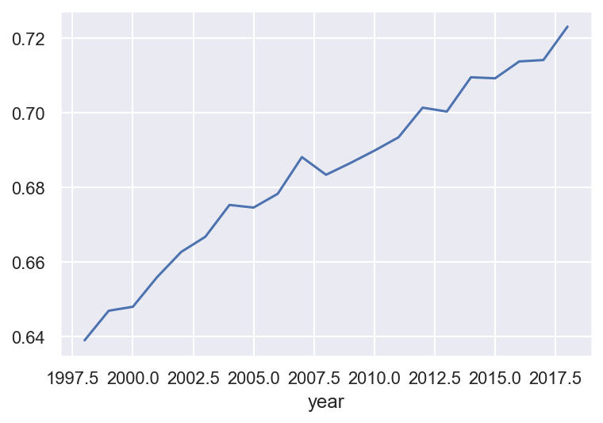

Popularity of names over time

``` python
import matplotlib.pyplot as plt

def plot_births(names, axis, values='prop'):
    (table[(table.name.isin(names))]
     .pivot_table(values, 'year', 'name', 'sum')
     .plot(ax=axis, xticks=range(1998, 2019), rot=45, linewidth=7))

    
fig, (left, right) = plt.subplots(1, 2, figsize=(20, 8))

girl_names = ['Emma']
boy_names = ['Liam', 'Leo', 'Theo', 'Fabian']

plot_births(girl_names, left, values='births')
plot_births(boy_names, right, values='births')
```

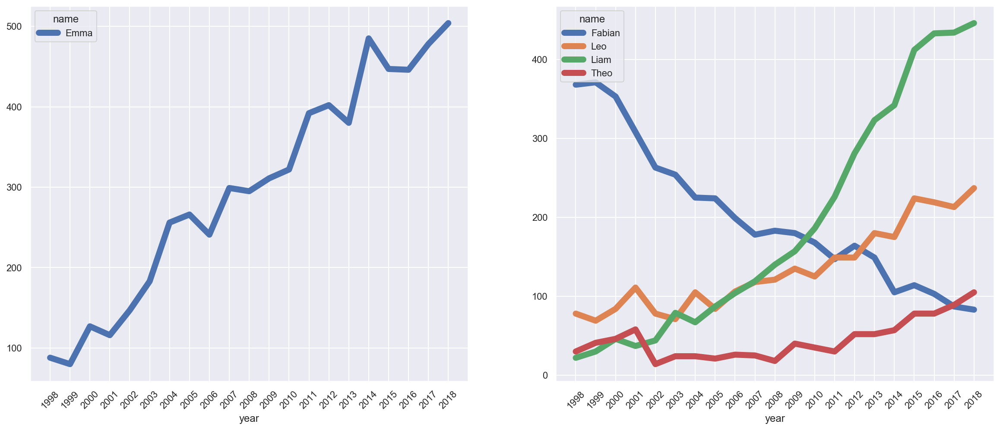

### USDA Food database

From [Python for Data Analysis](https://www.oreilly.com/library/view/python-for-data/9781491957653/)

``` python
ls data/usda_foods.json
```

    chap14-examples.ipynb  data/

``` python
import json

db = json.load(open('data/usda_foods.json'))
len(db)
```

``` python
db[0].keys()
```

    dict_keys(['id', 'description', 'tags', 'manufacturer', 'group', 'portions', 'nutrients'])

``` python
pd.DataFrame(db[0]['nutrients'])
```

<div>
<style scoped>
    .dataframe tbody tr th:only-of-type {
        vertical-align: middle;
    }

    .dataframe tbody tr th {
        vertical-align: top;
    }

    .dataframe thead th {
        text-align: right;
    }
</style>

|      | value   | units | description                        | group       |
|------|---------|-------|------------------------------------|-------------|
| 0    | 25.180  | g     | Protein                            | Composition |
| 1    | 29.200  | g     | Total lipid (fat)                  | Composition |
| 2    | 3.060   | g     | Carbohydrate, by difference        | Composition |
| 3    | 3.280   | g     | Ash                                | Other       |
| 4    | 376.000 | kcal  | Energy                             | Energy      |
| \... | \...    | \...  | \...                               | \...        |
| 157  | 1.472   | g     | Serine                             | Amino Acids |
| 158  | 93.000  | mg    | Cholesterol                        | Other       |
| 159  | 18.584  | g     | Fatty acids, total saturated       | Other       |
| 160  | 8.275   | g     | Fatty acids, total monounsaturated | Other       |
| 161  | 0.830   | g     | Fatty acids, total polyunsaturated | Other       |

<p>162 rows × 4 columns</p>
</div>

Produce df with info variables

``` python
info_keys = ['description', 'id', 'manufacturer', 'group']
new_col_names = {'description': 'food', 'group': 'fgroup'}

info = pd.DataFrame(db, columns=info_keys)
info = info.rename(columns=new_col_names)
info.head()
```

<div>
<style scoped>
    .dataframe tbody tr th:only-of-type {
        vertical-align: middle;
    }

    .dataframe tbody tr th {
        vertical-align: top;
    }

    .dataframe thead th {
        text-align: right;
    }
</style>

|     | food                               | id   | manufacturer | fgroup                 |
|-----|------------------------------------|------|--------------|------------------------|
| 0   | Cheese, caraway                    | 1008 |              | Dairy and Egg Products |
| 1   | Cheese, cheddar                    | 1009 |              | Dairy and Egg Products |
| 2   | Cheese, edam                       | 1018 |              | Dairy and Egg Products |
| 3   | Cheese, feta                       | 1019 |              | Dairy and Egg Products |
| 4   | Cheese, mozzarella, part skim milk | 1028 |              | Dairy and Egg Products |

</div>

Create a df with all the nutrient info for each food

``` python
new_col_names = {'description': 'nutrient', 'group': 'ngroup'}

pieces = []

for rec in db:
    nuts = pd.DataFrame(rec['nutrients'])
    nuts['id'] = rec['id']
    pieces.append(nuts)

nutrients = pd.concat(pieces, ignore_index=True)
nutrients = nutrients.rename(columns=new_col_names)
nutrients.head()
```

<div>
<style scoped>
    .dataframe tbody tr th:only-of-type {
        vertical-align: middle;
    }

    .dataframe tbody tr th {
        vertical-align: top;
    }

    .dataframe thead th {
        text-align: right;
    }
</style>

|     | value  | units | nutrient                    | ngroup      | id   |
|-----|--------|-------|-----------------------------|-------------|------|
| 0   | 25.18  | g     | Protein                     | Composition | 1008 |
| 1   | 29.20  | g     | Total lipid (fat)           | Composition | 1008 |
| 2   | 3.06   | g     | Carbohydrate, by difference | Composition | 1008 |
| 3   | 3.28   | g     | Ash                         | Other       | 1008 |
| 4   | 376.00 | kcal  | Energy                      | Energy      | 1008 |

</div>

Combine info and nutrient dfs

``` python
foods = pd.merge(info, nutrients).drop_duplicates()
foods.info()
```

    <class 'pandas.core.frame.DataFrame'>
    Int64Index: 375176 entries, 0 to 389354
    Data columns (total 8 columns):
     #   Column        Non-Null Count   Dtype  
    ---  ------        --------------   -----  
     0   food          375176 non-null  object 
     1   id            375176 non-null  int64  
     2   manufacturer  293054 non-null  object 
     3   fgroup        375176 non-null  object 
     4   value         375176 non-null  float64
     5   units         375176 non-null  object 
     6   nutrient      375176 non-null  object 
     7   ngroup        375176 non-null  object 
    dtypes: float64(1), int64(1), object(6)
    memory usage: 25.8+ MB

Plot nutrient content by food group

``` python
nutrient = 'Carbohydrate, by difference'

(foods[foods.nutrient.isin([nutrient])]
 .groupby('fgroup')
 .value
 .quantile(.5)
 .sort_values()
 .plot(kind='barh', figsize=(8, 6))
 .set(xlabel='Median %s content' % nutrient, ylabel=''));
```

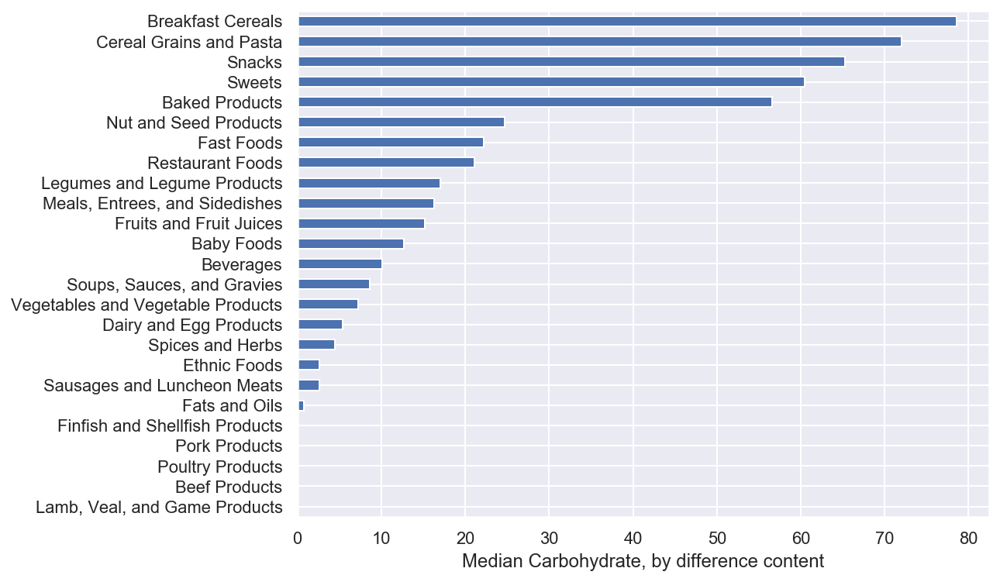

Find the food with the maxium nutritional content for each nutrient

``` python
get_max = lambda x: x.loc[x.value.idxmax()]
foods.groupby('nutrient').apply(get_max).head()
```

<div>
<style scoped>
    .dataframe tbody tr th:only-of-type {
        vertical-align: middle;
    }

    .dataframe tbody tr th {
        vertical-align: top;
    }

    .dataframe thead th {
        text-align: right;
    }
</style>

|                  | food                                               | id    | manufacturer | fgroup                | value  | units | nutrient         | ngroup      |
|------------------|----------------------------------------------------|-------|--------------|-----------------------|--------|-------|------------------|-------------|
| nutrient         |                                                    |       |              |                       |        |       |                  |             |
| Adjusted Protein | Baking chocolate, unsweetened, squares             | 19078 |              | Sweets                | 12.900 | g     | Adjusted Protein | Composition |
| Alanine          | Gelatins, dry powder, unsweetened                  | 19177 |              | Sweets                | 8.009  | g     | Alanine          | Amino Acids |
| Alcohol, ethyl   | Alcoholic beverage, distilled, all (gin, rum, \... | 14533 |              | Beverages             | 42.500 | g     | Alcohol, ethyl   | Other       |
| Arginine         | Seeds, sesame flour, low-fat                       | 12033 |              | Nut and Seed Products | 7.436  | g     | Arginine         | Amino Acids |
| Ash              | Desserts, rennin, tablets, unsweetened             | 19225 |              | Sweets                | 72.500 | g     | Ash              | Other       |

</div>

### FEC 2012 presidential election campaign contributions

From [Python for Data Analysis](https://www.oreilly.com/library/view/python-for-data/9781491957653/)

``` python
columns = {'cand_nm':'candidate',
           'contbr_city':'city', 
           'contbr_occupation':'occupation', 
           'contb_receipt_amt':'amount', 
           'contb_receipt_dt':'date'}

parties = {'Bachmann, Michelle': 'r', 
           'Romney, Mitt': 'r', 
           'Obama, Barack': 'd',
           "Roemer, Charles E. 'Buddy' III": 'r', 
           'Pawlenty, Timothy': 'r',
           'Johnson, Gary Earl': 'r', 
           'Paul, Ron': 'r', 
           'Santorum, Rick': 'r',
           'Cain, Herman': 'r',
           'Gingrich, Newt': 'r',
           'McCotter, Thaddeus G': 'r',
           'Huntsman, Jon': 'r', 
           'Perry, Rick': 'r'}

path = 'https://raw.githubusercontent.com/wesm/pydata-book/2nd-edition/datasets/fec/P00000001-ALL.csv'

fec = (pd.read_csv(path)
       [columns.keys()]
       .rename(columns=columns)
       .assign(party = lambda df: df.candidate.map(parties))) 
```

    /Users/fgu/miniconda3/envs/basics/lib/python3.7/site-packages/IPython/core/interactiveshell.py:3063: DtypeWarning: Columns (6) have mixed types.Specify dtype option on import or set low_memory=False.
      interactivity=interactivity, compiler=compiler, result=result)

``` python
fec.head()
```

<div>
<style scoped>
    .dataframe tbody tr th:only-of-type {
        vertical-align: middle;
    }

    .dataframe tbody tr th {
        vertical-align: top;
    }

    .dataframe thead th {
        text-align: right;
    }
</style>

|     | candidate          | city               | occupation            | amount | date      | party |
|-----|--------------------|--------------------|-----------------------|--------|-----------|-------|
| 0   | Bachmann, Michelle | MOBILE             | RETIRED               | 250.0  | 20-JUN-11 | r     |
| 1   | Bachmann, Michelle | MOBILE             | RETIRED               | 50.0   | 23-JUN-11 | r     |
| 2   | Bachmann, Michelle | LANETT             | INFORMATION REQUESTED | 250.0  | 05-JUL-11 | r     |
| 3   | Bachmann, Michelle | PIGGOTT            | RETIRED               | 250.0  | 01-AUG-11 | r     |
| 4   | Bachmann, Michelle | HOT SPRINGS NATION | RETIRED               | 300.0  | 20-JUN-11 | r     |

</div>

Compare total donations

``` python
fec.groupby('party').amount.sum()
```

    party
    d    1.335026e+08
    r    1.652488e+08
    Name: amount, dtype: float64

Compare donations by occupation

``` python
# Finishing this would take some extra work...
occ_mapping = {'INFORMATION REQUESTED':'Not provided',
               'INFORMATION REQUESTED PER BEST EFFORTS': 'Not provided'}

f = lambda x: occ_mapping.get(x, x)

fec.occupation = fec.occupation.map(f)
fec
```

<div>
<style scoped>
    .dataframe tbody tr th:only-of-type {
        vertical-align: middle;
    }

    .dataframe tbody tr th {
        vertical-align: top;
    }

    .dataframe thead th {
        text-align: right;
    }
</style>

|         | candidate          | city               | occupation                   | amount | date      | party |
|---------|--------------------|--------------------|------------------------------|--------|-----------|-------|
| 0       | Bachmann, Michelle | MOBILE             | RETIRED                      | 250.0  | 20-JUN-11 | r     |
| 1       | Bachmann, Michelle | MOBILE             | RETIRED                      | 50.0   | 23-JUN-11 | r     |
| 2       | Bachmann, Michelle | LANETT             | Not provided                 | 250.0  | 05-JUL-11 | r     |
| 3       | Bachmann, Michelle | PIGGOTT            | RETIRED                      | 250.0  | 01-AUG-11 | r     |
| 4       | Bachmann, Michelle | HOT SPRINGS NATION | RETIRED                      | 300.0  | 20-JUN-11 | r     |
| \...    | \...               | \...               | \...                         | \...   | \...      | \...  |
| 1001726 | Perry, Rick        | INFO REQUESTED     | Not provided                 | 5000.0 | 29-SEP-11 | r     |
| 1001727 | Perry, Rick        | INFO REQUESTED     | BUSINESS OWNER               | 2500.0 | 30-SEP-11 | r     |
| 1001728 | Perry, Rick        | INFO REQUESTED     | Not provided                 | 500.0  | 29-SEP-11 | r     |
| 1001729 | Perry, Rick        | INFO REQUESTED     | LONGWALL MAINTENANCE FOREMAN | 500.0  | 30-SEP-11 | r     |
| 1001730 | Perry, Rick        | INFO REQUESTED     | Not provided                 | 2500.0 | 31-AUG-11 | r     |

<p>1001731 rows × 6 columns</p>
</div>

Discretise donations into buckets for contribution size

## Seaborn

From [Python Data Science Handbook](https://www.oreilly.com/library/view/python-data-science/9781491912126/)

### Create a simple random walk plot using default

``` python
rng = np.random.RandomState(2312)
x = np.linspace(0, 10, 500)
y = np.cumsum(rng.randn(500, 6), axis=0)

plt.plot(x, y)
plt.legend('abcdef', ncol=2, loc='lower left');
```

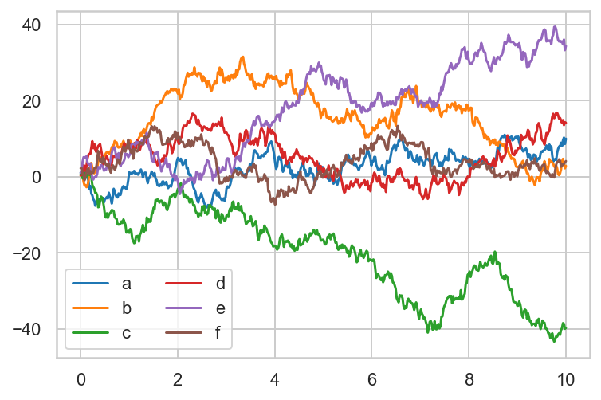

``` python
# Use seaborn style
import seaborn as sns
sns.set()
plt.plot(x, y);
plt.legend('abcdef', ncol=2, loc='lower left');
```

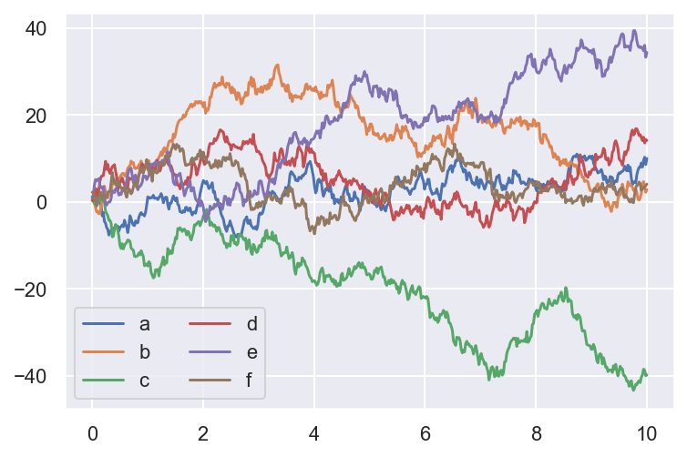

### Explore marathon data

``` python
from datetime import timedelta

# Read data
def convert_time(s):
    h, m, s = map(int, s.split(':'))
    return timedelta(hours=h, minutes=m, seconds=s)

file = 'https://raw.githubusercontent.com/jakevdp/marathon-data/master/marathon-data.csv'
df = pd.read_csv(file,
                 converters={'split': convert_time, 'final': convert_time})

# Add times in seconds
df['split_sec'] = df.split.astype(int) / 1E9
df['final_sec'] = df.final.astype(int) / 1E9

print(df.shape)
df.head()
```

    (37250, 6)

<div>
<style scoped>
    .dataframe tbody tr th:only-of-type {
        vertical-align: middle;
    }

    .dataframe tbody tr th {
        vertical-align: top;
    }

    .dataframe thead th {
        text-align: right;
    }
</style>

|     | age | gender | split    | final    | split_sec | final_sec |
|-----|-----|--------|----------|----------|-----------|-----------|
| 0   | 33  | M      | 01:05:38 | 02:08:51 | 3938.0    | 7731.0    |
| 1   | 32  | M      | 01:06:26 | 02:09:28 | 3986.0    | 7768.0    |
| 2   | 31  | M      | 01:06:49 | 02:10:42 | 4009.0    | 7842.0    |
| 3   | 38  | M      | 01:06:16 | 02:13:45 | 3976.0    | 8025.0    |
| 4   | 31  | M      | 01:06:32 | 02:13:59 | 3992.0    | 8039.0    |

</div>

``` python
# Jointplot to get first impression of data

with sns.axes_style('white'):
    g = sns.jointplot('split_sec', 'final_sec', data=df, kind='hex')
    g.ax_joint.plot(np.linspace(4000, 17000), np.linspace(8000, 33000), ':')
```

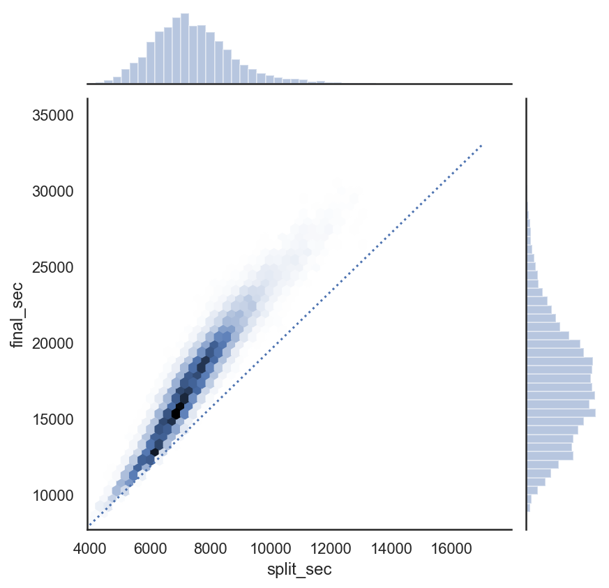

``` python
# Histogram of split fraction

df['split_frac'] = 1 - 2 * df.split_sec / df.final_sec
sns.distplot(df.split_frac, kde=False)
plt.axvline(0, linestyle='--');
```

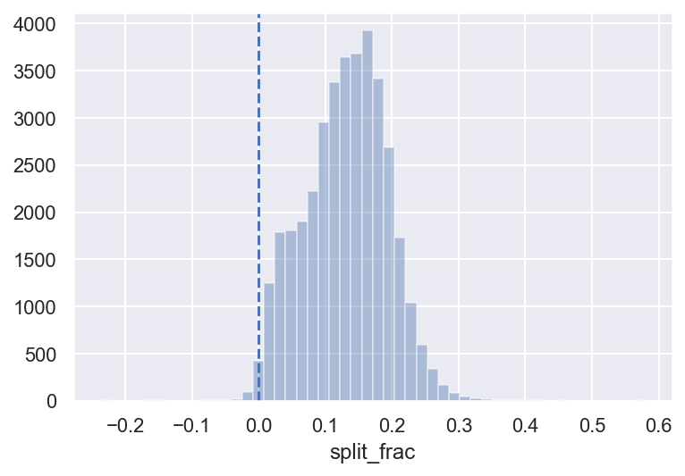

``` python
# Pairgrid to inspect correlations among variables

g = sns.PairGrid(df, hue='gender',
                 vars=['age', 'split_frac', 'final_sec', 'split_sec'])
g.map(sns.scatterplot, alpha=0.5)
g.add_legend();
```

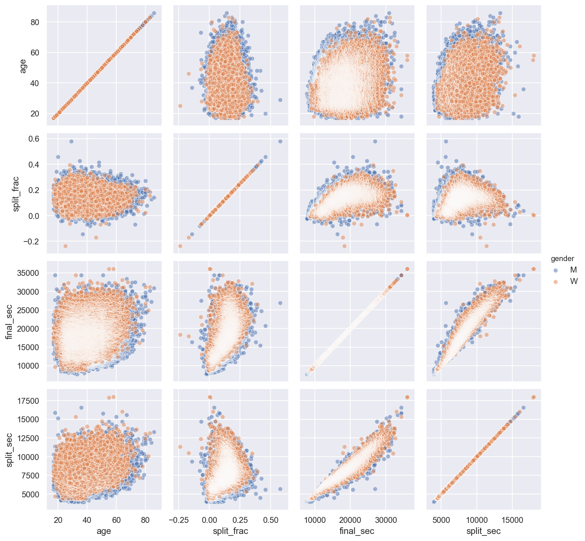

``` python
# Split fraction by gender

sns.kdeplot(df.split_frac[df.gender=='M'], label='Men', shade=True)
sns.kdeplot(df.split_frac[df.gender=='W'], label='Women', shade=True);
```


``` python
# Split fraction by gender using violin plots

sns.violinplot('gender', 'split_frac', data=df);
```

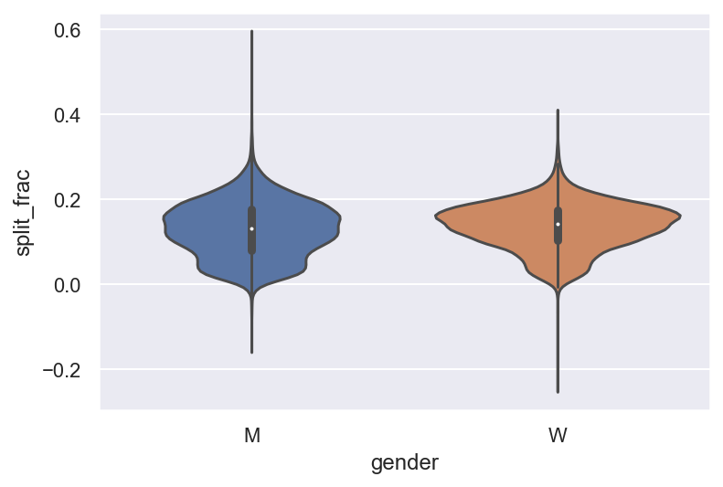

``` python
# Split fraction by gender and age using violin plots

df['age_dec'] = df.age.map(lambda age: age // 10 * 10)

sns.violinplot('age_dec', 'split_frac', hue='gender', split=True, data=df);
```

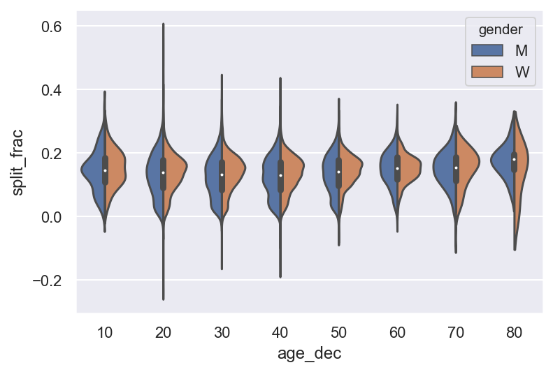

``` python
# Identify negative splitters

g = sns.lmplot('final_sec', 'split_frac', col='gender', data=df, markers='.', scatter_kws=dict(color='cornflowerblue'))
g.map(plt.axhline, y=0.1, color='k', ls=':');
```

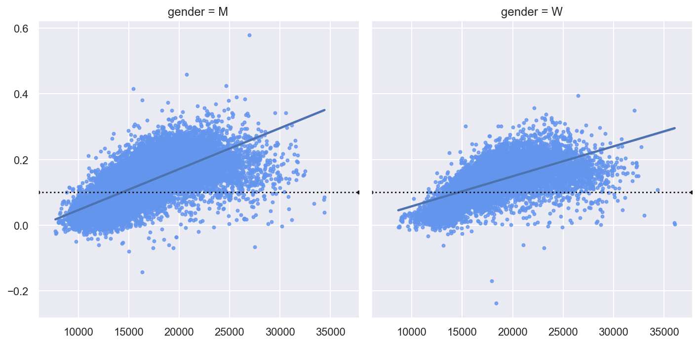

## Sources

-   [Python for Data Analysis](https://www.oreilly.com/library/view/python-for-data/9781491957653/)
-   [Python Data Science Handbook](https://www.oreilly.com/library/view/python-data-science/9781491912126/)

## TED talks

Analysing TED talks following \[this\] talk.

``` python
path = 'https://raw.githubusercontent.com/justmarkham/pycon-2019-tutorial/master/ted.csv'
ted = pd.read_csv(path)
ted.head(2)
```

<div>
<style scoped>
    .dataframe tbody tr th:only-of-type {
        vertical-align: middle;
    }

    .dataframe tbody tr th {
        vertical-align: top;
    }

    .dataframe thead th {
        text-align: right;
    }
</style>

|     | comments | description                                        | duration | event   | film_date  | languages | main_speaker | name                                      | num_speaker | published_date | ratings                                                      | related_talks                                            | speaker_occupation | tags                                                        | title                       | url                                                 | views    |
|-----|----------|----------------------------------------------------|----------|---------|------------|-----------|--------------|-------------------------------------------|-------------|----------------|--------------------------------------------------------------|----------------------------------------------------------|--------------------|-------------------------------------------------------------|-----------------------------|-----------------------------------------------------|----------|
| 0   | 4553     | Sir Ken Robinson makes an entertaining and pro\... | 1164     | TED2006 | 1140825600 | 60        | Ken Robinson | Ken Robinson: Do schools kill creativity? | 1           | 1151367060     | \[{\'id\': 7, \'name\': \'Funny\', \'count\': 19645}, {\...  | \[{\'id\': 865, \'hero\': \'https://pe.tedcdn.com/im\... | Author/educator    | \[\'children\', \'creativity\', \'culture\', \'dance\',\... | Do schools kill creativity? | https://www.ted.com/talks/ken_robinson_says_sc\...  | 47227110 |
| 1   | 265      | With the same humor and humanity he exuded in \... | 977      | TED2006 | 1140825600 | 43        | Al Gore      | Al Gore: Averting the climate crisis      | 1           | 1151367060     | \[{\'id\': 7, \'name\': \'Funny\', \'count\': 544}, {\'i\... | \[{\'id\': 243, \'hero\': \'https://pe.tedcdn.com/im\... | Climate advocate   | \[\'alternative energy\', \'cars\', \'climate change\...    | Averting the climate crisis | https://www.ted.com/talks/al_gore_on_averting\_\... | 3200520  |

</div>

``` python
ted.info()
```

    <class 'pandas.core.frame.DataFrame'>
    RangeIndex: 2550 entries, 0 to 2549
    Data columns (total 17 columns):
     #   Column              Non-Null Count  Dtype 
    ---  ------              --------------  ----- 
     0   comments            2550 non-null   int64 
     1   description         2550 non-null   object
     2   duration            2550 non-null   int64 
     3   event               2550 non-null   object
     4   film_date           2550 non-null   int64 
     5   languages           2550 non-null   int64 
     6   main_speaker        2550 non-null   object
     7   name                2550 non-null   object
     8   num_speaker         2550 non-null   int64 
     9   published_date      2550 non-null   int64 
     10  ratings             2550 non-null   object
     11  related_talks       2550 non-null   object
     12  speaker_occupation  2544 non-null   object
     13  tags                2550 non-null   object
     14  title               2550 non-null   object
     15  url                 2550 non-null   object
     16  views               2550 non-null   int64 
    dtypes: int64(7), object(10)
    memory usage: 338.8+ KB

``` python
ted.isna().sum()
```

    comments              0
    description           0
    duration              0
    event                 0
    film_date             0
    languages             0
    main_speaker          0
    name                  0
    num_speaker           0
    published_date        0
    ratings               0
    related_talks         0
    speaker_occupation    6
    tags                  0
    title                 0
    url                   0
    views                 0
    dtype: int64

## Which talks provoke the most online discussion?

``` python
ted['views_per_comment'] = ted.views / ted.comments
vpc = ted.sort_values('views_per_comment')[['name', 'main_speaker', 'views_per_comment']]
display(vpc.head())
display(vpc.tail())
```

<div>
<style scoped>
    .dataframe tbody tr th:only-of-type {
        vertical-align: middle;
    }

    .dataframe tbody tr th {
        vertical-align: top;
    }

    .dataframe thead th {
        text-align: right;
    }
</style>

|     | name                                               | main_speaker          | views_per_comment |
|-----|----------------------------------------------------|-----------------------|-------------------|
| 744 | Diane J. Savino: The case for same-sex marriage    | Diane J. Savino       | 450.531587        |
| 803 | David Bismark: E-voting without fraud              | David Bismark         | 651.739808        |
| 96  | Richard Dawkins: Militant atheism                  | Richard Dawkins       | 683.134291        |
| 694 | Sharmeen Obaid-Chinoy: Inside a school for sui\... | Sharmeen Obaid-Chinoy | 703.886818        |
| 954 | Janet Echelman: Taking imagination seriously       | Janet Echelman        | 735.525682        |

</div>
<div>
<style scoped>
    .dataframe tbody tr th:only-of-type {
        vertical-align: middle;
    }

    .dataframe tbody tr th {
        vertical-align: top;
    }

    .dataframe thead th {
        text-align: right;
    }
</style>

|      | name                                               | main_speaker       | views_per_comment |
|------|----------------------------------------------------|--------------------|-------------------|
| 2494 | Jimmy Lin: A simple new blood test that can ca\... | Jimmy Lin          | 143643.714286     |
| 2528 | Chance Coughenour: How your pictures can help \... | Chance Coughenour  | 179735.666667     |
| 2542 | Sethembile Msezane: Living sculptures that sta\... | Sethembile Msezane | 180696.000000     |
| 2501 | Françoise Mouly: The stories behind The New Yo\... | Françoise Mouly    | 279680.000000     |
| 2534 | Benjamin Grant: What it feels like to see Eart\... | Benjamin Grant     | 323087.000000     |

</div>

# Plot the distribution of comments

``` python
ted.comments.hist();
```

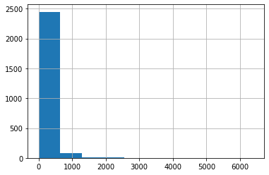

``` python
ted[ted.comments >= 1500].shape
```

    (17, 19)

Most talks have fewer than 1500 comments (only 17 have more), so I drop the ones that have more. I initially tried to avoid this, but as Keving points out in the video: plotting entails decision making, as a plot is a summary of your data and not a representation of all your data. This is a good lesson to take away from this.

``` python
ted.loc[ted.comments < 1000, 'comments'].hist(bins=20, grid=False);
```

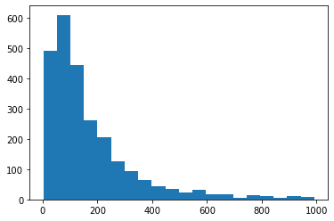

## Plot the number of talks that took place each year

``` python
ted.published_date
```

    744     1282062180
    803     1288685640
    96      1176689220
    694     1274865960
    954     1307489760
               ...    
    2494    1500994384
    2528    1504209631
    2542    1505488093
    2501    1501770244
    2534    1504814438
    Name: published_date, Length: 2550, dtype: int64

``` python
(pd.to_datetime(ted.film_date, unit='s').dt.year
 .value_counts()
 .sort_index()
 .plot(marker='o', ylabel='Number of events'));
```

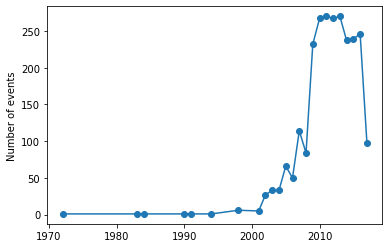

# What were the "best" events in TED history to attend

Defining "best" as event with most overall views, this is simple

``` python
ted.groupby('event').views.sum().sort_values(ascending=False)[:5]
```

    event
    TED2013           177307937
    TED2014           174121423
    TEDGlobal 2013    170554736
    TED2015           150826305
    TED2006           147345533
    Name: views, dtype: int64

# Unpack the ratings data

``` python
ted.ratings[0]
```

    "[{'id': 7, 'name': 'Funny', 'count': 19645}, {'id': 1, 'name': 'Beautiful', 'count': 4573}, {'id': 9, 'name': 'Ingenious', 'count': 6073}, {'id': 3, 'name': 'Courageous', 'count': 3253}, {'id': 11, 'name': 'Longwinded', 'count': 387}, {'id': 2, 'name': 'Confusing', 'count': 242}, {'id': 8, 'name': 'Informative', 'count': 7346}, {'id': 22, 'name': 'Fascinating', 'count': 10581}, {'id': 21, 'name': 'Unconvincing', 'count': 300}, {'id': 24, 'name': 'Persuasive', 'count': 10704}, {'id': 23, 'name': 'Jaw-dropping', 'count': 4439}, {'id': 25, 'name': 'OK', 'count': 1174}, {'id': 26, 'name': 'Obnoxious', 'count': 209}, {'id': 10, 'name': 'Inspiring', 'count': 24924}]"

``` python
import ast
ast.literal_eval(ted.ratings[0])
```

    [{'id': 7, 'name': 'Funny', 'count': 19645},
     {'id': 1, 'name': 'Beautiful', 'count': 4573},
     {'id': 9, 'name': 'Ingenious', 'count': 6073},
     {'id': 3, 'name': 'Courageous', 'count': 3253},
     {'id': 11, 'name': 'Longwinded', 'count': 387},
     {'id': 2, 'name': 'Confusing', 'count': 242},
     {'id': 8, 'name': 'Informative', 'count': 7346},
     {'id': 22, 'name': 'Fascinating', 'count': 10581},
     {'id': 21, 'name': 'Unconvincing', 'count': 300},
     {'id': 24, 'name': 'Persuasive', 'count': 10704},
     {'id': 23, 'name': 'Jaw-dropping', 'count': 4439},
     {'id': 25, 'name': 'OK', 'count': 1174},
     {'id': 26, 'name': 'Obnoxious', 'count': 209},
     {'id': 10, 'name': 'Inspiring', 'count': 24924}]

``` python
ted['ratings'] = ted.ratings.apply(ast.literal_eval)

pieces = []
for idx, talk in ted.iterrows():
    df = pd.DataFrame(talk['ratings'])
    df['talk_name'] = talk['name']
    pieces.append(df)
    
ratings = pd.concat(pieces)
ratings.head()
```

<div>
<style scoped>
    .dataframe tbody tr th:only-of-type {
        vertical-align: middle;
    }

    .dataframe tbody tr th {
        vertical-align: top;
    }

    .dataframe thead th {
        text-align: right;
    }
</style>

|     | id  | name       | count | talk_name                                 |
|-----|-----|------------|-------|-------------------------------------------|
| 0   | 7   | Funny      | 19645 | Ken Robinson: Do schools kill creativity? |
| 1   | 1   | Beautiful  | 4573  | Ken Robinson: Do schools kill creativity? |
| 2   | 9   | Ingenious  | 6073  | Ken Robinson: Do schools kill creativity? |
| 3   | 3   | Courageous | 3253  | Ken Robinson: Do schools kill creativity? |
| 4   | 11  | Longwinded | 387   | Ken Robinson: Do schools kill creativity? |

</div>

# Count total number of ratings received by each talk

``` python
def counter(list_of_dics):
    return sum(a['count'] for a in list_of_dics)

ted.ratings.apply(counter)
```

    0       93850
    1        2936
    2        2824
    3        3728
    4       25620
            ...  
    2545      192
    2546      151
    2547      136
    2548      583
    2549      142
    Name: ratings, Length: 2550, dtype: int64

## Cran packages

Analyse R packages on CRAN as part of the Tidy Tuesday [challenge](https://github.com/rfordatascience/tidytuesday/tree/master/data/2019/2019-11-12), then compare with [David Robinson's approach](https://www.youtube.com/watch?v=dr4qw8o0nYU).

``` python
fp = 'https://raw.githubusercontent.com/rfordatascience/tidytuesday/master/data/2019/2019-11-12/loc_cran_packages.csv'
cran = pd.read_csv(fp)
cran.head(2)
```

<div>
<style scoped>
    .dataframe tbody tr th:only-of-type {
        vertical-align: middle;
    }

    .dataframe tbody tr th {
        vertical-align: top;
    }

    .dataframe thead th {
        text-align: right;
    }
</style>

|     | file | language | blank | comment | code | pkg_name | version |
|-----|------|----------|-------|---------|------|----------|---------|
| 0   | 2    | R        | 96    | 353     | 365  | A3       | 1.0.0   |
| 1   | 1    | HTML     | 347   | 5       | 2661 | aaSEA    | 1.0.0   |

</div>

``` python
# Lines of code from different languages for tidyverse packages

plt.style.use('ggplot')
(cran[cran.pkg_name.str.contains("^tidy")]
 .groupby(["pkg_name", "language"]).code.sum()
 .unstack()
 .assign(tot=lambda x: x.sum(axis=1))
 .sort_values('tot')
 .drop('tot', axis=1)
).plot.barh(stacked=True)
```

    <AxesSubplot:ylabel='pkg_name'>

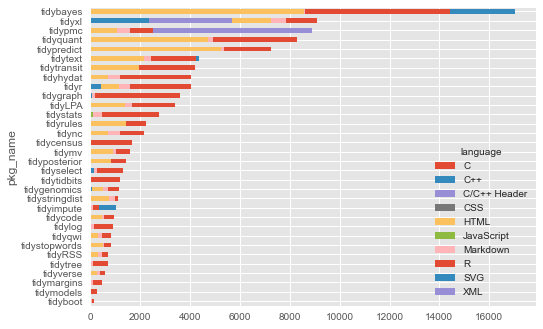
