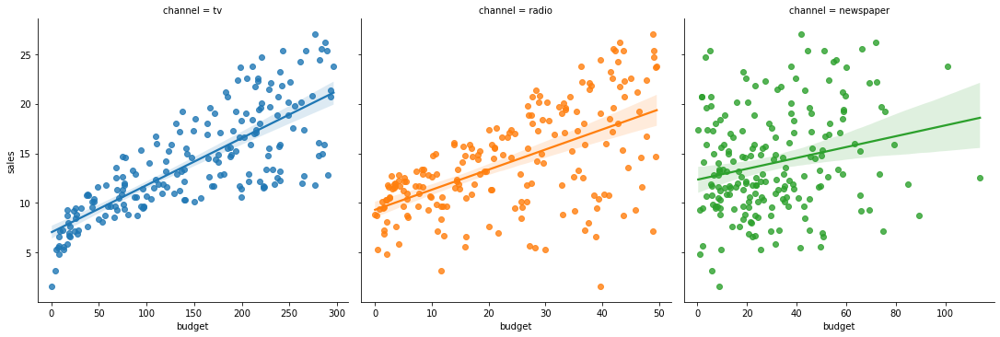

<script src="https://cdnjs.cloudflare.com/ajax/libs/require.js/2.3.6/require.min.js" integrity="sha512-c3Nl8+7g4LMSTdrm621y7kf9v3SDPnhxLNhcjFJbKECVnmZHTdo+IRO05sNLTH/D3vA6u1X32ehoLC7WFVdheg==" crossorigin="anonymous"></script>
<script src="https://cdnjs.cloudflare.com/ajax/libs/jquery/3.5.1/jquery.min.js" integrity="sha512-bLT0Qm9VnAYZDflyKcBaQ2gg0hSYNQrJ8RilYldYQ1FxQYoCLtUjuuRuZo+fjqhx/qtq/1itJ0C2ejDxltZVFg==" crossorigin="anonymous"></script>
<script type="application/javascript">define('jquery', [],function() {return window.jQuery;})</script>


-   hide: true
-   toc: true
-   comments: true
-   categories: \[ml, stats\]

``` python
import numpy as np
import pandas as pd
import seaborn as sns
import statsmodels.api as sm
import statsmodels.formula.api as smf
from stargazer.stargazer import Stargazer
```

Notes:

-   When will regression do well: when the underlying model is linear. Check KNN vs linear regression comparison.

## Multicollinearity

Load sample dataset

``` python
df = (
    sns.load_dataset("titanic")
    .pipe(pd.get_dummies, columns=["sex"])
    .rename(columns=lambda x: x.replace("sex_", ""))
)
df.head(3)
```

<div>
<style scoped>
    .dataframe tbody tr th:only-of-type {
        vertical-align: middle;
    }

    .dataframe tbody tr th {
        vertical-align: top;
    }

    .dataframe thead th {
        text-align: right;
    }
</style>

|     | survived | pclass | age  | sibsp | parch | fare    | embarked | class | who   | adult_male | deck | embark_town | alive | alone | female | male |
|-----|----------|--------|------|-------|-------|---------|----------|-------|-------|------------|------|-------------|-------|-------|--------|------|
| 0   | 0        | 3      | 22.0 | 1     | 0     | 7.2500  | S        | Third | man   | True       | NaN  | Southampton | no    | False | 0      | 1    |
| 1   | 1        | 1      | 38.0 | 1     | 0     | 71.2833 | C        | First | woman | False      | C    | Cherbourg   | yes   | False | 1      | 0    |
| 2   | 1        | 3      | 26.0 | 0     | 0     | 7.9250  | S        | Third | woman | False      | NaN  | Southampton | yes   | True  | 1      | 0    |

</div>

Check that female and male are mutually exclusive

``` python
df.groupby(["female", "male"]).size().unstack()
```

<div>
<style scoped>
    .dataframe tbody tr th:only-of-type {
        vertical-align: middle;
    }

    .dataframe tbody tr th {
        vertical-align: top;
    }

    .dataframe thead th {
        text-align: right;
    }
</style>

| male   | 0     | 1     |
|--------|-------|-------|
| female |       |       |
| 0      | NaN   | 577.0 |
| 1      | 314.0 | NaN   |

</div>

Regression specifications

``` python
m1 = smf.ols("survived ~ female", data=df).fit()
m2 = smf.ols("survived ~ male", data=df).fit()
m3 = smf.ols("survived ~ male + female -1", data=df).fit()
m4 = smf.ols("survived ~ male + female", data=df).fit()

Stargazer([m1, m2, m3, m4])
```

<table style="text-align:center"><tr><td colspan="5" style="border-bottom: 1px solid black"></td></tr><tr><td style="text-align:left"></td><td colspan="4"><em>Dependent variable:survived</em></td></tr><tr><td style="text-align:left"></td><tr><td style="text-align:left"></td><td>(1)</td><td>(2)</td><td>(3)</td><td>(4)</td></tr><tr><td colspan="5" style="border-bottom: 1px solid black"></td></tr><tr><td style="text-align:left">Intercept</td><td>0.189<sup>***</sup></td><td>0.742<sup>***</sup></td><td></td><td>0.310<sup>***</sup></td></tr><tr><td style="text-align:left"></td><td>(0.017)</td><td>(0.023)</td><td></td><td>(0.010)</td></tr><tr><td style="text-align:left">female</td><td>0.553<sup>***</sup></td><td></td><td>0.742<sup>***</sup></td><td>0.432<sup>***</sup></td></tr><tr><td style="text-align:left"></td><td>(0.029)</td><td></td><td>(0.023)</td><td>(0.016)</td></tr><tr><td style="text-align:left">male</td><td></td><td>-0.553<sup>***</sup></td><td>0.189<sup>***</sup></td><td>-0.121<sup>***</sup></td></tr><tr><td style="text-align:left"></td><td></td><td>(0.029)</td><td>(0.017)</td><td>(0.014)</td></tr><td colspan="5" style="border-bottom: 1px solid black"></td></tr><tr><td style="text-align: left">Observations</td><td>891</td><td>891</td><td>891</td><td>891</td></tr><tr><td style="text-align: left">R<sup>2</sup></td><td>0.295</td><td>0.295</td><td>0.295</td><td>0.295</td></tr><tr><td style="text-align: left">Adjusted R<sup>2</sup></td><td>0.294</td><td>0.294</td><td>0.294</td><td>0.294</td></tr><tr><td style="text-align: left">Residual Std. Error</td><td>0.409 (df=889)</td><td>0.409 (df=889)</td><td>0.409 (df=889)</td><td>0.409 (df=888)</td></tr><tr><td style="text-align: left">F Statistic</td><td>372.406<sup>***</sup> (df=1; 889)</td><td>372.406<sup>***</sup> (df=1; 889)</td><td>372.406<sup>***</sup> (df=1; 889)</td><td>185.993<sup>***</sup> (df=2; 888)</td></tr><tr><td colspan="5" style="border-bottom: 1px solid black"></td></tr><tr><td style="text-align: left">Note:</td>
 <td colspan="4" style="text-align: right">
  <sup>*</sup>p&lt;0.1;
  <sup>**</sup>p&lt;0.05;
  <sup>***</sup>p&lt;0.01
 </td></tr></table>

``` python
m3.summary()
```

|                   |                  |                     |          |
|-------------------|------------------|---------------------|----------|
| Dep. Variable:    | survived         | R-squared:          | 0.295    |
| Model:            | OLS              | Adj. R-squared:     | 0.294    |
| Method:           | Least Squares    | F-statistic:        | 372.4    |
| Date:             | Fri, 04 Feb 2022 | Prob (F-statistic): | 1.41e-69 |
| Time:             | 08:53:47         | Log-Likelihood:     | -466.09  |
| No. Observations: | 891              | AIC:                | 936.2    |
| Df Residuals:     | 889              | BIC:                | 945.8    |
| Df Model:         | 1                |                     |          |
| Covariance Type:  | nonrobust        |                     |          |

OLS Regression Results

|        |        |         |        |          |         |         |
|--------|--------|---------|--------|----------|---------|---------|
|        | coef   | std err | t      | P\>\|t\| | \[0.025 | 0.975\] |
| male   | 0.1889 | 0.017   | 11.102 | 0.000    | 0.156   | 0.222   |
| female | 0.7420 | 0.023   | 32.171 | 0.000    | 0.697   | 0.787   |

|                |        |                   |          |
|----------------|--------|-------------------|----------|
| Omnibus:       | 25.424 | Durbin-Watson:    | 1.959    |
| Prob(Omnibus): | 0.000  | Jarque-Bera (JB): | 27.169   |
| Skew:          | 0.427  | Prob(JB):         | 1.26e-06 |
| Kurtosis:      | 2.963  | Cond. No.         | 1.36     |

<br/><br/>Notes:<br/>[1] Standard Errors assume that the covariance matrix of the errors is correctly specified.

``` python
smf.ols("survived ~ ")

df
```

    TypeError: from_formula() missing 1 required positional argument: 'data'

# Example

``` python
path = "https://www.statlearning.com/s/Advertising.csv"
cols = ["TV", "radio", "newspaper", "sales"]
df = (
    pd.read_csv(path, usecols=cols)
    .rename(lambda col: col.lower(), axis=1)
    .reset_index()
    .rename(columns={"index": "market"})
)
print(df.shape)
df.head(3)
```

    (200, 5)

<div>
<style scoped>
    .dataframe tbody tr th:only-of-type {
        vertical-align: middle;
    }

    .dataframe tbody tr th {
        vertical-align: top;
    }

    .dataframe thead th {
        text-align: right;
    }
</style>

|     | market | tv    | radio | newspaper | sales |
|-----|--------|-------|-------|-----------|-------|
| 0   | 0      | 230.1 | 37.8  | 69.2      | 22.1  |
| 1   | 1      | 44.5  | 39.3  | 45.1      | 10.4  |
| 2   | 2      | 17.2  | 45.9  | 69.3      | 9.3   |

</div>

``` python
# Inspect data

tidy = df.melt(id_vars=["market", "sales"], var_name="channel", value_name="budget")

sns.lmplot(x="budget", y="sales", hue="channel", col="channel", sharex=False, data=tidy);
```



# Estimating coefficients

``` python
mod = sm.OLS.from_formula("sales ~ tv + radio + newspaper", data=df)
res = mod.fit()
print(res.summary())
```

                                OLS Regression Results                            
    ==============================================================================
    Dep. Variable:                  sales   R-squared:                       0.897
    Model:                            OLS   Adj. R-squared:                  0.896
    Method:                 Least Squares   F-statistic:                     570.3
    Date:                Mon, 15 Mar 2021   Prob (F-statistic):           1.58e-96
    Time:                        15:43:14   Log-Likelihood:                -386.18
    No. Observations:                 200   AIC:                             780.4
    Df Residuals:                     196   BIC:                             793.6
    Df Model:                           3                                         
    Covariance Type:            nonrobust                                         
    ==============================================================================
                     coef    std err          t      P>|t|      [0.025      0.975]
    ------------------------------------------------------------------------------
    Intercept      2.9389      0.312      9.422      0.000       2.324       3.554
    tv             0.0458      0.001     32.809      0.000       0.043       0.049
    radio          0.1885      0.009     21.893      0.000       0.172       0.206
    newspaper     -0.0010      0.006     -0.177      0.860      -0.013       0.011
    ==============================================================================
    Omnibus:                       60.414   Durbin-Watson:                   2.084
    Prob(Omnibus):                  0.000   Jarque-Bera (JB):              151.241
    Skew:                          -1.327   Prob(JB):                     1.44e-33
    Kurtosis:                       6.332   Cond. No.                         454.
    ==============================================================================

    Warnings:
    [1] Standard Errors assume that the covariance matrix of the errors is correctly specified.

# Evaluating accuracy of coefficient estimates

-   Hypothesis testing

# Evaluating accuracy of model

### Residual standard error

-   The RSE is an estimate of the irreducible error, $\epsilon$, and thus meansures how much, on average, the response will deviate from the true regression line.

-   The RSE is 3.25, which implies that our estimates deviate about 3.25 from the actual values (this would be true even if we knew the population parameters, as the RSE is an estimate of the error standard deviation). Given the average value of sales, the percentage error is about 12 percent. Whether this is a lot or not depends on the application.

-   Becaue the RSE is an absolute measure of lack of fit, expressed in units of y, it's not always easy to interpret whether a given RSE is small or large.

``` python
rse = np.sqrt(res.scale)
x_mean = df.sales.mean()

print(rse)
print(rse / x_mean)
print(res.rsquared)
```

    1.685510373414744
    0.1202004188564624
    0.8972106381789522

### $R^2$

-   $R^2$, which is a relative measure of lack of fit, and measures the percentage of variance in y that the model can explain (and is thus always between 0 and 1). In the simple linear regression setting, $R^2 = Cor(X, Y)^2$.

-   A low $R^2$ can mean that the true relationship is non-linear or that the error variance is very high or both. What constitutes "low" depends on the application.

-   In the model above, more than 90 percent of the variation is explained by the set of explanatory variables.

# Multiple linear regression

### Estimating the coefficients

# Questions of interest

## Is there a relationship between the response and predictors?

-   To test whether at least one of the predictors is useful in predicting the response, we can look at the reported F statistic.

``` python
res.fvalue, res.f_pvalue
```

    (570.2707036590942, 1.575227256092437e-96)

-   To test whether a subset of parameters is useful, we can run our own F-test. To manually test for all parameters, we can use:

``` python
a = np.identity(len(res.params))[1:]
res.f_test(a)
```

    <class 'statsmodels.stats.contrast.ContrastResults'>
    <F test: F=array([[570.27070366]]), p=1.5752272560925203e-96, df_denom=196, df_num=3>

-   Which is equivalent to the statistic provided in the output. To test the (joint) usefulness of radio and newspaper, we can use:

``` python
a = np.identity(len(res.params))[[2, 3]]
res.f_test(a)
```

    <class 'statsmodels.stats.contrast.ContrastResults'>
    <F test: F=array([[272.04067681]]), p=2.829486915701129e-57, df_denom=196, df_num=2>

-   Remember: the F statistic is valuable because irrespective of $p$, there is only a 5 percent change that the p-value is below 0.05. In contrast, individual predictors each have that probability, so for a large number of predictors, it's very likely that we observe significant ones solely due to chance.

Are all of the predictors or only a subset useful in explaining y?

## Application

``` python
# Overal fit

rse = np.sqrt(res.scale)
x_mean = df.sales.mean()

print(rse)
print(rse / x_mean)
print(res.rsquared)
```

    1.685510373414744
    0.1202004188564624
    0.8972106381789522

-   The RSE is 3.25, which implies that our estimates deviate about 3.25 from the actual values (this would be true even if we knew the population parameters, as the RSE is an estimate of the error standard deviation). Given the average value of sales, the percentage error is about 12 percent. Whether this is a lot or not depends on the application.

-   Becaue the RSE is an absolute measure of lack of fit, expressed in units of y, it's not always easy to interpret whether a given RSE is small or large.

-   $R^2$, which is a relative measure of lack of fit, and measures the percentage of variance in y that the model can explain (and is thus always between 0 and 1). In the simple linear regression setting, $R^2 = Cor(X, Y)^2$.

-   A low $R^2$ can mean that the true relationship is non-linear or that the error variance is very high or both. What constitutes "low" depends on the application.

-   In the model above, more than 90 percent of the variation is explained by the set of explanatory variables.

``` python
# Is at least one of the predictors useful in explaining y?

res.fvalue, res.f_pvalue
```

    (570.2707036590942, 1.575227256092437e-96)

``` python
# Is a subset of predictors useful?

a = np.identity(len(res.params))[[2, 3]]
res.f_test(a)
```

    <class 'statsmodels.stats.contrast.ContrastResults'>
    <F test: F=array([[272.04067681]]), p=2.829486915701129e-57, df_denom=196, df_num=2>

Remember: the F statistic is valuable because irrespective of $p$, there is only a 5 percent change that the p-value is below 0.05. In contrast, individual predictors each have that probability, so for a large number of predictors, it's very likely that we observe significant ones solely due to chance.

### Regression diagnostics

See [this](https://github.com/erykml/medium_articles/blob/master/Statistics/linear_regression_assumptions.ipynb) awesome post.

## Non-standard standard errors

A very useful [post](https://www.vincentgregoire.com/standard-errors-in-python/) by Vincent Grégoire on how to use various standard error adjustment commonly used in economics.

# Sources

-   [The hundred-page machine learning book](http://themlbook.com)
-   [An introduction to statistical learning](https://www.statlearning.com)
