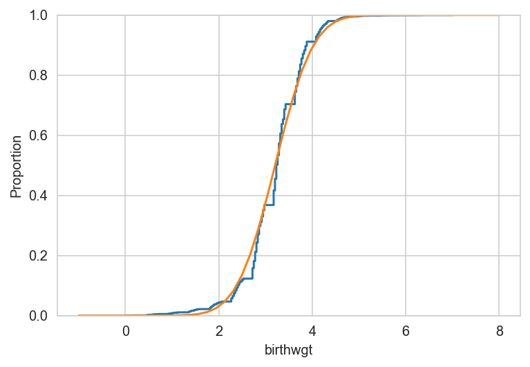
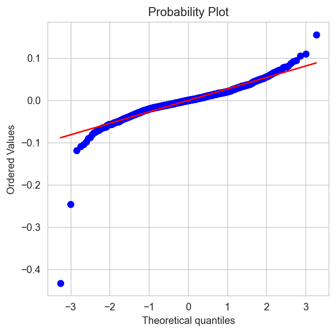
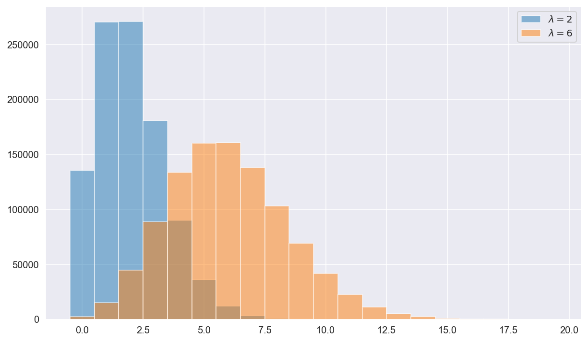
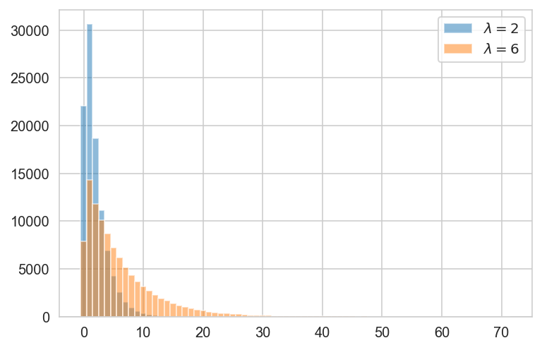
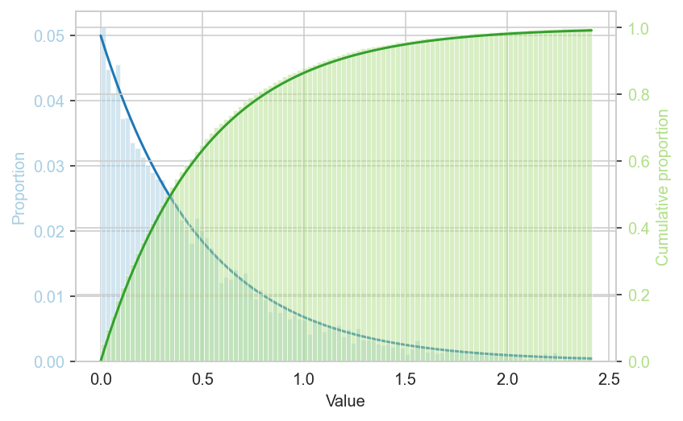
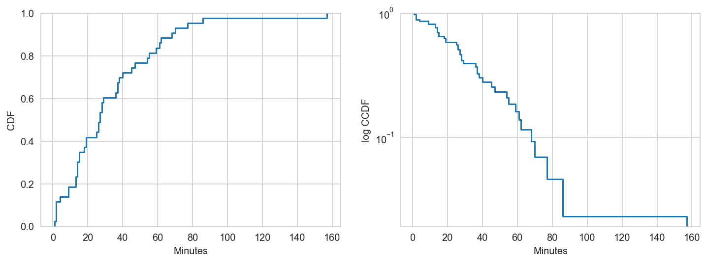
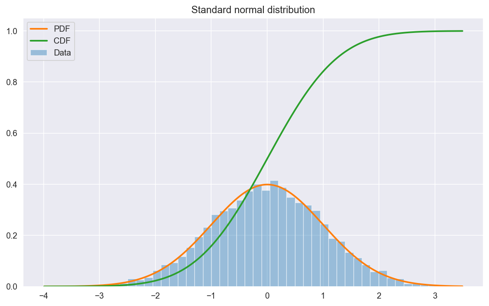
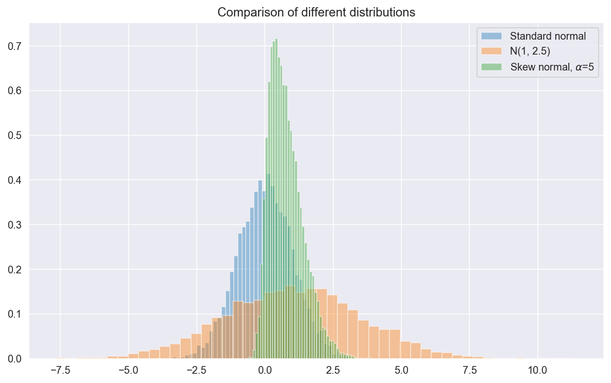

<script src="https://cdnjs.cloudflare.com/ajax/libs/require.js/2.3.6/require.min.js" integrity="sha512-c3Nl8+7g4LMSTdrm621y7kf9v3SDPnhxLNhcjFJbKECVnmZHTdo+IRO05sNLTH/D3vA6u1X32ehoLC7WFVdheg==" crossorigin="anonymous"></script>
<script src="https://cdnjs.cloudflare.com/ajax/libs/jquery/3.5.1/jquery.min.js" integrity="sha512-bLT0Qm9VnAYZDflyKcBaQ2gg0hSYNQrJ8RilYldYQ1FxQYoCLtUjuuRuZo+fjqhx/qtq/1itJ0C2ejDxltZVFg==" crossorigin="anonymous"></script>
<script type="application/javascript">define('jquery', [],function() {return window.jQuery;})</script>


``` python
import matplotlib.pyplot as plt
import numpy as np
import pandas as pd
import pandas_datareader as pdr
import seaborn as sns
from scipy import stats
from statsmodels.api import ProbPlot

import helpers as hs

%config InlineBackend.figure_format ='retina'
%load_ext autoreload
%autoreload 2

sns.set_style("whitegrid")
```

    The autoreload extension is already loaded. To reload it, use:
      %reload_ext autoreload

## Discreet distributions

### Binomial

#### Application: are girls and boys equally likely?

Based on [Dunn (1999)](https://www.tandfonline.com/doi/pdf/10.1080/10691898.1999.12131281), via [ThinkStats](https://greenteapress.com/wp/think-stats-2e/).

-   Task: test whether a new baby is as likely to be a boy as a girl.
-   Approach: Use a [binomial test](https://en.wikipedia.org/wiki/Binomial_test) to check whether we can reject the hypothesis that the probability of giving birth to a girl is 0.5.

Load data

``` python
df = hs.read_birth_data()
df['sex'] = df.sex.map({1: 'girl', 2: 'boy'})
df.head(3)
```

<div>
<style scoped>
    .dataframe tbody tr th:only-of-type {
        vertical-align: middle;
    }

    .dataframe tbody tr th {
        vertical-align: top;
    }

    .dataframe thead th {
        text-align: right;
    }
</style>

|     | time | sex  | weight | mam |
|-----|------|------|--------|-----|
| 0   | 0005 | girl | 3837   | 5   |
| 1   | 0104 | girl | 3334   | 64  |
| 2   | 0118 | boy  | 3554   | 78  |

</div>

Perform the binomial test

``` python
num_girls = df.sex.value_counts()['girl']
num_babies = len(df)
p_girl_h0 = 0.5
p = stats.binomtest(k=num_girls, n=num_babies, p=p_girl_h0).pvalue
print(f"p-value for observing {num_girls} or more girls in a total of {num_babies} babies is {p:.3f}.")
```

    p-value for observing 18 or more girls in a total of 44 babies is 0.291.

Conclusion:
- The probability of observing 18 girls in 44 babies is not that unusual under the null hypothesis that boys and girls are equally likely to be born, so we don't reject it.

### Negative binomial

-   Used to model probability of an event occurring after a given number of independent Bernoulli trials.
-   E.g. what is the probability of throwing the 3th 6 in the 12th throw of a dice?

## Continuous distributions

### Normal distribution

-   Useful not mainly because data is often normally distributed, but because sample distributions of statistics (as well as errors) often are.
-   But rely on normality assumption only as a last resort if using empirical distributions or bootstrap is not available.

#### Application - test whether normal distribution is a good model for baby weight data

``` python
df = hs.read_pregnancy_data()
df.head(3)
```

<div>
<style scoped>
    .dataframe tbody tr th:only-of-type {
        vertical-align: middle;
    }

    .dataframe tbody tr th {
        vertical-align: top;
    }

    .dataframe thead th {
        text-align: right;
    }
</style>

|     | caseid | babygirl | birthord | prglength | birthwgt | outcome | agepreg | firstborn |
|-----|--------|----------|----------|-----------|----------|---------|---------|-----------|
| 0   | 1      | 1.0      | 1.0      | 39        | 3.713152 | 1       | 33.0    | 1         |
| 1   | 1      | 0.0      | 2.0      | 39        | 3.287982 | 1       | 39.0    | 0         |
| 2   | 2      | 1.0      | 1.0      | 39        | 4.138322 | 1       | 14.0    | 1         |

</div>

``` python
def normal_cdf_comparison(s):
    """Returns figure comparing series ECDF with normal CDF"""
    rv = stats.norm(loc=s.mean(), scale=s.std())
    x = np.linspace(s.min()-1, s.max()+1)
    fig, ax = plt.subplots()
    sns.ecdfplot(s, label='data')
    ax.plot(x, rv.cdf(x), label='model')
    return fig, ax

normal_cdf_comparison(df.birthwgt);
```



#### Application - test normality of stock returns

-   Q-Q plots (for quantile-quantile plot) help us compare the quantiles in our dataset to the quantiles of a theoretical distribution (or, less commonly, that of two datasets or two theoretical distributions) to see whether our data follows this distribution (I'll refer to the normal distribution below to fix ideas). (See [this](https://www.youtube.com/watch?v=okjYjClSjOg) helpful video for more details on how to construct Q-Q plots, and [this](https://towardsdatascience.com/explaining-probability-plots-9e5c5d304703) useful article for details on probability plots more generally.)

-   In general, the x-percent quantile is a point in the data such that x percent of the data fall below it (this point is also the xth percentile).

-   To create a Q-Q plot, we proceed as follows:

    1.  Sort the data and define each point as its own quantile to end up with as many equally sized groups of size one as there are data points.

    2.  Find the values for the same number of quantiles in the reference distribution as you created in the data. In the reference distribution, groups of equal size are the same as intervals with equal probability mass.

    3.  Mark the quantiles for the data on the y-axis and for the normal distribution on the x-axis.

-   The QQ-plot below shows that while Netflix stock returns fit a normal distribution well in the inner part of the distribution, the returns distribution has fat tails -- a disproportionate number of very high and low returns.

``` python
data = pdr.get_data_yahoo("nflx").Close
returns = np.diff(np.log(data[data > 0]))
fix, ax = plt.subplots(figsize=(5, 5))
stats.probplot(returns, plot=ax);
```



### Chi-Squared distribution

-   To assess goodness of fit.

### F distribution

-   Can be used to measure whether means of different treatment groups differ from control condition.
-   F-statistic is calculated as the ratio of the variance between groups and the variance within groups (ANOVA).
-   F distribution gives all values that would be produced if between variance were zero (i.e. under the null model).
-   Df is given by the number of groups we compare.

### Poisson distribution

-   Useful to model processes that randomly generate outcomes at a constant rate (e.g. processes like arrivals that vary over time, or number of defects or typos that vary over space).
-   The parameter of the distribution is lambda, which is both the rate per unit of time and the variance.
-   The poisson and exponential distribution can be very useful when modelling, say, arrivals and waiting times. It's important, though, to remember the three key assumptions: 1) lambda remains constant across intervals, 2) events are independent, and 3) two events cannot occur at the same time.
-   To account for 1), defining the intervals such that they are sufficiently homogenous often helps.

``` python
# Comparing Poisson distributions

x = np.random.poisson(2, 1000000)
y = np.random.poisson(6, 1000000)
plt.hist(x, alpha=0.5, label="$\\lambda = 2$", bins=np.arange(min(x), max(x)) - 0.5)
plt.hist(y, alpha=0.5, label="$\\lambda = 6$", bins=np.arange(min(y), max(y)) - 0.5)
plt.legend();
```



### Exponential distribution

-   Takes the same parameter lambda as the Poisson distribution, but can be used to model the time between random events occuring at a frequent rate lambda (i.e. the time/space difference between Poisson events).
-   Events have to be equally likely to occur at any point in time.

Comparing exponential distributions

``` python
n = 100000
x = np.random.exponential(2, n)
y = np.random.exponential(6, n)
plt.hist(x, alpha=0.5, label="$\\lambda = 2$", bins=np.arange(min(x), max(x)) - 0.5)
plt.hist(y, alpha=0.5, label="$\\lambda = 6$", bins=np.arange(min(y), max(y)) - 0.5)
plt.legend();
```



pdf and cdf

``` python
rng = np.random.default_rng(2312)

# Draw sample from exponential with lambda = 2
# and discard 1 percent largest values
scale = 0.5   # scale is beta = 1/lambda
data = rng.exponential(scale, 10000)
p99 = np.percentile(data, 99)
data = data[data <= p99]


fig, ax1 = plt.subplots(figsize=(6, 4))

color = '#a6cee3'
sns.histplot(data, bins=100, alpha=0.5, color=color, stat='proportion', ax=ax1)
ax1.set_xlabel('Value')
ax1.set_ylabel('Proportion', color=color)
ax1.tick_params(axis='y', labelcolor=color)

ax2 = ax1.twinx()
color = "#b2df8a"
sns.histplot(data, bins=100, alpha=0.5, color=color, stat='proportion', cumulative=True, ax=ax2)
ax2.set_ylabel('Cumulative proportion', color=color)
ax2.tick_params(axis='y', labelcolor=color)

x = np.linspace(0, p99, 100)
exp = stats.expon(scale=0.5)
color = '#1f78b4'
ax1.plot(x, exp.pdf(x) / 40, color=color)
color = '#33a02c'
ax2.plot(x, exp.cdf(x), color = color);
```



#### Application - model time between births

Based on Chapter 5 in [ThinkStats](https://greenteapress.com/wp/think-stats-2e/)

Task:
- Check whether the exponential distribution is a suitable model for interval between births.

Approach:
- The cdf of the exponential function is $CDF(x) = 1 - e^{-\lambda x}$. The complementary cdf is defined as $1-cdf$. Hence, the complement of the exponential cdf is $CCDF(x) = 1 - (1 - e^{-\lambda x}) = e^{-\lambda x}$, and the log thereof is $log CCDF(x) = -\lambda x$. This means that if the data were approximately exponentially distributed a plot of the log CCDF would produce a straight line with slope $-\lambda$.

-   I thus create such a plot to examine whether I get an approximately staright line.

Loading data

``` python
df = hs.read_birth_data()
df['dt'] = df.mam.diff()
df.head(3)
```

<div>
<style scoped>
    .dataframe tbody tr th:only-of-type {
        vertical-align: middle;
    }

    .dataframe tbody tr th {
        vertical-align: top;
    }

    .dataframe thead th {
        text-align: right;
    }
</style>

|     | time | sex | weight | mam | dt   |
|-----|------|-----|--------|-----|------|
| 0   | 0005 | 1   | 3837   | 5   | NaN  |
| 1   | 0104 | 1   | 3334   | 64  | 59.0 |
| 2   | 0118 | 2   | 3554   | 78  | 14.0 |

</div>

Model time interval between births (based on minutes after midnight)

``` python
fig, ax = plt.subplots(1, 2, figsize=(12, 4))
sns.ecdfplot(df.dt, ax=ax[0])
sns.ecdfplot(df.dt, complementary = True, log_scale=(False, True), ax=ax[1]);
ax[0].set(xlabel='Minutes', ylabel='CDF')
ax[1].set(xlabel='Minutes', ylabel='log CCDF');
```



Conclusion:
- The line in the right hand panel in the above figure is not perfectly straight, indicating that the exponential distribution is not a perfect model for the data (probably because the assumption that births are equally likely at eat time of day is not exactly true). But, depending on our purpose, it might be good enough.
- Doing so would allow us to characterise the data with the single parameter $\lambda$.

### Weibull distribution

-   Used to model events for which the event rate changes during the time of the interval, and thus violates the poisson and exponential assumption.
-   An example is mechanical failure, where the probability of failure increases as time goes by.
-   Parameters of the distribution are $\eta$, the scale parameter, and $\beta$, the shape parameter ($\beta > 1$ indicates increasing probability of an event over time, $\beta < 1$ decreasing probability).

## Plotting distributions in Seaborn

``` python
# Generating random samples

n = 10000
rv_std_normal = np.random.normal(size=n)
rv_normal = np.random.normal(1, 2.5, n)
rv_skew_normal = stats.skewnorm.rvs(a=5, size=n)
```

``` python
# Drawing histogram, pdf, and cdf of std normal sample

x = np.linspace(min(rv_std_normal), max(rv_std_normal), 1000)

pdf = stats.norm.pdf(x)
cdf = stats.norm.cdf(x)

ax = sns.distplot(rv_std_normal, kde=False, norm_hist=True, label="Data")
ax.plot(x, pdf, lw=2, label="PDF")
ax.plot(x, cdf, lw=2, label="CDF")

ax.set_title("Standard normal distribution")
ax.legend();
```



``` python
# Compare three distributions

ax = sns.distplot(rv_std_normal, kde=False, norm_hist=True, label="Standard normal")
ax = sns.distplot(rv_normal, kde=False, norm_hist=True, label="N(1, 2.5)")
ax = sns.distplot(
    rv_skew_normal, kde=False, norm_hist=True, label="Skew normal, $\\alpha$=5"
)
ax.set_title("Comparison of different distributions")
ax.legend();
```



# dev
