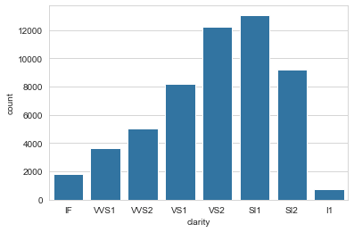
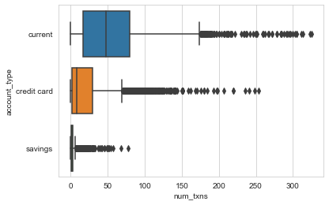
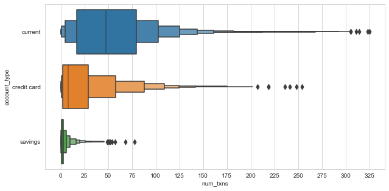

# Data visualisation notes


<script src="https://cdnjs.cloudflare.com/ajax/libs/require.js/2.3.6/require.min.js" integrity="sha512-c3Nl8+7g4LMSTdrm621y7kf9v3SDPnhxLNhcjFJbKECVnmZHTdo+IRO05sNLTH/D3vA6u1X32ehoLC7WFVdheg==" crossorigin="anonymous"></script>
<script src="https://cdnjs.cloudflare.com/ajax/libs/jquery/3.5.1/jquery.min.js" integrity="sha512-bLT0Qm9VnAYZDflyKcBaQ2gg0hSYNQrJ8RilYldYQ1FxQYoCLtUjuuRuZo+fjqhx/qtq/1itJ0C2ejDxltZVFg==" crossorigin="anonymous" data-relocate-top="true"></script>
<script type="application/javascript">define('jquery', [],function() {return window.jQuery;})</script>


``` python
import matplotlib.pyplot as plt
import numpy as np
import pandas as pd
import seaborn as sns

sns.set_style('whitegrid')
```

``` python
df = sns.load_dataset('diamonds')
df.head(2)
```

<div>
<style scoped>
    .dataframe tbody tr th:only-of-type {
        vertical-align: middle;
    }

    .dataframe tbody tr th {
        vertical-align: top;
    }

    .dataframe thead th {
        text-align: right;
    }
</style>

|     | carat | cut     | color | clarity | depth | table | price | x    | y    | z    |
|-----|-------|---------|-------|---------|-------|-------|-------|------|------|------|
| 0   | 0.23  | Ideal   | E     | SI2     | 61.5  | 55.0  | 326   | 3.95 | 3.98 | 2.43 |
| 1   | 0.21  | Premium | E     | SI1     | 59.8  | 61.0  | 326   | 3.89 | 3.84 | 2.31 |

</div>

``` python
df.clarity.value_counts()
```

    SI1     13065
    VS2     12258
    SI2      9194
    VS1      8171
    VVS2     5066
    VVS1     3655
    IF       1790
    I1        741
    Name: clarity, dtype: int64

## Use `countplot()` (not a histogram!) for categorical frequencies

To visualise the frequency of a categorical variable, I'd often reflexively plot a histogram, even though I kind of knew that that's not what it's for (it's for plotting the distribution of continuous variables). For categorical frequencies, it's much better to use `countplot()`, one [several](https://seaborn.pydata.org/api.html#categorical-plots) plot types `seaborn` provides for categorical variables.

``` python
sns.countplot(x='clarity', data=df, color='tab:blue');
```



## Letter-value plots

``` python
fp = f'~/tmp/entropy_X77.parquet'
df = pd.read_parquet(fp)

def make_data(df):
    return (df.loc[df.account_type.ne('other')]
            .set_index('date')
            .groupby(['account_type', 'account_id'], observed=True)
            .resample('M').id.count()
            .rename('num_txns')
            .reset_index())
data = make_data(df)
data.head(2)
```

<div>
<style scoped>
    .dataframe tbody tr th:only-of-type {
        vertical-align: middle;
    }

    .dataframe tbody tr th {
        vertical-align: top;
    }

    .dataframe thead th {
        text-align: right;
    }
</style>

|     | account_type | account_id | date       | num_txns |
|-----|--------------|------------|------------|----------|
| 0   | current      | 15837      | 2014-07-31 | 5        |
| 1   | current      | 15837      | 2014-08-31 | 27       |

</div>

I want to compare the distributions of monthly transactions per account types. An obvious choice is a boxplot.

``` python
sns.boxplot(data=data, y='account_type', x='num_txns');
```



-   The plot shows quartiles, whiskers indicating variability outside the quartiles, and outliers for each distribution.
-   By [default](https://seaborn.pydata.org/generated/seaborn.boxplot.html#seaborn.boxplot), Seaborn defines as outliers all observations that are outside of 1.5 x IQR on either side of the box.
-   The width (height, really) of the boxes is arbitrary (in particular, they are not related to sample size, as is the case in some [variations](https://en.wikipedia.org/wiki/Box_plot#Variations)).

The plot has obvious limitations, though.

-   For small datasets (n \< 200) estimates of tail behaviour is unreliable and boxplots provide appropriately vague information beyond the quartiles. Also, for small datasets, the number of outliers is usually small and tractable.

-   For larger datasets (10,000 - 100,000), boxplots have two shortcomings: 1) we could and would like to provide more information about tail behaviour, and 2) they classify lots of points as outliers (see above), many of which are extreme but not unexpected (i.e. they are extreme values drawn from the same distribution as the rest of the data, not genuine outliers drawn from a different distribution).

This is where letter-value plots (or boxenplots, as Seaborn calls them), are useful.

``` python
fix, ax = plt.subplots(figsize=(10, 5))
sns.boxenplot(data=data, y='account_type', x='num_txns')
ax.set_xticks(range(0, 350, 25));
```



-   Letter-value plots address the two shortcomints of boxplots for large datasets: they provide more information about the distribution in the tails, and classify fewer points as outliers.

Interpreting letter-value plots:

-   Each box on either side captures half the remaining data on that side.
-   For instance, we can see that the median number of monthly transactions for current accounts is about 48. The right half of the innermost box then tells us that half of the remaining observations to the right of the median, i.e. 25% of all data, have fewer than 80 transactions. This is equivalent to saying that three quarters of all month-account observations have fewer than 80 transactions, and corresponds to the box shown in the boxplot above.
-   The interpretation of the next box is the same: it tells us that half of all the remaining data past the third quartile (12.5% of all the data) have fewer than about 105 transactions, and similarly for all further boxes.
-   Boxes with identical heights correspond the the same level.
-   The width of each box indicates how spread out the data are in that region of the distribution (e.g. the large width of the right-most boxes shows that in the extremes, the data is very spread out).

## Explore colour palettes

``` python
import seaborn as sns

pal = 'Paired'
print(sns.color_palette(pal).as_hex())
sns.color_palette(pal)

# colors = sns.color_palatte('Paired')[:4]
```

    ['#a6cee3', '#1f78b4', '#b2df8a', '#33a02c', '#fb9a99', '#e31a1c', '#fdbf6f', '#ff7f00', '#cab2d6', '#6a3d9a', '#ffff99', '#b15928']

<svg  width="660" height="55"><rect x="0" y="0" width="55" height="55" style="fill:#a6cee3;stroke-width:2;stroke:rgb(255,255,255)"/><rect x="55" y="0" width="55" height="55" style="fill:#1f78b4;stroke-width:2;stroke:rgb(255,255,255)"/><rect x="110" y="0" width="55" height="55" style="fill:#b2df8a;stroke-width:2;stroke:rgb(255,255,255)"/><rect x="165" y="0" width="55" height="55" style="fill:#33a02c;stroke-width:2;stroke:rgb(255,255,255)"/><rect x="220" y="0" width="55" height="55" style="fill:#fb9a99;stroke-width:2;stroke:rgb(255,255,255)"/><rect x="275" y="0" width="55" height="55" style="fill:#e31a1c;stroke-width:2;stroke:rgb(255,255,255)"/><rect x="330" y="0" width="55" height="55" style="fill:#fdbf6f;stroke-width:2;stroke:rgb(255,255,255)"/><rect x="385" y="0" width="55" height="55" style="fill:#ff7f00;stroke-width:2;stroke:rgb(255,255,255)"/><rect x="440" y="0" width="55" height="55" style="fill:#cab2d6;stroke-width:2;stroke:rgb(255,255,255)"/><rect x="495" y="0" width="55" height="55" style="fill:#6a3d9a;stroke-width:2;stroke:rgb(255,255,255)"/><rect x="550" y="0" width="55" height="55" style="fill:#ffff99;stroke-width:2;stroke:rgb(255,255,255)"/><rect x="605" y="0" width="55" height="55" style="fill:#b15928;stroke-width:2;stroke:rgb(255,255,255)"/></svg>

### Sources:

-   [Letter-value plots paper](https://vita.had.co.nz/papers/letter-value-plot.html)
-   [Boxplots on Wikipedia](https://en.wikipedia.org/wiki/Box_plot)
-   [Dennis Meisner on Medium](https://towardsdatascience.com/letter-value-plot-the-easy-to-understand-boxplot-for-large-datasets-12d6c1279c97)

