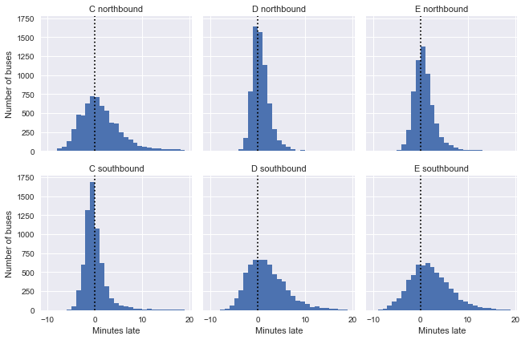

<script src="https://cdnjs.cloudflare.com/ajax/libs/require.js/2.3.6/require.min.js" integrity="sha512-c3Nl8+7g4LMSTdrm621y7kf9v3SDPnhxLNhcjFJbKECVnmZHTdo+IRO05sNLTH/D3vA6u1X32ehoLC7WFVdheg==" crossorigin="anonymous"></script>
<script src="https://cdnjs.cloudflare.com/ajax/libs/jquery/3.5.1/jquery.min.js" integrity="sha512-bLT0Qm9VnAYZDflyKcBaQ2gg0hSYNQrJ8RilYldYQ1FxQYoCLtUjuuRuZo+fjqhx/qtq/1itJ0C2ejDxltZVFg==" crossorigin="anonymous"></script>
<script type="application/javascript">define('jquery', [],function() {return window.jQuery;})</script>


This notebook replicates Jake VanderPlas' awesome [post](http://jakevdp.github.io/blog/2018/09/13/waiting-time-paradox/) on the topic.

## Background

The waiting-time paradox is a special case of the [inspection paradox](https://towardsdatascience.com/the-inspection-paradox-is-everywhere-2ef1c2e9d709), which -- as VanderPlas succinctly summarises -- occurs whenever the probability of observing a quantity is related to the quantity being observed. For example: if you sample random students on campus and ask them about the size of their classes you'll probably get a larger number than if you asked the collge administrator, because you're likely to oversample students from large classes. Similarly, you are more likely to arrive at a bus stop during a longer waiting time simply because the waiting time is longer.

However, the waiting time paradox claims not only that the experienced waiting time is longer than the average waiting time, but that it is twice as long.

## Simulating wait times

``` python
import random

import matplotlib.pyplot as plt
import numpy as np
import pandas as pd
import seaborn as sns
from scipy.stats import norm, poisson

plt.style.use("seaborn")
```

Helper functions

``` python
def simulate_bus_arrivals(n=1000000, tau=10, rseed=231296):
    """
    Simulates the arrival of n buses that are scheduled to arrive every tau minutes.
    """
    np.random.RandomState(rseed)
    return n * tau * np.sort(np.random.rand(n))


def simulate_wait_times(arrival_times, n=1000000, rseed=231286):
    """
    Calculate the waiting time for each arriving passenger.
    """
    # Simulate customer arrival times (between 0 and arrival of last bus)
    np.random.RandomState(rseed)
    arrival_times = np.array(arrival_times)
    passenger_times = arrival_times.max() * np.sort(np.random.rand(n))

    # Find the index of the next bus for each simulated customer
    i = np.searchsorted(arrival_times, passenger_times, side="right")

    return arrival_times[i] - passenger_times
```

``` python
# Create bus arrival times and check that frequency is about tau

bus_arrival_times = simulate_bus_arrivals(n=1000000, tau=10, rseed=231286)
intervals = np.diff(bus_arrival_times)
intervals.mean()
```

    9.9999994693088

``` python
# Calculate passenger waiting times

wait_times = simulate_wait_times(bus_arrival_times)
wait_times.mean()
```

    10.00276398808929

This is in line with the paradox: if buses arrive every 10 minutes on average, the the average wait time is not 5 minutes, but 10 mintues.

## Digging deeper

To model the above result analytically, let's model the process we generated to calculate waiting times and then derive the expected waiting time.

For a start, we can write the expected value of intervals $T$ between bus arrivals as

$$ E(T) = \int_{0}^{\infty} Tp(T)dT $$.

In the simulation above, we set $E(T) = \tau = 10$ minutes.

What we're after, however, is the expected value of the waiting time for a rider who arrives at the bus stop. To get this, we first model the distribution of experienced waiting times for customers, and then recognise that the expected value of the waiting time is half the expected value for the experienced waiting time.

From the inspection paradox, we know that the experienced waiting time depends on the actual intervals between buses, $p(T)$ as well as on the length of the intervals, $T$. So we can write

$$ p_{exp}(T) \propto Tp(T)$$.

Substitute the constant of proportionality for the proportional sign seemed obvious for jvdp, but was less so for me, so I'm gonna back up and explain, based on [this](https://davidrosenberg.github.io/mlcourse/Notes/proportionality.pdf) super helpful resource.

If \$ p\_{exp}(T) Tp(T)\$, then we know that there exists a constant of proportionality $k$ such that

$$ p_{exp}(T) = kTp(T)$$.

Because $p_{exp}(T)$ is a density, we have $\int_0^\infty p_{exp}(T)dT = 1$, which means that

$$\int_0^\infty kTp(T)dT = 1$$
$$k\int_0^\infty Tp(T)dT = 1$$
$$k = \left[\int_0^\infty kTp(T)dT\right]^{-1}$$

Using this in our expression above, we get

$$p_{exp}(T) = \frac{Tp(T)}{\int_0^\infty Tp(T)dT}$$.

And using the definition of $E(T)$ above, this simplifies to

$$p_{exp}(T) = \frac{Tp(T)}{E(T)}$$.

To find the expected waiting time $E(W)$, the final step is use the fact that the expected value for the observed interval is half the expected interval (if riders experience buses at arriving every 20 minutes, then their expected waiting time is 10 minutes). We can thus write:

$$E(W) = \frac{1}{2} E_{exp}(T) = \frac{1}{2} \int_{0}^{\infty} Tp_{exp}(T)dT$$.

Using our expression from above and rewriting gives

$$
E(W) = \frac{1}{2} \int_{0}^{\infty} T\frac{Tp(T)}{E(T)}dT
E(W) = \frac{1}{2E(T)} \int_{0}^{\infty} T^2p(T)dT
E(W) =\frac{E(T^2)}{2E(T)}
$$.

What we now need to do is to find a form for $p(T)$ and compute our integrals.

## Choosing p(T)

``` python
# Plot distribution of simulated intervals

plt.hist(intervals, bins=np.arange(80), alpha=0.5, density=True)
plt.axvline(intervals.mean(), color="black", linestyle="dotted")
plt.xlabel("Interval between arrivals (minutes)")
plt.ylabel("Probability density");
```


The distribution of intervals is clearly exponential. The original post describes in some more detail why this was to be expected given that we sampled arrival times from a uniform distribution. The short answer is: random selection from a uniform distribution approximates a poisson process, and the distribution of intervals of a poisson process is exponential. Let's thus check whether our arrival times do indeed follow a poisson distribution.

``` python
# Count number of arrivals for each 1-hour interval

binsize = 60
binned_counts = np.bincount((np.sort(bus_arrival_times) // binsize).astype("int"))

# Plot results and compare with poisson distribution

x = np.arange(20)
tau = 10
mu = binsize / tau
plt.hist(
    binned_counts,
    bins=x - 0.5,
    density=True,
    alpha=0.5,
    label="Simulation",
)
plt.plot(x, poisson.pmf(x, mu), "ok", label="Poisson prediction")
plt.legend();
```


It's clear that the poisson distribution approximates our distribution of simulated arrivals very well. This means that we can write the probability distribution of our intervals as ...

...

jvdp gets $p(T) = \frac{1}{\tau}e^{-T/\tau}$

I can't see where this is coming from. Following the logic of [this](https://nicolewhite.github.io/2015/05/23/understanding-waiting-times.html) post, I get $p(T) = -e^{T/\tau}$

## Waiting times in reality

``` python
# Load data
df = pd.read_csv("./data/bus_paradox_arrival_times.csv")
df = df.dropna(axis=0, how="any")
df.head()
```

<div>
<style scoped>
    .dataframe tbody tr th:only-of-type {
        vertical-align: middle;
    }

    .dataframe tbody tr th {
        vertical-align: top;
    }

    .dataframe thead th {
        text-align: right;
    }
</style>

|     | OPD_DATE   | VEHICLE_ID | RTE | DIR | TRIP_ID  | STOP_ID | STOP_NAME               | SCH_STOP_TM | ACT_STOP_TM |
|-----|------------|------------|-----|-----|----------|---------|-------------------------|-------------|-------------|
| 0   | 2016-03-26 | 6201       | 673 | S   | 30908177 | 431     | 3RD AVE & PIKE ST (431) | 01:11:57    | 01:13:19    |
| 1   | 2016-03-26 | 6201       | 673 | S   | 30908033 | 431     | 3RD AVE & PIKE ST (431) | 23:19:57    | 23:16:13    |
| 2   | 2016-03-26 | 6201       | 673 | S   | 30908028 | 431     | 3RD AVE & PIKE ST (431) | 21:19:57    | 21:18:46    |
| 3   | 2016-03-26 | 6201       | 673 | S   | 30908019 | 431     | 3RD AVE & PIKE ST (431) | 19:04:57    | 19:01:49    |
| 4   | 2016-03-26 | 6201       | 673 | S   | 30908252 | 431     | 3RD AVE & PIKE ST (431) | 16:42:57    | 16:42:39    |

</div>

### Data cleanup

``` python
# Combine time and data into single timestamp
df["actual"] = pd.to_datetime(df["OPD_DATE"] + " " + df["ACT_STOP_TM"])
df["scheduled"] = pd.to_datetime(df["OPD_DATE"] + " " + df["SCH_STOP_TM"])

# Calculate dalay in minutes, adjusting actual day when actual and scheduled span midnight
minute = np.timedelta64(1, "m")
hour = 60 * minute
diff_hrs = (df["actual"] - df["scheduled"]) / hour
df.loc[diff_hrs < -22, "actual"] += 2 * hour
df.loc[diff_hrs > 22, "actual"] -= 2 * hour
df["minutes_late"] = (df["actual"] - df["scheduled"]) / minute

# Map internal route codes to external route letters
df["route"] = df["RTE"].replace({673: "C", 674: "D", 675: "E"}).astype("category")
df["direction"] = (
    df["DIR"].replace({"N": "northbound", "S": "southbound"}).astype("category")
)

# Extract useful columns
df = df[["route", "direction", "scheduled", "actual", "minutes_late"]]

df.head()
```

<div>
<style scoped>
    .dataframe tbody tr th:only-of-type {
        vertical-align: middle;
    }

    .dataframe tbody tr th {
        vertical-align: top;
    }

    .dataframe thead th {
        text-align: right;
    }
</style>

|     | route | direction  | scheduled           | actual              | minutes_late |
|-----|-------|------------|---------------------|---------------------|--------------|
| 0   | C     | southbound | 2016-03-26 01:11:57 | 2016-03-26 01:13:19 | 1.366667     |
| 1   | C     | southbound | 2016-03-26 23:19:57 | 2016-03-26 23:16:13 | -3.733333    |
| 2   | C     | southbound | 2016-03-26 21:19:57 | 2016-03-26 21:18:46 | -1.183333    |
| 3   | C     | southbound | 2016-03-26 19:04:57 | 2016-03-26 19:01:49 | -3.133333    |
| 4   | C     | southbound | 2016-03-26 16:42:57 | 2016-03-26 16:42:39 | -0.300000    |

</div>

``` python
df.info()
```

    <class 'pandas.core.frame.DataFrame'>
    Int64Index: 38917 entries, 0 to 39156
    Data columns (total 5 columns):
     #   Column        Non-Null Count  Dtype         
    ---  ------        --------------  -----         
     0   route         38917 non-null  category      
     1   direction     38917 non-null  category      
     2   scheduled     38917 non-null  datetime64[ns]
     3   actual        38917 non-null  datetime64[ns]
     4   minutes_late  38917 non-null  float64       
    dtypes: category(2), datetime64[ns](2), float64(1)
    memory usage: 1.3 MB

## How late are buses?

We can look at the direction of each route separately to get a sense of the distribution of delays. We can't know this from looking at the data, but the routes are such that the southbound trip for C, and the northbound trip for D and E are near the beginning of the line (i.e. C runs from north to south and back to noth). As jvdp notes, we'd expect buses to keep more closely to their schedules early in the trip, which is precisely what we can see, which is pretty cool!

``` python
g = sns.FacetGrid(df, row="direction", col="route")
g.map(plt.hist, "minutes_late", bins=np.arange(-10, 20))
for ax in g.axes.flat:
    ax.axvline(0, color="k", linestyle="dotted")
g.set_titles("{col_name} {row_name}")
g.set_axis_labels("Minutes late", "Number of buses");
```



## Scheduled and observed arrival intervals

``` python
# Calculate actual and scheduled intervals


def compute_interval(series):
    minute = np.timedelta64(1, "m")
    return series.sort_values().diff() / minute


grouped = df.groupby(["route", "direction"])
df["actual_interval"] = grouped["actual"].transform(compute_interval)
df["scheduled_interval"] = grouped["scheduled"].transform(compute_interval)
```

``` python
# Plot actual intervals

g = sns.FacetGrid(df, row="direction", col="route")
g.map(plt.hist, "actual_interval", bins=np.arange(50) + 0.5)
g.set_titles("{col_name} {row_name}")
g.set_axis_labels("Actual intervals (minutes)", "Number of buses");
```

``` python
# Plot scheduled intervals

g = sns.FacetGrid(df, row="direction", col="route")
g.map(plt.hist, "scheduled_interval", bins=np.arange(20) - 0.5)
g.set_titles("{col_name} {row_name}")
g.set_axis_labels("Scheduled intervals (minutes)", "Number of buses");
```


While actual intervals are clearly not distributed exponentially, the plot of scheduled intervals shows that this might be the case because there are a variety of different scheduled intervals (e.g. it's not the case that all buses are scheduled to arrive in 10 minute intervals).

Instead, jvdp proposes a clever workaround: group arrivals by route, direction, and scheduled interval, and then stack these observations together as if they happened in sequence. This preserves the properties of the data, while giving us a situation analogous to our simulation above: a series of buses scheduled to arrive at constant intervals.

``` python
# Check for most frequent intervals

df["scheduled_interval"].value_counts().head(3)
```

    15.0    7367
    12.0    7062
    10.0    4879
    Name: scheduled_interval, dtype: int64

``` python
def stacked_sequence(data):
    # Sort by scheduled arrival time
    data = data.sort_values("scheduled")

    # Restack data and compute needed variables
    data["scheduled"] = data["scheduled_interval"].cumsum()
    data["actual"] = data["scheduled"] + data["minutes_late"]
    data["actual_interval"] = data["actual"].diff()
    return data


subset = df[df["scheduled_interval"].isin(["10", "15"])]
grouped = subset.groupby(["route", "direction", "scheduled_interval"])
sequenced = grouped.apply(stacked_sequence).reset_index(drop=True)
sequenced.head()
```

<div>
<style scoped>
    .dataframe tbody tr th:only-of-type {
        vertical-align: middle;
    }

    .dataframe tbody tr th {
        vertical-align: top;
    }

    .dataframe thead th {
        text-align: right;
    }
</style>

|     | route | direction  | scheduled | actual    | minutes_late | actual_interval | scheduled_interval |
|-----|-------|------------|-----------|-----------|--------------|-----------------|--------------------|
| 0   | C     | northbound | 10.0      | 12.400000 | 2.400000     | NaN             | 10.0               |
| 1   | C     | northbound | 20.0      | 27.150000 | 7.150000     | 14.750000       | 10.0               |
| 2   | C     | northbound | 30.0      | 26.966667 | -3.033333    | -0.183333       | 10.0               |
| 3   | C     | northbound | 40.0      | 35.516667 | -4.483333    | 8.550000        | 10.0               |
| 4   | C     | northbound | 50.0      | 53.583333 | 3.583333     | 18.066667       | 10.0               |

</div>

``` python
for route in ["C", "D", "E"]:
    data = sequenced.query(f"route == '{route}'")
    g = sns.FacetGrid(data, row="direction", col="scheduled_interval")
    g.map(plt.hist, "actual_interval", bins=np.arange(-20, 40) - 0.5)
    g.set_titles("{row_name} ({col_name:.0f} mins)")
    g.set_axis_labels("Actual interval (min)", "Number of buses")
    g.fig.set_size_inches(8, 4)
    g.fig.suptitle(f"{route} line", y=1.05, fontsize=14)
```


It's very clear that arrival intervals do not follow an exponential distribution. Instead, they are almost perfectly normal and peak near the point of their scheduled interval time.

## Simulate waiting times

``` python
grouped = sequenced.groupby(["route", "direction", "scheduled_interval"])
sims = grouped["actual"].apply(simulate_wait_times)
sims.apply(lambda times: "{0:.1f} +/- {1:.1f}".format(times.mean(), times.std()))
```

    route  direction   scheduled_interval
    C      northbound  10.0                   24.8 +/- 150.5
                       15.0                    12.9 +/- 73.2
           southbound  10.0                      6.2 +/- 6.0
                       15.0                    10.2 +/- 49.5
    D      northbound  10.0                      5.9 +/- 6.7
                       15.0                      7.9 +/- 5.3
           southbound  10.0                  238.6 +/- 303.8
                       15.0                  144.5 +/- 252.1
    E      northbound  10.0                   27.4 +/- 113.0
                       15.0                      7.9 +/- 4.9
           southbound  10.0                   82.6 +/- 199.6
                       15.0                   54.0 +/- 184.5
    Name: actual, dtype: object

## Unsolved issues

1.  As indicated above, I still can't see how jvdp gets to $p(T) = \frac{1}{\tau}e^{-T/\tau}$ for the distribution of intervals. Leaving this for now.

2.  There is a problem in the code when I include 12 minute intervals. The output below shows len(arrival_times) and max(i) for each subset of the data. For some myserious reason, C northbound 12 mins interval have a customer for which the next bus is 1234, which is the bus after the last bus, which is not possible. I can't figure out how this comes about. So -- after trying to figure this out for an hour now -- I'm gonna leave it for now.

``` python
grouped = sequenced.groupby(["route", "direction", "scheduled_interval"])
grouped["actual"].apply(simulate_wait_times)
```

    route  direction   scheduled_interval
    C      northbound  10.0                    (349, 348)
                       12.0                  (1434, 1434)
                       15.0                  (1377, 1376)
           southbound  10.0                    (483, 482)
                       12.0                  (1312, 1311)
                       15.0                  (1453, 1452)
    D      northbound  10.0                    (441, 440)
                       12.0                  (1413, 1412)
                       15.0                  (1507, 1506)
           southbound  10.0                    (395, 394)
                       12.0                  (1300, 1299)
                       15.0                  (1391, 1390)
    E      northbound  10.0                  (1869, 1868)
                       12.0                    (516, 515)
                       15.0                    (590, 589)
           southbound  10.0                  (1342, 1341)
                       12.0                  (1087, 1086)
                       15.0                  (1049, 1048)
    Name: actual, dtype: object

## Cool stuff picked up while working through this

``` python
# Simulate arrivals and compare interval distribution to an exponential distribution

import scipy.stats as stats

N = 1000000
x = np.linspace(0, 10, 100)

diffs = np.diff(np.sort(N * np.random.rand(N)))
plt.hist(diffs, bins=x, density=True, alpha=0.5)
plt.plot(x, stats.expon.pdf(x, scale=1), "-k");
```


``` python
# Playing around with poisson and visualising normal approximation to poisson

fig, ax = plt.subplots(1, 2, figsize=(18, 6))

x = np.arange(20)
for l in range(1, 8):
    ax[0].plot(x, poisson.pmf(x, l), "-o", label=f"Lambda = {l}")
    ax[0].legend()

x = np.arange(1, 50)
end = 30
for l in range(1, end):
    ax[1].plot(x, poisson.pmf(x, l), "-o", alpha=0.5, label=f"Lambda ={l}")
    ax[1].plot(x, norm.pdf(x, end, np.sqrt(end)), color="b", linewidth=4)
```


