# Seattle bicycle traffic


<script src="https://cdnjs.cloudflare.com/ajax/libs/require.js/2.3.6/require.min.js" integrity="sha512-c3Nl8+7g4LMSTdrm621y7kf9v3SDPnhxLNhcjFJbKECVnmZHTdo+IRO05sNLTH/D3vA6u1X32ehoLC7WFVdheg==" crossorigin="anonymous"></script>
<script src="https://cdnjs.cloudflare.com/ajax/libs/jquery/3.5.1/jquery.min.js" integrity="sha512-bLT0Qm9VnAYZDflyKcBaQ2gg0hSYNQrJ8RilYldYQ1FxQYoCLtUjuuRuZo+fjqhx/qtq/1itJ0C2ejDxltZVFg==" crossorigin="anonymous"></script>
<script type="application/javascript">define('jquery', [],function() {return window.jQuery;})</script>


This notebook contains my replication of [this](https://jakevdp.github.io/blog/2015/07/23/learning-seattles-work-habits-from-bicycle-counts/) blog post by [Jake VanderPlas](http://vanderplas.com/) on using data from bicycle traffic across Seattle's Fremont Bridge to learn about commuting patterns.

``` python
import os
import ssl
from urllib.request import urlretrieve

import altair as alt
import matplotlib.pyplot as plt
import numpy as np
import pandas as pd
import seaborn
from pandas.tseries.holiday import USFederalHolidayCalendar
from seattlecycling.data import get_fremont_data
from seattlecycling.toolbox import csnap
from sklearn.decomposition import PCA
from sklearn.mixture import GaussianMixture as GMM
from vega_datasets import data as vega_data

seaborn.set()
```

Helper functions

``` python
fremont_url = (
    "https://data.seattle.gov/api/views/65db-xm6k/rows.csv?accessType=DOWNLOAD"
)


def get_fremont_data(
    filename="seattle_weather_fremont.csv", url=fremont_url, force_download=False
):
    """Download and cache the fremont bridge data

    Parameters
    ----------
    filename : string (optional)
        location to store the data
    url : string (optional)
        web location of the data
    force_download : Boolean (optional)
        if True, force redownload of data

    Returns
    -------
    data : pandas.DataFrame
        The fremont bridge data
    """
    # Solve problem with SSL certificate verification
    if not os.environ.get("PYTHONHTTPSVERIFY", "") and getattr(
        ssl, "_create_unverified_context", None
    ):
        ssl._create_default_https_context = ssl._create_unverified_context
    # Download and prepare data
    if force_download or not os.path.exists(filename):
        urlretrieve(url, filename)
    data = pd.read_csv("seattle_weather_fremont.csv", index_col="Date")
    try:
        data.index = pd.to_datetime(data.index, format="%m/%d/%Y %I:%M:%S %p")
    except TypeError:
        data.index = pd.to_datetime(data.index)
    data.columns = ["total", "west", "east"]
    return data


def hours_of_daylight(date, axis=23.44, latitude=47.61):
    """Compute the hours of daylight for the given date"""
    diff = date - pd.datetime(2000, 12, 21)
    day = diff.total_seconds() / 24.0 / 3600
    day %= 365.25
    m = 1.0 - np.tan(np.radians(latitude)) * np.tan(
        np.radians(axis) * np.cos(day * np.pi / 182.625)
    )
    m = max(0, min(m, 2))
    return 24.0 * np.degrees(np.arccos(1 - m)) / 180.0


def print_rms(var):
    """Calculates and prints the root-mean-square about the trend line"""
    rms = np.std(var)
    print("Root-mean-square about trend: {0: .0f} riders".format(rms))


def csnap(df, fn=lambda x: x.shape, msg=None):
    """
    Custom Help function to print things in method chaining.
    Returns back the df to further use in chaining.
    """
    if msg:
        print(msg)
    display(fn(df))
    return df
```

## Unsupervised exploration

``` python
# Load data

start = "1 Oct 2012"
end = "30 Jun 2015"

data = get_fremont_data()
data = data.loc[start:end]
data.head(3)
```

    /var/folders/xg/n9p73cf50s52twlnz7z778vr0000gn/T/ipykernel_3899/1377138058.py:7: FutureWarning: Value based partial slicing on non-monotonic DatetimeIndexes with non-existing keys is deprecated and will raise a KeyError in a future Version.
      data = data.loc[start:end]

<div>
<style scoped>
    .dataframe tbody tr th:only-of-type {
        vertical-align: middle;
    }

    .dataframe tbody tr th {
        vertical-align: top;
    }

    .dataframe thead th {
        text-align: right;
    }
</style>

|                     | total | west | east |
|---------------------|-------|------|------|
| Date                |       |      |      |
| 2012-10-03 00:00:00 | 13.0  | 4.0  | 9.0  |
| 2012-10-03 01:00:00 | 10.0  | 4.0  | 6.0  |
| 2012-10-03 02:00:00 | 2.0   | 1.0  | 1.0  |

</div>

``` python
# A first look at the data

data.resample("w").sum().plot()
```

    <matplotlib.axes._subplots.AxesSubplot at 0x1a23e32850>

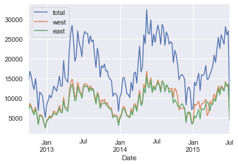

Same graph as above using Altair

``` python
# Create a melted dataset

melted = (
    data.resample("w")
    .sum()
    .reset_index()
    .rename(columns={"Date": "date"})
    .melt(
        id_vars="date",
        var_name=["side"],
        value_name="crossings",
        value_vars=["total", "east", "west"],
    )
)
melted.head()
```

<div>
<style scoped>
    .dataframe tbody tr th:only-of-type {
        vertical-align: middle;
    }

    .dataframe tbody tr th {
        vertical-align: top;
    }

    .dataframe thead th {
        text-align: right;
    }
</style>

|     | date       | side  | crossings |
|-----|------------|-------|-----------|
| 0   | 2012-10-07 | total | 14292.0   |
| 1   | 2012-10-14 | total | 16795.0   |
| 2   | 2012-10-21 | total | 15509.0   |
| 3   | 2012-10-28 | total | 13437.0   |
| 4   | 2012-11-04 | total | 12194.0   |

</div>

``` python
# Produce same graph as above

alt.Chart(melted).mark_line().encode(x="date", y="crossings", color="side")
```

<script type="application/javascript">
const spec = {"config": {"view": {"width": 400, "height": 300}, "mark": {"tooltip": null}}, "data": {"name": "data-22ebd49c3361b546e8566c4d6f0be1bc"}, "mark": "line", "encoding": {"color": {"type": "nominal", "field": "side"}, "x": {"type": "temporal", "field": "date"}, "y": {"type": "quantitative", "field": "crossings"}}, "$schema": "https://vega.github.io/schema/vega-lite/v3.4.0.json", "datasets": {"data-22ebd49c3361b546e8566c4d6f0be1bc": [{"date": "2012-10-07T00:00:00", "side": "total", "crossings": 14292.0}, {"date": "2012-10-14T00:00:00", "side": "total", "crossings": 16795.0}, {"date": "2012-10-21T00:00:00", "side": "total", "crossings": 15509.0}, {"date": "2012-10-28T00:00:00", "side": "total", "crossings": 13437.0}, {"date": "2012-11-04T00:00:00", "side": "total", "crossings": 12194.0}, {"date": "2012-11-11T00:00:00", "side": "total", "crossings": 15016.0}, {"date": "2012-11-18T00:00:00", "side": "total", "crossings": 11876.0}, {"date": "2012-11-25T00:00:00", "side": "total", "crossings": 6850.0}, {"date": "2012-12-02T00:00:00", "side": "total", "crossings": 11534.0}, {"date": "2012-12-09T00:00:00", "side": "total", "crossings": 11170.0}, {"date": "2012-12-16T00:00:00", "side": "total", "crossings": 10491.0}, {"date": "2012-12-23T00:00:00", "side": "total", "crossings": 7457.0}, {"date": "2012-12-30T00:00:00", "side": "total", "crossings": 5104.0}, {"date": "2013-01-06T00:00:00", "side": "total", "crossings": 8439.0}, {"date": "2013-01-13T00:00:00", "side": "total", "crossings": 9434.0}, {"date": "2013-01-20T00:00:00", "side": "total", "crossings": 10808.0}, {"date": "2013-01-27T00:00:00", "side": "total", "crossings": 10011.0}, {"date": "2013-02-03T00:00:00", "side": "total", "crossings": 11287.0}, {"date": "2013-02-10T00:00:00", "side": "total", "crossings": 13069.0}, {"date": "2013-02-17T00:00:00", "side": "total", "crossings": 12390.0}, {"date": "2013-02-24T00:00:00", "side": "total", "crossings": 11783.0}, {"date": "2013-03-03T00:00:00", "side": "total", "crossings": 13444.0}, {"date": "2013-03-10T00:00:00", "side": "total", "crossings": 15595.0}, {"date": "2013-03-17T00:00:00", "side": "total", "crossings": 13039.0}, {"date": "2013-03-24T00:00:00", "side": "total", "crossings": 13123.0}, {"date": "2013-03-31T00:00:00", "side": "total", "crossings": 19564.0}, {"date": "2013-04-07T00:00:00", "side": "total", "crossings": 15236.0}, {"date": "2013-04-14T00:00:00", "side": "total", "crossings": 14556.0}, {"date": "2013-04-21T00:00:00", "side": "total", "crossings": 14059.0}, {"date": "2013-04-28T00:00:00", "side": "total", "crossings": 22052.0}, {"date": "2013-05-05T00:00:00", "side": "total", "crossings": 26424.0}, {"date": "2013-05-12T00:00:00", "side": "total", "crossings": 28414.0}, {"date": "2013-05-19T00:00:00", "side": "total", "crossings": 24845.0}, {"date": "2013-05-26T00:00:00", "side": "total", "crossings": 19343.0}, {"date": "2013-06-02T00:00:00", "side": "total", "crossings": 20559.0}, {"date": "2013-06-09T00:00:00", "side": "total", "crossings": 27026.0}, {"date": "2013-06-16T00:00:00", "side": "total", "crossings": 24147.0}, {"date": "2013-06-23T00:00:00", "side": "total", "crossings": 22701.0}, {"date": "2013-06-30T00:00:00", "side": "total", "crossings": 20490.0}, {"date": "2013-07-07T00:00:00", "side": "total", "crossings": 25512.0}, {"date": "2013-07-14T00:00:00", "side": "total", "crossings": 26904.0}, {"date": "2013-07-21T00:00:00", "side": "total", "crossings": 26419.0}, {"date": "2013-07-28T00:00:00", "side": "total", "crossings": 26389.0}, {"date": "2013-08-04T00:00:00", "side": "total", "crossings": 23771.0}, {"date": "2013-08-11T00:00:00", "side": "total", "crossings": 25790.0}, {"date": "2013-08-18T00:00:00", "side": "total", "crossings": 24341.0}, {"date": "2013-08-25T00:00:00", "side": "total", "crossings": 24738.0}, {"date": "2013-09-01T00:00:00", "side": "total", "crossings": 20947.0}, {"date": "2013-09-08T00:00:00", "side": "total", "crossings": 17768.0}, {"date": "2013-09-15T00:00:00", "side": "total", "crossings": 22682.0}, {"date": "2013-09-22T00:00:00", "side": "total", "crossings": 20438.0}, {"date": "2013-09-29T00:00:00", "side": "total", "crossings": 15294.0}, {"date": "2013-10-06T00:00:00", "side": "total", "crossings": 18189.0}, {"date": "2013-10-13T00:00:00", "side": "total", "crossings": 17712.0}, {"date": "2013-10-20T00:00:00", "side": "total", "crossings": 18656.0}, {"date": "2013-10-27T00:00:00", "side": "total", "crossings": 16847.0}, {"date": "2013-11-03T00:00:00", "side": "total", "crossings": 17010.0}, {"date": "2013-11-10T00:00:00", "side": "total", "crossings": 15289.0}, {"date": "2013-11-17T00:00:00", "side": "total", "crossings": 14885.0}, {"date": "2013-11-24T00:00:00", "side": "total", "crossings": 14441.0}, {"date": "2013-12-01T00:00:00", "side": "total", "crossings": 10533.0}, {"date": "2013-12-08T00:00:00", "side": "total", "crossings": 11268.0}, {"date": "2013-12-15T00:00:00", "side": "total", "crossings": 11141.0}, {"date": "2013-12-22T00:00:00", "side": "total", "crossings": 10637.0}, {"date": "2013-12-29T00:00:00", "side": "total", "crossings": 6685.0}, {"date": "2014-01-05T00:00:00", "side": "total", "crossings": 10270.0}, {"date": "2014-01-12T00:00:00", "side": "total", "crossings": 11312.0}, {"date": "2014-01-19T00:00:00", "side": "total", "crossings": 15018.0}, {"date": "2014-01-26T00:00:00", "side": "total", "crossings": 15286.0}, {"date": "2014-02-02T00:00:00", "side": "total", "crossings": 13357.0}, {"date": "2014-02-09T00:00:00", "side": "total", "crossings": 11119.0}, {"date": "2014-02-16T00:00:00", "side": "total", "crossings": 10909.0}, {"date": "2014-02-23T00:00:00", "side": "total", "crossings": 10138.0}, {"date": "2014-03-02T00:00:00", "side": "total", "crossings": 14050.0}, {"date": "2014-03-09T00:00:00", "side": "total", "crossings": 11876.0}, {"date": "2014-03-16T00:00:00", "side": "total", "crossings": 16307.0}, {"date": "2014-03-23T00:00:00", "side": "total", "crossings": 16613.0}, {"date": "2014-03-30T00:00:00", "side": "total", "crossings": 13842.0}, {"date": "2014-04-06T00:00:00", "side": "total", "crossings": 18926.0}, {"date": "2014-04-13T00:00:00", "side": "total", "crossings": 23160.0}, {"date": "2014-04-20T00:00:00", "side": "total", "crossings": 16665.0}, {"date": "2014-04-27T00:00:00", "side": "total", "crossings": 17812.0}, {"date": "2014-05-04T00:00:00", "side": "total", "crossings": 26050.0}, {"date": "2014-05-11T00:00:00", "side": "total", "crossings": 23759.0}, {"date": "2014-05-18T00:00:00", "side": "total", "crossings": 32427.0}, {"date": "2014-05-25T00:00:00", "side": "total", "crossings": 26464.0}, {"date": "2014-06-01T00:00:00", "side": "total", "crossings": 26273.0}, {"date": "2014-06-08T00:00:00", "side": "total", "crossings": 29858.0}, {"date": "2014-06-15T00:00:00", "side": "total", "crossings": 23237.0}, {"date": "2014-06-22T00:00:00", "side": "total", "crossings": 26238.0}, {"date": "2014-06-29T00:00:00", "side": "total", "crossings": 24171.0}, {"date": "2014-07-06T00:00:00", "side": "total", "crossings": 26592.0}, {"date": "2014-07-13T00:00:00", "side": "total", "crossings": 28552.0}, {"date": "2014-07-20T00:00:00", "side": "total", "crossings": 26686.0}, {"date": "2014-07-27T00:00:00", "side": "total", "crossings": 23703.0}, {"date": "2014-08-03T00:00:00", "side": "total", "crossings": 28671.0}, {"date": "2014-08-10T00:00:00", "side": "total", "crossings": 27775.0}, {"date": "2014-08-17T00:00:00", "side": "total", "crossings": 23359.0}, {"date": "2014-08-24T00:00:00", "side": "total", "crossings": 26767.0}, {"date": "2014-08-31T00:00:00", "side": "total", "crossings": 25856.0}, {"date": "2014-09-07T00:00:00", "side": "total", "crossings": 23711.0}, {"date": "2014-09-14T00:00:00", "side": "total", "crossings": 24305.0}, {"date": "2014-09-21T00:00:00", "side": "total", "crossings": 23961.0}, {"date": "2014-09-28T00:00:00", "side": "total", "crossings": 18984.0}, {"date": "2014-10-05T00:00:00", "side": "total", "crossings": 22141.0}, {"date": "2014-10-12T00:00:00", "side": "total", "crossings": 21028.0}, {"date": "2014-10-19T00:00:00", "side": "total", "crossings": 18571.0}, {"date": "2014-10-26T00:00:00", "side": "total", "crossings": 14724.0}, {"date": "2014-11-02T00:00:00", "side": "total", "crossings": 15683.0}, {"date": "2014-11-09T00:00:00", "side": "total", "crossings": 15997.0}, {"date": "2014-11-16T00:00:00", "side": "total", "crossings": 15667.0}, {"date": "2014-11-23T00:00:00", "side": "total", "crossings": 14690.0}, {"date": "2014-11-30T00:00:00", "side": "total", "crossings": 8270.0}, {"date": "2014-12-07T00:00:00", "side": "total", "crossings": 12362.0}, {"date": "2014-12-14T00:00:00", "side": "total", "crossings": 12822.0}, {"date": "2014-12-21T00:00:00", "side": "total", "crossings": 11745.0}, {"date": "2014-12-28T00:00:00", "side": "total", "crossings": 7106.0}, {"date": "2015-01-04T00:00:00", "side": "total", "crossings": 7553.0}, {"date": "2015-01-11T00:00:00", "side": "total", "crossings": 14054.0}, {"date": "2015-01-18T00:00:00", "side": "total", "crossings": 13162.0}, {"date": "2015-01-25T00:00:00", "side": "total", "crossings": 14739.0}, {"date": "2015-02-01T00:00:00", "side": "total", "crossings": 16302.0}, {"date": "2015-02-08T00:00:00", "side": "total", "crossings": 11945.0}, {"date": "2015-02-15T00:00:00", "side": "total", "crossings": 15885.0}, {"date": "2015-02-22T00:00:00", "side": "total", "crossings": 15766.0}, {"date": "2015-03-01T00:00:00", "side": "total", "crossings": 16127.0}, {"date": "2015-03-08T00:00:00", "side": "total", "crossings": 18286.0}, {"date": "2015-03-15T00:00:00", "side": "total", "crossings": 14735.0}, {"date": "2015-03-22T00:00:00", "side": "total", "crossings": 14956.0}, {"date": "2015-03-29T00:00:00", "side": "total", "crossings": 16034.0}, {"date": "2015-04-05T00:00:00", "side": "total", "crossings": 16943.0}, {"date": "2015-04-12T00:00:00", "side": "total", "crossings": 18208.0}, {"date": "2015-04-19T00:00:00", "side": "total", "crossings": 20911.0}, {"date": "2015-04-26T00:00:00", "side": "total", "crossings": 19066.0}, {"date": "2015-05-03T00:00:00", "side": "total", "crossings": 22604.0}, {"date": "2015-05-10T00:00:00", "side": "total", "crossings": 25435.0}, {"date": "2015-05-17T00:00:00", "side": "total", "crossings": 22566.0}, {"date": "2015-05-24T00:00:00", "side": "total", "crossings": 26089.0}, {"date": "2015-05-31T00:00:00", "side": "total", "crossings": 25011.0}, {"date": "2015-06-07T00:00:00", "side": "total", "crossings": 23657.0}, {"date": "2015-06-14T00:00:00", "side": "total", "crossings": 28119.0}, {"date": "2015-06-21T00:00:00", "side": "total", "crossings": 26037.0}, {"date": "2015-06-28T00:00:00", "side": "total", "crossings": 27068.0}, {"date": "2015-07-05T00:00:00", "side": "total", "crossings": 8836.0}, {"date": "2012-10-07T00:00:00", "side": "east", "crossings": 6995.0}, {"date": "2012-10-14T00:00:00", "side": "east", "crossings": 8116.0}, {"date": "2012-10-21T00:00:00", "side": "east", "crossings": 7563.0}, {"date": "2012-10-28T00:00:00", "side": "east", "crossings": 6536.0}, {"date": "2012-11-04T00:00:00", "side": "east", "crossings": 5786.0}, {"date": "2012-11-11T00:00:00", "side": "east", "crossings": 7275.0}, {"date": "2012-11-18T00:00:00", "side": "east", "crossings": 5799.0}, {"date": "2012-11-25T00:00:00", "side": "east", "crossings": 3316.0}, {"date": "2012-12-02T00:00:00", "side": "east", "crossings": 5659.0}, {"date": "2012-12-09T00:00:00", "side": "east", "crossings": 5488.0}, {"date": "2012-12-16T00:00:00", "side": "east", "crossings": 5107.0}, {"date": "2012-12-23T00:00:00", "side": "east", "crossings": 3705.0}, {"date": "2012-12-30T00:00:00", "side": "east", "crossings": 2492.0}, {"date": "2013-01-06T00:00:00", "side": "east", "crossings": 4124.0}, {"date": "2013-01-13T00:00:00", "side": "east", "crossings": 4573.0}, {"date": "2013-01-20T00:00:00", "side": "east", "crossings": 5258.0}, {"date": "2013-01-27T00:00:00", "side": "east", "crossings": 4915.0}, {"date": "2013-02-03T00:00:00", "side": "east", "crossings": 5439.0}, {"date": "2013-02-10T00:00:00", "side": "east", "crossings": 6253.0}, {"date": "2013-02-17T00:00:00", "side": "east", "crossings": 5952.0}, {"date": "2013-02-24T00:00:00", "side": "east", "crossings": 5720.0}, {"date": "2013-03-03T00:00:00", "side": "east", "crossings": 6507.0}, {"date": "2013-03-10T00:00:00", "side": "east", "crossings": 7434.0}, {"date": "2013-03-17T00:00:00", "side": "east", "crossings": 6315.0}, {"date": "2013-03-24T00:00:00", "side": "east", "crossings": 6355.0}, {"date": "2013-03-31T00:00:00", "side": "east", "crossings": 9344.0}, {"date": "2013-04-07T00:00:00", "side": "east", "crossings": 7485.0}, {"date": "2013-04-14T00:00:00", "side": "east", "crossings": 7030.0}, {"date": "2013-04-21T00:00:00", "side": "east", "crossings": 6672.0}, {"date": "2013-04-28T00:00:00", "side": "east", "crossings": 10546.0}, {"date": "2013-05-05T00:00:00", "side": "east", "crossings": 12520.0}, {"date": "2013-05-12T00:00:00", "side": "east", "crossings": 13551.0}, {"date": "2013-05-19T00:00:00", "side": "east", "crossings": 11725.0}, {"date": "2013-05-26T00:00:00", "side": "east", "crossings": 9325.0}, {"date": "2013-06-02T00:00:00", "side": "east", "crossings": 9658.0}, {"date": "2013-06-09T00:00:00", "side": "east", "crossings": 13023.0}, {"date": "2013-06-16T00:00:00", "side": "east", "crossings": 11558.0}, {"date": "2013-06-23T00:00:00", "side": "east", "crossings": 11242.0}, {"date": "2013-06-30T00:00:00", "side": "east", "crossings": 9938.0}, {"date": "2013-07-07T00:00:00", "side": "east", "crossings": 12430.0}, {"date": "2013-07-14T00:00:00", "side": "east", "crossings": 13218.0}, {"date": "2013-07-21T00:00:00", "side": "east", "crossings": 12880.0}, {"date": "2013-07-28T00:00:00", "side": "east", "crossings": 13047.0}, {"date": "2013-08-04T00:00:00", "side": "east", "crossings": 11624.0}, {"date": "2013-08-11T00:00:00", "side": "east", "crossings": 12633.0}, {"date": "2013-08-18T00:00:00", "side": "east", "crossings": 11958.0}, {"date": "2013-08-25T00:00:00", "side": "east", "crossings": 12357.0}, {"date": "2013-09-01T00:00:00", "side": "east", "crossings": 10189.0}, {"date": "2013-09-08T00:00:00", "side": "east", "crossings": 8498.0}, {"date": "2013-09-15T00:00:00", "side": "east", "crossings": 11197.0}, {"date": "2013-09-22T00:00:00", "side": "east", "crossings": 9838.0}, {"date": "2013-09-29T00:00:00", "side": "east", "crossings": 7403.0}, {"date": "2013-10-06T00:00:00", "side": "east", "crossings": 8592.0}, {"date": "2013-10-13T00:00:00", "side": "east", "crossings": 8570.0}, {"date": "2013-10-20T00:00:00", "side": "east", "crossings": 8889.0}, {"date": "2013-10-27T00:00:00", "side": "east", "crossings": 8392.0}, {"date": "2013-11-03T00:00:00", "side": "east", "crossings": 8109.0}, {"date": "2013-11-10T00:00:00", "side": "east", "crossings": 7497.0}, {"date": "2013-11-17T00:00:00", "side": "east", "crossings": 7290.0}, {"date": "2013-11-24T00:00:00", "side": "east", "crossings": 6923.0}, {"date": "2013-12-01T00:00:00", "side": "east", "crossings": 5053.0}, {"date": "2013-12-08T00:00:00", "side": "east", "crossings": 5432.0}, {"date": "2013-12-15T00:00:00", "side": "east", "crossings": 5381.0}, {"date": "2013-12-22T00:00:00", "side": "east", "crossings": 5182.0}, {"date": "2013-12-29T00:00:00", "side": "east", "crossings": 3118.0}, {"date": "2014-01-05T00:00:00", "side": "east", "crossings": 4865.0}, {"date": "2014-01-12T00:00:00", "side": "east", "crossings": 5492.0}, {"date": "2014-01-19T00:00:00", "side": "east", "crossings": 7263.0}, {"date": "2014-01-26T00:00:00", "side": "east", "crossings": 7376.0}, {"date": "2014-02-02T00:00:00", "side": "east", "crossings": 6448.0}, {"date": "2014-02-09T00:00:00", "side": "east", "crossings": 5508.0}, {"date": "2014-02-16T00:00:00", "side": "east", "crossings": 5340.0}, {"date": "2014-02-23T00:00:00", "side": "east", "crossings": 5029.0}, {"date": "2014-03-02T00:00:00", "side": "east", "crossings": 6671.0}, {"date": "2014-03-09T00:00:00", "side": "east", "crossings": 5704.0}, {"date": "2014-03-16T00:00:00", "side": "east", "crossings": 7897.0}, {"date": "2014-03-23T00:00:00", "side": "east", "crossings": 8039.0}, {"date": "2014-03-30T00:00:00", "side": "east", "crossings": 6692.0}, {"date": "2014-04-06T00:00:00", "side": "east", "crossings": 9125.0}, {"date": "2014-04-13T00:00:00", "side": "east", "crossings": 11153.0}, {"date": "2014-04-20T00:00:00", "side": "east", "crossings": 8149.0}, {"date": "2014-04-27T00:00:00", "side": "east", "crossings": 8675.0}, {"date": "2014-05-04T00:00:00", "side": "east", "crossings": 12518.0}, {"date": "2014-05-11T00:00:00", "side": "east", "crossings": 11276.0}, {"date": "2014-05-18T00:00:00", "side": "east", "crossings": 15580.0}, {"date": "2014-05-25T00:00:00", "side": "east", "crossings": 13000.0}, {"date": "2014-06-01T00:00:00", "side": "east", "crossings": 12589.0}, {"date": "2014-06-08T00:00:00", "side": "east", "crossings": 14646.0}, {"date": "2014-06-15T00:00:00", "side": "east", "crossings": 11386.0}, {"date": "2014-06-22T00:00:00", "side": "east", "crossings": 13023.0}, {"date": "2014-06-29T00:00:00", "side": "east", "crossings": 11977.0}, {"date": "2014-07-06T00:00:00", "side": "east", "crossings": 13240.0}, {"date": "2014-07-13T00:00:00", "side": "east", "crossings": 13926.0}, {"date": "2014-07-20T00:00:00", "side": "east", "crossings": 13235.0}, {"date": "2014-07-27T00:00:00", "side": "east", "crossings": 11486.0}, {"date": "2014-08-03T00:00:00", "side": "east", "crossings": 14226.0}, {"date": "2014-08-10T00:00:00", "side": "east", "crossings": 13886.0}, {"date": "2014-08-17T00:00:00", "side": "east", "crossings": 11737.0}, {"date": "2014-08-24T00:00:00", "side": "east", "crossings": 13424.0}, {"date": "2014-08-31T00:00:00", "side": "east", "crossings": 12988.0}, {"date": "2014-09-07T00:00:00", "side": "east", "crossings": 11416.0}, {"date": "2014-09-14T00:00:00", "side": "east", "crossings": 11943.0}, {"date": "2014-09-21T00:00:00", "side": "east", "crossings": 11411.0}, {"date": "2014-09-28T00:00:00", "side": "east", "crossings": 8758.0}, {"date": "2014-10-05T00:00:00", "side": "east", "crossings": 9635.0}, {"date": "2014-10-12T00:00:00", "side": "east", "crossings": 9043.0}, {"date": "2014-10-19T00:00:00", "side": "east", "crossings": 8131.0}, {"date": "2014-10-26T00:00:00", "side": "east", "crossings": 7687.0}, {"date": "2014-11-02T00:00:00", "side": "east", "crossings": 8060.0}, {"date": "2014-11-09T00:00:00", "side": "east", "crossings": 8612.0}, {"date": "2014-11-16T00:00:00", "side": "east", "crossings": 8148.0}, {"date": "2014-11-23T00:00:00", "side": "east", "crossings": 7420.0}, {"date": "2014-11-30T00:00:00", "side": "east", "crossings": 3785.0}, {"date": "2014-12-07T00:00:00", "side": "east", "crossings": 6361.0}, {"date": "2014-12-14T00:00:00", "side": "east", "crossings": 6494.0}, {"date": "2014-12-21T00:00:00", "side": "east", "crossings": 6338.0}, {"date": "2014-12-28T00:00:00", "side": "east", "crossings": 3443.0}, {"date": "2015-01-04T00:00:00", "side": "east", "crossings": 3613.0}, {"date": "2015-01-11T00:00:00", "side": "east", "crossings": 5547.0}, {"date": "2015-01-18T00:00:00", "side": "east", "crossings": 5004.0}, {"date": "2015-01-25T00:00:00", "side": "east", "crossings": 6104.0}, {"date": "2015-02-01T00:00:00", "side": "east", "crossings": 7108.0}, {"date": "2015-02-08T00:00:00", "side": "east", "crossings": 4747.0}, {"date": "2015-02-15T00:00:00", "side": "east", "crossings": 7343.0}, {"date": "2015-02-22T00:00:00", "side": "east", "crossings": 7110.0}, {"date": "2015-03-01T00:00:00", "side": "east", "crossings": 7119.0}, {"date": "2015-03-08T00:00:00", "side": "east", "crossings": 8525.0}, {"date": "2015-03-15T00:00:00", "side": "east", "crossings": 9099.0}, {"date": "2015-03-22T00:00:00", "side": "east", "crossings": 8611.0}, {"date": "2015-03-29T00:00:00", "side": "east", "crossings": 6771.0}, {"date": "2015-04-05T00:00:00", "side": "east", "crossings": 8487.0}, {"date": "2015-04-12T00:00:00", "side": "east", "crossings": 8431.0}, {"date": "2015-04-19T00:00:00", "side": "east", "crossings": 9854.0}, {"date": "2015-04-26T00:00:00", "side": "east", "crossings": 9215.0}, {"date": "2015-05-03T00:00:00", "side": "east", "crossings": 10960.0}, {"date": "2015-05-10T00:00:00", "side": "east", "crossings": 12380.0}, {"date": "2015-05-17T00:00:00", "side": "east", "crossings": 10843.0}, {"date": "2015-05-24T00:00:00", "side": "east", "crossings": 12955.0}, {"date": "2015-05-31T00:00:00", "side": "east", "crossings": 12293.0}, {"date": "2015-06-07T00:00:00", "side": "east", "crossings": 11784.0}, {"date": "2015-06-14T00:00:00", "side": "east", "crossings": 13915.0}, {"date": "2015-06-21T00:00:00", "side": "east", "crossings": 13141.0}, {"date": "2015-06-28T00:00:00", "side": "east", "crossings": 13412.0}, {"date": "2015-07-05T00:00:00", "side": "east", "crossings": 4389.0}, {"date": "2012-10-07T00:00:00", "side": "west", "crossings": 7297.0}, {"date": "2012-10-14T00:00:00", "side": "west", "crossings": 8679.0}, {"date": "2012-10-21T00:00:00", "side": "west", "crossings": 7946.0}, {"date": "2012-10-28T00:00:00", "side": "west", "crossings": 6901.0}, {"date": "2012-11-04T00:00:00", "side": "west", "crossings": 6408.0}, {"date": "2012-11-11T00:00:00", "side": "west", "crossings": 7741.0}, {"date": "2012-11-18T00:00:00", "side": "west", "crossings": 6077.0}, {"date": "2012-11-25T00:00:00", "side": "west", "crossings": 3534.0}, {"date": "2012-12-02T00:00:00", "side": "west", "crossings": 5875.0}, {"date": "2012-12-09T00:00:00", "side": "west", "crossings": 5682.0}, {"date": "2012-12-16T00:00:00", "side": "west", "crossings": 5384.0}, {"date": "2012-12-23T00:00:00", "side": "west", "crossings": 3752.0}, {"date": "2012-12-30T00:00:00", "side": "west", "crossings": 2612.0}, {"date": "2013-01-06T00:00:00", "side": "west", "crossings": 4315.0}, {"date": "2013-01-13T00:00:00", "side": "west", "crossings": 4861.0}, {"date": "2013-01-20T00:00:00", "side": "west", "crossings": 5550.0}, {"date": "2013-01-27T00:00:00", "side": "west", "crossings": 5096.0}, {"date": "2013-02-03T00:00:00", "side": "west", "crossings": 5848.0}, {"date": "2013-02-10T00:00:00", "side": "west", "crossings": 6816.0}, {"date": "2013-02-17T00:00:00", "side": "west", "crossings": 6438.0}, {"date": "2013-02-24T00:00:00", "side": "west", "crossings": 6063.0}, {"date": "2013-03-03T00:00:00", "side": "west", "crossings": 6937.0}, {"date": "2013-03-10T00:00:00", "side": "west", "crossings": 8161.0}, {"date": "2013-03-17T00:00:00", "side": "west", "crossings": 6724.0}, {"date": "2013-03-24T00:00:00", "side": "west", "crossings": 6768.0}, {"date": "2013-03-31T00:00:00", "side": "west", "crossings": 10220.0}, {"date": "2013-04-07T00:00:00", "side": "west", "crossings": 7751.0}, {"date": "2013-04-14T00:00:00", "side": "west", "crossings": 7526.0}, {"date": "2013-04-21T00:00:00", "side": "west", "crossings": 7387.0}, {"date": "2013-04-28T00:00:00", "side": "west", "crossings": 11506.0}, {"date": "2013-05-05T00:00:00", "side": "west", "crossings": 13904.0}, {"date": "2013-05-12T00:00:00", "side": "west", "crossings": 14863.0}, {"date": "2013-05-19T00:00:00", "side": "west", "crossings": 13120.0}, {"date": "2013-05-26T00:00:00", "side": "west", "crossings": 10018.0}, {"date": "2013-06-02T00:00:00", "side": "west", "crossings": 10901.0}, {"date": "2013-06-09T00:00:00", "side": "west", "crossings": 14003.0}, {"date": "2013-06-16T00:00:00", "side": "west", "crossings": 12589.0}, {"date": "2013-06-23T00:00:00", "side": "west", "crossings": 11459.0}, {"date": "2013-06-30T00:00:00", "side": "west", "crossings": 10552.0}, {"date": "2013-07-07T00:00:00", "side": "west", "crossings": 13082.0}, {"date": "2013-07-14T00:00:00", "side": "west", "crossings": 13686.0}, {"date": "2013-07-21T00:00:00", "side": "west", "crossings": 13539.0}, {"date": "2013-07-28T00:00:00", "side": "west", "crossings": 13342.0}, {"date": "2013-08-04T00:00:00", "side": "west", "crossings": 12147.0}, {"date": "2013-08-11T00:00:00", "side": "west", "crossings": 13157.0}, {"date": "2013-08-18T00:00:00", "side": "west", "crossings": 12383.0}, {"date": "2013-08-25T00:00:00", "side": "west", "crossings": 12381.0}, {"date": "2013-09-01T00:00:00", "side": "west", "crossings": 10758.0}, {"date": "2013-09-08T00:00:00", "side": "west", "crossings": 9270.0}, {"date": "2013-09-15T00:00:00", "side": "west", "crossings": 11485.0}, {"date": "2013-09-22T00:00:00", "side": "west", "crossings": 10600.0}, {"date": "2013-09-29T00:00:00", "side": "west", "crossings": 7891.0}, {"date": "2013-10-06T00:00:00", "side": "west", "crossings": 9597.0}, {"date": "2013-10-13T00:00:00", "side": "west", "crossings": 9142.0}, {"date": "2013-10-20T00:00:00", "side": "west", "crossings": 9767.0}, {"date": "2013-10-27T00:00:00", "side": "west", "crossings": 8455.0}, {"date": "2013-11-03T00:00:00", "side": "west", "crossings": 8901.0}, {"date": "2013-11-10T00:00:00", "side": "west", "crossings": 7792.0}, {"date": "2013-11-17T00:00:00", "side": "west", "crossings": 7595.0}, {"date": "2013-11-24T00:00:00", "side": "west", "crossings": 7518.0}, {"date": "2013-12-01T00:00:00", "side": "west", "crossings": 5480.0}, {"date": "2013-12-08T00:00:00", "side": "west", "crossings": 5836.0}, {"date": "2013-12-15T00:00:00", "side": "west", "crossings": 5760.0}, {"date": "2013-12-22T00:00:00", "side": "west", "crossings": 5455.0}, {"date": "2013-12-29T00:00:00", "side": "west", "crossings": 3567.0}, {"date": "2014-01-05T00:00:00", "side": "west", "crossings": 5405.0}, {"date": "2014-01-12T00:00:00", "side": "west", "crossings": 5820.0}, {"date": "2014-01-19T00:00:00", "side": "west", "crossings": 7755.0}, {"date": "2014-01-26T00:00:00", "side": "west", "crossings": 7910.0}, {"date": "2014-02-02T00:00:00", "side": "west", "crossings": 6909.0}, {"date": "2014-02-09T00:00:00", "side": "west", "crossings": 5611.0}, {"date": "2014-02-16T00:00:00", "side": "west", "crossings": 5569.0}, {"date": "2014-02-23T00:00:00", "side": "west", "crossings": 5109.0}, {"date": "2014-03-02T00:00:00", "side": "west", "crossings": 7379.0}, {"date": "2014-03-09T00:00:00", "side": "west", "crossings": 6172.0}, {"date": "2014-03-16T00:00:00", "side": "west", "crossings": 8410.0}, {"date": "2014-03-23T00:00:00", "side": "west", "crossings": 8574.0}, {"date": "2014-03-30T00:00:00", "side": "west", "crossings": 7150.0}, {"date": "2014-04-06T00:00:00", "side": "west", "crossings": 9801.0}, {"date": "2014-04-13T00:00:00", "side": "west", "crossings": 12007.0}, {"date": "2014-04-20T00:00:00", "side": "west", "crossings": 8516.0}, {"date": "2014-04-27T00:00:00", "side": "west", "crossings": 9137.0}, {"date": "2014-05-04T00:00:00", "side": "west", "crossings": 13532.0}, {"date": "2014-05-11T00:00:00", "side": "west", "crossings": 12483.0}, {"date": "2014-05-18T00:00:00", "side": "west", "crossings": 16847.0}, {"date": "2014-05-25T00:00:00", "side": "west", "crossings": 13464.0}, {"date": "2014-06-01T00:00:00", "side": "west", "crossings": 13684.0}, {"date": "2014-06-08T00:00:00", "side": "west", "crossings": 15212.0}, {"date": "2014-06-15T00:00:00", "side": "west", "crossings": 11851.0}, {"date": "2014-06-22T00:00:00", "side": "west", "crossings": 13215.0}, {"date": "2014-06-29T00:00:00", "side": "west", "crossings": 12194.0}, {"date": "2014-07-06T00:00:00", "side": "west", "crossings": 13352.0}, {"date": "2014-07-13T00:00:00", "side": "west", "crossings": 14626.0}, {"date": "2014-07-20T00:00:00", "side": "west", "crossings": 13451.0}, {"date": "2014-07-27T00:00:00", "side": "west", "crossings": 12217.0}, {"date": "2014-08-03T00:00:00", "side": "west", "crossings": 14445.0}, {"date": "2014-08-10T00:00:00", "side": "west", "crossings": 13889.0}, {"date": "2014-08-17T00:00:00", "side": "west", "crossings": 11622.0}, {"date": "2014-08-24T00:00:00", "side": "west", "crossings": 13343.0}, {"date": "2014-08-31T00:00:00", "side": "west", "crossings": 12868.0}, {"date": "2014-09-07T00:00:00", "side": "west", "crossings": 12295.0}, {"date": "2014-09-14T00:00:00", "side": "west", "crossings": 12362.0}, {"date": "2014-09-21T00:00:00", "side": "west", "crossings": 12550.0}, {"date": "2014-09-28T00:00:00", "side": "west", "crossings": 10226.0}, {"date": "2014-10-05T00:00:00", "side": "west", "crossings": 12506.0}, {"date": "2014-10-12T00:00:00", "side": "west", "crossings": 11985.0}, {"date": "2014-10-19T00:00:00", "side": "west", "crossings": 10440.0}, {"date": "2014-10-26T00:00:00", "side": "west", "crossings": 7037.0}, {"date": "2014-11-02T00:00:00", "side": "west", "crossings": 7623.0}, {"date": "2014-11-09T00:00:00", "side": "west", "crossings": 7385.0}, {"date": "2014-11-16T00:00:00", "side": "west", "crossings": 7519.0}, {"date": "2014-11-23T00:00:00", "side": "west", "crossings": 7270.0}, {"date": "2014-11-30T00:00:00", "side": "west", "crossings": 4485.0}, {"date": "2014-12-07T00:00:00", "side": "west", "crossings": 6001.0}, {"date": "2014-12-14T00:00:00", "side": "west", "crossings": 6328.0}, {"date": "2014-12-21T00:00:00", "side": "west", "crossings": 5407.0}, {"date": "2014-12-28T00:00:00", "side": "west", "crossings": 3663.0}, {"date": "2015-01-04T00:00:00", "side": "west", "crossings": 3940.0}, {"date": "2015-01-11T00:00:00", "side": "west", "crossings": 8507.0}, {"date": "2015-01-18T00:00:00", "side": "west", "crossings": 8158.0}, {"date": "2015-01-25T00:00:00", "side": "west", "crossings": 8635.0}, {"date": "2015-02-01T00:00:00", "side": "west", "crossings": 9194.0}, {"date": "2015-02-08T00:00:00", "side": "west", "crossings": 7198.0}, {"date": "2015-02-15T00:00:00", "side": "west", "crossings": 8542.0}, {"date": "2015-02-22T00:00:00", "side": "west", "crossings": 8656.0}, {"date": "2015-03-01T00:00:00", "side": "west", "crossings": 9008.0}, {"date": "2015-03-08T00:00:00", "side": "west", "crossings": 9761.0}, {"date": "2015-03-15T00:00:00", "side": "west", "crossings": 5636.0}, {"date": "2015-03-22T00:00:00", "side": "west", "crossings": 6345.0}, {"date": "2015-03-29T00:00:00", "side": "west", "crossings": 9263.0}, {"date": "2015-04-05T00:00:00", "side": "west", "crossings": 8456.0}, {"date": "2015-04-12T00:00:00", "side": "west", "crossings": 9777.0}, {"date": "2015-04-19T00:00:00", "side": "west", "crossings": 11057.0}, {"date": "2015-04-26T00:00:00", "side": "west", "crossings": 9851.0}, {"date": "2015-05-03T00:00:00", "side": "west", "crossings": 11644.0}, {"date": "2015-05-10T00:00:00", "side": "west", "crossings": 13055.0}, {"date": "2015-05-17T00:00:00", "side": "west", "crossings": 11723.0}, {"date": "2015-05-24T00:00:00", "side": "west", "crossings": 13134.0}, {"date": "2015-05-31T00:00:00", "side": "west", "crossings": 12718.0}, {"date": "2015-06-07T00:00:00", "side": "west", "crossings": 11873.0}, {"date": "2015-06-14T00:00:00", "side": "west", "crossings": 14204.0}, {"date": "2015-06-21T00:00:00", "side": "west", "crossings": 12896.0}, {"date": "2015-06-28T00:00:00", "side": "west", "crossings": 13656.0}, {"date": "2015-07-05T00:00:00", "side": "west", "crossings": 4447.0}]}};
const opt = {};
const type = "vega-lite";
const id = "9838b0f5-784c-4758-93d5-d6de3c3ca541";

const output_area = this;

require(["nbextensions/jupyter-vega/index"], function(vega) {
  const target = document.createElement("div");
  target.id = id;
  target.className = "vega-embed";

  const style = document.createElement("style");
  style.textContent = [
    ".vega-embed .error p {",
    "  color: firebrick;",
    "  font-size: 14px;",
    "}",
  ].join("\\n");

  // element is a jQuery wrapped DOM element inside the output area
  // see http://ipython.readthedocs.io/en/stable/api/generated/\
  // IPython.display.html#IPython.display.Javascript.__init__
  element[0].appendChild(target);
  element[0].appendChild(style);

  vega.render("#" + id, spec, type, opt, output_area);
}, function (err) {
  if (err.requireType !== "scripterror") {
    throw(err);
  }
});

</script>

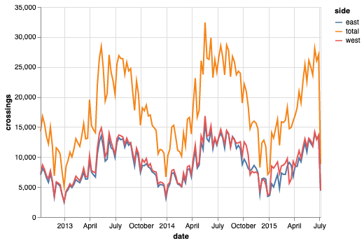

### Visualising the data

``` python
# Create a datframe with days as dates and index and hours as columns
pivoted = data.pivot_table(
    ["west", "east", "total"],
    index=data.index.date,
    columns=data.index.hour,
    fill_value=0,
)
pivoted.head()
```

<div>
<style scoped>
    .dataframe tbody tr th:only-of-type {
        vertical-align: middle;
    }

    .dataframe tbody tr th {
        vertical-align: top;
    }

    .dataframe thead tr th {
        text-align: left;
    }
</style>

|            | east |     |     |     |     |     |     |     |     |     | \... | west |     |     |     |     |     |     |     |     |     |
|------------|------|-----|-----|-----|-----|-----|-----|-----|-----|-----|------|------|-----|-----|-----|-----|-----|-----|-----|-----|-----|
| Date       | 0    | 1   | 2   | 3   | 4   | 5   | 6   | 7   | 8   | 9   | \... | 14   | 15  | 16  | 17  | 18  | 19  | 20  | 21  | 22  | 23  |
| 2012-10-03 | 9    | 6   | 1   | 3   | 1   | 10  | 50  | 95  | 146 | 104 | \... | 77   | 72  | 133 | 192 | 122 | 59  | 29  | 25  | 24  | 5   |
| 2012-10-04 | 11   | 0   | 6   | 3   | 1   | 11  | 51  | 89  | 134 | 94  | \... | 63   | 73  | 114 | 154 | 137 | 57  | 27  | 31  | 25  | 11  |
| 2012-10-05 | 7    | 4   | 3   | 2   | 2   | 7   | 37  | 101 | 119 | 81  | \... | 63   | 80  | 120 | 144 | 107 | 42  | 27  | 11  | 10  | 16  |
| 2012-10-06 | 7    | 5   | 2   | 2   | 1   | 2   | 15  | 16  | 47  | 55  | \... | 89   | 115 | 107 | 107 | 41  | 40  | 25  | 18  | 14  | 15  |
| 2012-10-07 | 5    | 5   | 1   | 2   | 2   | 3   | 8   | 12  | 26  | 36  | \... | 126  | 122 | 132 | 118 | 68  | 26  | 19  | 12  | 9   | 5   |

<p>5 rows × 72 columns</p>
</div>

``` python
# Put raw values in a matrix

X = pivoted.values
X.shape
```

    (1001, 72)

``` python
# Use PCA to reduce dimensionality (keep 90 percent of the variance)

Xpca = PCA(0.9).fit_transform(X)
Xpca.shape
```

    (1001, 2)

``` python
total_trips = X.sum(1)
plt.scatter(Xpca[:, 0], Xpca[:, 1], c=total_trips, cmap="Paired")
plt.colorbar(label="Total trips")
```

    <matplotlib.colorbar.Colorbar at 0x1a26ec9dd0>

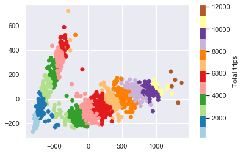

What can we learn from this graph? We can see that the days fall into two quite distinct cluster, one with a higher number of trips and one with a lower number of trips, that the number of trips increases along the length of each projected cluster (i.e. as we move away from the origin), and that close to the origin, the groups are less distinguishable. Overall, we can see that there are, in effect, two types of days for Seattle cyclists. This is indeed pretty cool.

### Unsupervised clustering

``` python
# Use a Gaussian mixture model to separate days into two clusters

gmm = GMM(2, covariance_type="full", random_state=0)
gmm.fit(Xpca)
cluster_label = gmm.predict(Xpca)
plt.scatter(Xpca[:, 0], Xpca[:, 1], c=cluster_label, cmap="Paired")
```

    <matplotlib.collections.PathCollection at 0x1a249be050>

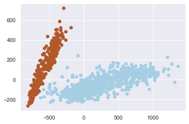

``` python
# Add cluster labels to original data

pivoted["cluster"] = cluster_label
data = data.join(pivoted["cluster"], on=data.index.date)
data.head()
```

<div>
<style scoped>
    .dataframe tbody tr th:only-of-type {
        vertical-align: middle;
    }

    .dataframe tbody tr th {
        vertical-align: top;
    }

    .dataframe thead th {
        text-align: right;
    }
</style>

|                     | total | west | east | cluster |
|---------------------|-------|------|------|---------|
| Date                |       |      |      |         |
| 2012-10-03 00:00:00 | 13.0  | 4.0  | 9.0  | 0       |
| 2012-10-03 01:00:00 | 10.0  | 4.0  | 6.0  | 0       |
| 2012-10-03 02:00:00 | 2.0   | 1.0  | 1.0  | 0       |
| 2012-10-03 03:00:00 | 5.0   | 2.0  | 3.0  | 0       |
| 2012-10-03 04:00:00 | 7.0   | 6.0  | 1.0  | 0       |

</div>

``` python
# Plot

hourly = data.groupby(["cluster", data.index.time]).mean()

fig, ax = plt.subplots(1, 2, figsize=(14, 5))
hourly_ticks = 4 * 60 * 60 * np.arange(6)

for i in range(2):
    hourly.loc[i].plot(ax=ax[i], xticks=hourly_ticks)
    ax[i].set_title("Cluster {0}".format(i))
    ax[i].set_ylabel("Average hourly trips")
```

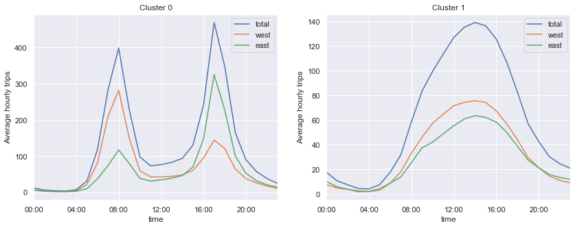

First plot shows a sharp bimodal pattern, indicative of a communing pattern (with the majority of people riding west in the morning and east in the evening), while the second plot shows a wide unimodel pattern, indicative of weekend days and holidays.

### Uncovering work habits

``` python
# Check whether two clusters correspond to weekend and weekdays

dayofweek = pd.to_datetime(pivoted.index).dayofweek

plt.scatter(Xpca[:, 0], Xpca[:, 1], c=dayofweek, cmap=plt.cm.get_cmap("Paired", 7))

cb = plt.colorbar(ticks=range(7))
cb.set_ticklabels(["Mo", "Tu", "We", "Th", "Fr", "Sa", "Su"])
```

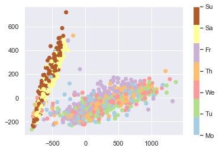

Let's look more closely at weekdays that follow a weekend pattern, of which there are a few.

``` python
results = pd.DataFrame(
    {
        "cluster": pivoted["cluster"],
        "is_weekend": (dayofweek > 4),
        "weekday": pivoted.index.map(lambda x: x.strftime("%a")),
    }
)
results.head()
```

<div>
<style scoped>
    .dataframe tbody tr th:only-of-type {
        vertical-align: middle;
    }

    .dataframe tbody tr th {
        vertical-align: top;
    }

    .dataframe thead th {
        text-align: right;
    }
</style>

|            | cluster | is_weekend | weekday |
|------------|---------|------------|---------|
| 2012-10-03 | 0       | False      | Wed     |
| 2012-10-04 | 0       | False      | Thu     |
| 2012-10-05 | 0       | False      | Fri     |
| 2012-10-06 | 1       | True       | Sat     |
| 2012-10-07 | 1       | True       | Sun     |

</div>

Count number of weekend days with a workday pattern

``` python
weekend_workdays = results.query("cluster == 0 and is_weekend")
len(weekend_workdays)
```

    0

Count number of week days that fall into the weekend / holiday pattern

``` python
weekday_holidays = results.query("cluster == 1 and not is_weekend")
len(weekday_holidays)
```

    23

There were zero weekend days where people in Seattle decided to work, but 23 weekdays that appear to be public holidasy. Let's have a look.

``` python
# Download list of public holidays

cal = USFederalHolidayCalendar()
holidays = cal.holidays("2012", "2016", return_name=True)
holidays.head()
```

    2012-01-02                 New Years Day
    2012-01-16    Martin Luther King Jr. Day
    2012-02-20                Presidents Day
    2012-05-28                  Memorial Day
    2012-07-04                      July 4th
    dtype: object

``` python
# Add the days before and after holidays to the list

holidays_all = pd.concat(
    [
        holidays,
        "Day before " + holidays.shift(-1, "D"),
        "Day after " + holidays.shift(1, "D"),
    ]
)
holidays_all.sort_index(inplace=True)
holidays_all.head()
```

    2012-01-01                 Day before New Years Day
    2012-01-02                            New Years Day
    2012-01-03                  Day after New Years Day
    2012-01-15    Day before Martin Luther King Jr. Day
    2012-01-16               Martin Luther King Jr. Day
    dtype: object

``` python
# A list of holidays on which people in Seattle skip work

holidays_all.name = "name"
joined = weekday_holidays.join(holidays_all)
set(joined["name"])
```

    {'Christmas',
     'Day after Christmas',
     'Day after Thanksgiving',
     'Day before Christmas',
     'July 4th',
     'Labor Day',
     'Memorial Day',
     'New Years Day',
     'Thanksgiving'}

``` python
# A list of holidays on which people in Seattle do go to work

set(holidays) - set(joined["name"])
```

    {'Columbus Day',
     'Martin Luther King Jr. Day',
     'Presidents Day',
     'Veterans Day'}

### What's up with Fridays?

``` python
# Plot Fridays separately

fridays = dayofweek == 4
plt.scatter(Xpca[:, 0], Xpca[:, 1], c="gray", alpha=0.2)
plt.scatter(Xpca[fridays, 0], Xpca[fridays, 1], c="green")
```

    <matplotlib.collections.PathCollection at 0x1a26303c10>

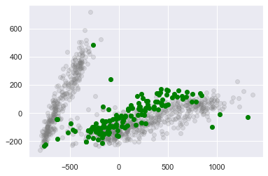

What's going on with the three strange outliers in the right bottom corner?

``` python
# Get dates for the three outliers

weird_fridays = pivoted.index[fridays & (Xpca[:, 0] > 900)]
weird_fridays
```

    Index([2013-05-17, 2014-05-16, 2015-05-15], dtype='object')

``` python
# Plot pattern for three outliers relative to average Friday

all_days = data.pivot_table("total", index=data.index.time, columns=data.index.date)

all_days.loc[:, weird_fridays].plot()
all_days.mean(1).plot(color="grey", lw=4, alpha=0.5, xticks=hourly_ticks)
```

    <matplotlib.axes._subplots.AxesSubplot at 0x1a2631b750>

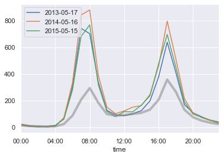

We've found Seattle's [bike to work day](https://www.cascade.org/bikeeverywhereday).

## Supervised modeling

This part contains my replication of [this](https://jakevdp.github.io/blog/2014/06/10/is-seattle-really-seeing-an-uptick-in-cycling/) blog post by [Jake VanderPlan](http://vanderplas.com/) on using data from bicycle traffic across Seattle's Fremont Bridge to learn about commuting patterns.

``` python
%matplotlib inline
import matplotlib.pyplot as plt
import numpy as np
import pandas as pd
from sklearn.linear_model import LinearRegression

plt.style.use("seaborn")

from seattlecycling.data import get_fremont_data
from seattlecycling.toolbox import hours_of_daylight, print_rms
```

``` python
# Load data

start = "1 Oct 2012"
end = "15 May 2014"

data = get_fremont_data()
data = data.loc[start:end]
data.head(3)
```

<div>
<style scoped>
    .dataframe tbody tr th:only-of-type {
        vertical-align: middle;
    }

    .dataframe tbody tr th {
        vertical-align: top;
    }

    .dataframe thead th {
        text-align: right;
    }
</style>

|                     | total | west | east |
|---------------------|-------|------|------|
| Date                |       |      |      |
| 2012-10-03 00:00:00 | 13.0  | 4.0  | 9.0  |
| 2012-10-03 01:00:00 | 10.0  | 4.0  | 6.0  |
| 2012-10-03 02:00:00 | 2.0   | 1.0  | 1.0  |

</div>

``` python
# Resample data into daily and weekly totals

daily = data.resample("d").sum()
weekly = data.resample("w").sum()
```

``` python
# A first look at the data

weekly.plot()
plt.ylabel("Weekly rides");
```

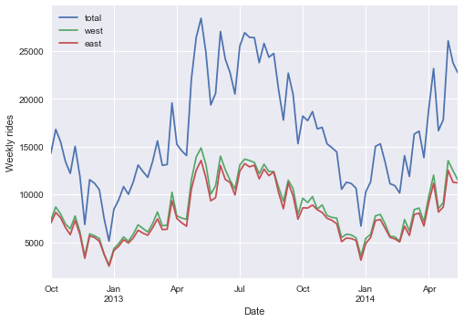

``` python
# Look at rolling weekly mean to smooth out short-term variation

data.resample("d").sum().rolling(30, center=True).mean().plot();
```

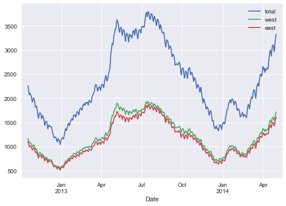

Blog post points out that 2014 has seen increased cycle traffic across the bridge. Below we're modelling seasonal variation based on what we think influences peoples' decision whether or not to ride a bike.

### Accounting for hours of daylight

``` python
# Hours of daylight

weekly["daylight"] = list(map(hours_of_daylight, weekly.index))
daily["daylight"] = list(map(hours_of_daylight, daily.index))

weekly["daylight"].plot()
plt.ylabel("Hours of daylight (Seattle)");
```

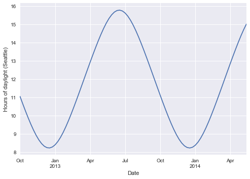

``` python
# Relationship between daylight and cycle traffic

plt.scatter(weekly.daylight, weekly.total)
plt.xlabel("Hours of daylight")
plt.ylabel("Weekly bicycle traffic");
```

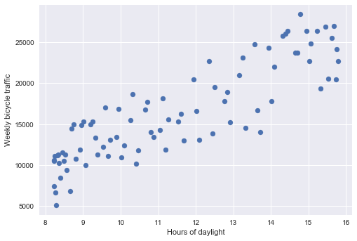

``` python
# Adding a linear trend

X = weekly[["daylight"]]
y = weekly["total"]
clf = LinearRegression(fit_intercept=True).fit(X, y)

weekly["daylight_trend"] = clf.predict(X)
weekly["daylight_corrected_total"] = (
    weekly.total - weekly.daylight_trend + np.mean(weekly.daylight_trend)
)

xfit = np.linspace(7, 17)
yfit = clf.predict(xfit[:, None])

plt.scatter(weekly.daylight, weekly.total)
plt.plot(xfit, yfit, "-k")
plt.title("Bycicle traffic through the year")
plt.xlabel("Hours of daylight")
plt.ylabel("Weekly bicycle traffic");
```

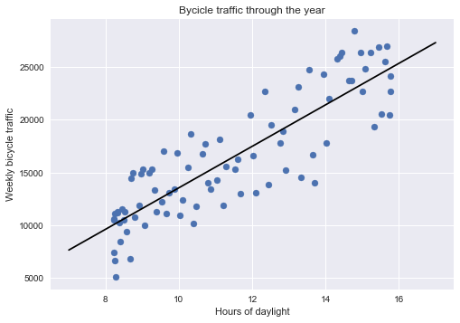

``` python
clf.coef_[0]
```

    1966.2003072317068

``` python
# Plot detrended data

trend = clf.predict(weekly[["daylight"]].values)
plt.scatter(weekly.daylight, weekly.total - trend + np.mean(trend))
plt.plot(xfit, np.mean(trend) + 0 * yfit, "-k")
plt.title("Weekly traffic through the year (detrended)")
plt.xlabel("Hours of daylight")
plt.ylabel("Adjusted weekly bicycle traffic");
```

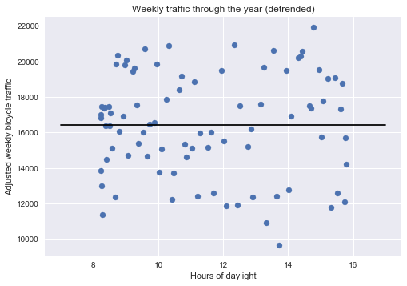

In the graph above, we have removed the number of riders per week that correlate with the number of hours of daylight, so that we can think of what is shown of the number of rides per week we'd expect to see if daylight was not an issue.

``` python
fix, ax = plt.subplots(1, 2, figsize=(15, 5))

weekly[["total", "daylight_trend"]].plot(ax=ax[0])
weekly["daylight_corrected_total"].plot(ax=ax[1])

ax[0].set_ylabel("Weekly crossing")
ax[0].set_title("Total weekly crossings and trend")
ax[1].set_ylabel("Adjusted weekly crossings")
ax[1].set_title("Detrended weekly crossings")

print_rms(weekly["daylight_corrected_total"])
```

    Root-mean-square about trend:  2872 riders

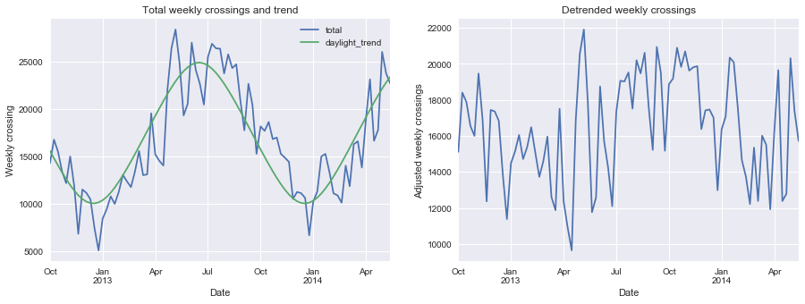

### Accounting for day of the week

``` python
# Plot average number of trips by weekday

days = ["Mon", "Tue", "Wed", "Thu", "Fri", "Sat", "Sun"]
daily["dayofweek"] = daily["total"].index.dayofweek
grouped = daily.groupby("dayofweek")["total"].mean()
grouped.index = days

grouped.plot()
plt.title("Average crossings by weekday")
plt.ylabel("Average daily crossings");
```

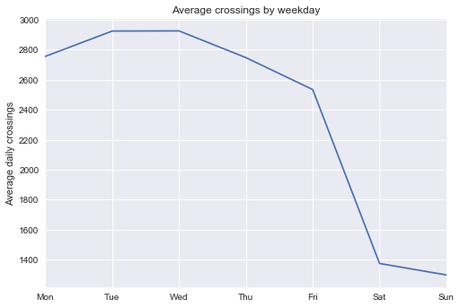

``` python
# Account for hours of daylight and day of week simultaneously

# Add one-hot indicators of weekdays
for i in range(7):
    daily[days[i]] = (daily.index.dayofweek == i).astype(float)

# Detrend on days of week and daylight together
X = daily[days + ["daylight"]]
y = daily["total"]
clf = LinearRegression().fit(X, y)

daily["dayofweek_trend"] = clf.predict(X)
daily["dayofweek_corrected"] = (
    daily["total"] - daily["dayofweek_trend"] + daily["dayofweek_trend"].mean()
)
```

``` python
# Plot crossings and trend, and detrended data

fix, ax = plt.subplots(1, 2, figsize=(15, 5))

daily[["total", "dayofweek_trend"]].plot(ax=ax[0])
daily["dayofweek_corrected"].plot(ax=ax[1])

ax[0].set_ylabel("Daily crossing")
ax[0].set_title("Total daily crossings and trend")
ax[1].set_ylabel("Adjusted daily crossings")
ax[1].set_title("Detrended daily crossings")

print_rms(daily["dayofweek_corrected"])
```

    Root-mean-square about trend:  652 riders

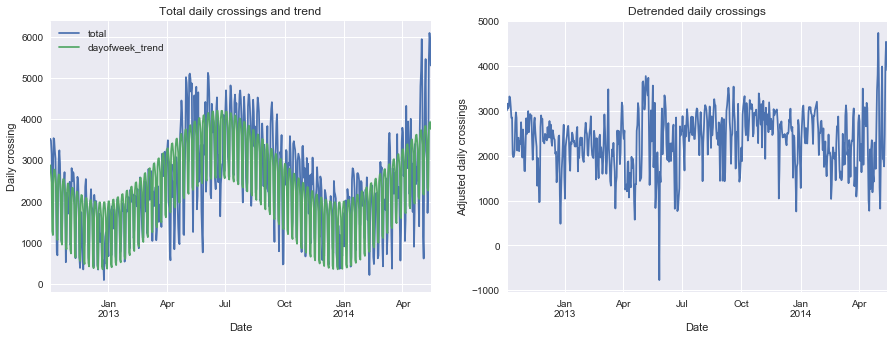

### Accounting for rainfall and temparature

``` python
# Read in weather data
weather = pd.read_csv(
    "seattle_weather_SeaTacWeather.csv",
    index_col="DATE",
    parse_dates=True,
    usecols=[2, 5, 9, 10],
)
weather = weather.loc[start:end]
weather.columns = map(str.lower, weather.columns)

# Temparatures are in 1/10 deg F; convert to deg C
weather["tmax"] = (weather["tmax"] - 32) * 5 / 9
weather["tmin"] = (weather["tmin"] - 32) * 5 / 9

# Rainfall is in inches; convert to mm
weather["prcp"] *= 25.4

weather["tmax"].resample("w").max().plot()
weather["tmin"].resample("w").min().plot()
plt.title("Temperature extremes in Seattle")
plt.ylabel("Weekly temperature extremes (C)");
```

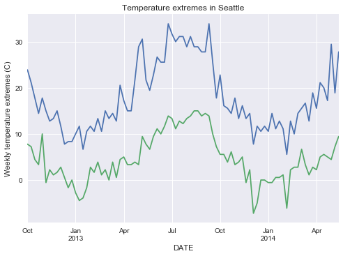

``` python
weather["prcp"].resample("w").sum().plot()
plt.title("Precipitation in Seattle")
plt.ylabel("Weekly precipitation in Seattle (mm)");
```

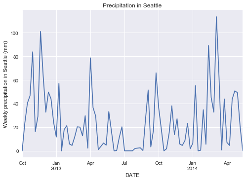

``` python
# Combine daily and weather dataset

daily = daily.join(weather)
```

``` python
# Detrend data including weather information

columns = days + ["daylight", "tmax", "tmin", "prcp"]
X = daily[columns]
y = daily["total"]
clf = LinearRegression().fit(X, y)

daily["overall_trend"] = clf.predict(X)
daily["overall_corrected"] = (
    daily["total"] - daily["overall_trend"] + daily["overall_trend"].mean()
)
```

``` python
# Plot crossings and trend, and detrended data
fix, ax = plt.subplots(1, 2, figsize=(15, 5))

daily[["total", "overall_trend"]].plot(ax=ax[0])
daily["overall_corrected"].plot(ax=ax[1])

ax[0].set_ylabel("Daily crossing")
ax[0].set_title("Total daily crossings and trend")
ax[1].set_ylabel("Adjusted daily crossings")
ax[1].set_title("Detrended daily crossings")

print_rms(daily["overall_corrected"])
```

    Root-mean-square about trend:  457 riders

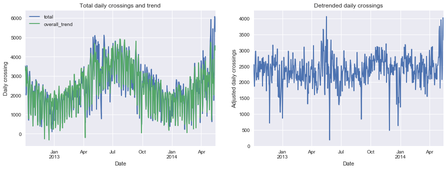

``` python
# Plot rolling 30 day average

daily["overall_corrected"].rolling(30, center=True).mean().plot()
plt.title("1-month moving average");
```

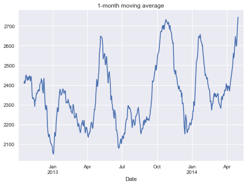

### Accounting for a steady increase in riders

``` python
daily["daycount"] = np.arange(len(daily))

columns = days + ["daycount", "daylight", "tmax", "tmin", "prcp"]
X = daily[columns]
y = daily["total"]
final_model = LinearRegression().fit(X, y)

daily["final_trend"] = final_model.predict(X)
daily["final_corrected"] = (
    daily["total"] - daily["final_trend"] + daily["final_trend"].mean()
)
```

``` python
# Plot crossings and trend, and detrended data
fix, ax = plt.subplots(1, 2, figsize=(15, 5))

daily[["total", "final_trend"]].plot(ax=ax[0])
daily["final_corrected"].plot(ax=ax[1])

ax[0].set_ylabel("Daily crossing")
ax[0].set_title("Total daily crossings and trend")
ax[1].set_ylabel("Adjusted daily crossings")
ax[1].set_title("Detrended daily crossings")

print_rms(daily["final_corrected"])
```

    Root-mean-square about trend:  451 riders

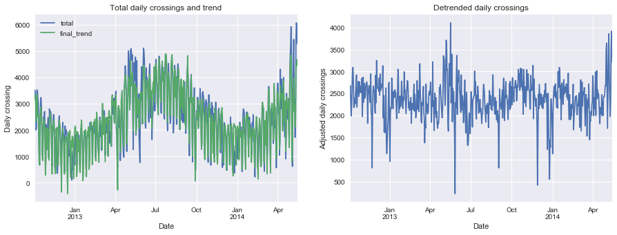

### What can the final model tell us?

``` python
# Compute error variance

vy = np.sum((y - daily["final_trend"]) ** 2) / len(y)
X2 = np.hstack([X, np.ones((X.shape[0], 1))])
C = vy * np.linalg.inv(np.dot(X2.T, X2))
var = C.diagonal()
```

#### How does rain affect ridership?

``` python
ind = columns.index("prcp")
slope = final_model.coef_[ind]
error = np.sqrt(var[ind])
print(
    "{0: .0f} +/- {1: .0f} daily crossings lost per cm of rain".format(
        -slope * 10, error * 10
    )
)
```

     331 +/-  28 daily crossings lost per cm of rain

The model shows that for every cm of rain, about 300 cyclists stay home or use another mode of transport.

#### How does temparature affect ridership?

``` python
ind1, ind2 = columns.index("tmin"), columns.index("tmax")
slope = final_model.coef_[ind1] + final_model.coef_[ind2]
error = np.sqrt(var[ind1] + var[ind2])
print(
    "{0:.0f} +/- {1:.0f} riders per ten degrees Celsius".format(10 * slope, 10 * error)
)
```

    493 +/- 102 riders per ten degrees Celsius

#### How does daylight affect ridership?

``` python
ind = columns.index("daylight")
slopt = final_model.coef_[ind]
error = np.sqrt(var[ind])
print("{0:.0f} +/- {1:.0f} riders per hour of daylight".format(slope, error))
```

    49 +/- 12 riders per hour of daylight

#### Is ridership increasing?

``` python
ind = columns.index("daycount")
slope = final_model.coef_[ind]
error = np.sqrt(var[ind])
print("{0:.2f} +/- {1:.2f} new riders per day".format(slope, error))
print("{0:.1f} +/- {1:.1f} new riders per week".format(7 * slope, 7 * error))
print(
    "annual change: ({0:.0f} +/- {1:.0f})%".format(
        100 * 365 * slope / daily["total"].mean(),
        100 * 365 * error / daily["total"].mean(),
    )
)
```

    0.43 +/- 0.11 new riders per day
    3.0 +/- 0.8 new riders per week
    annual change: (7 +/- 2)%

